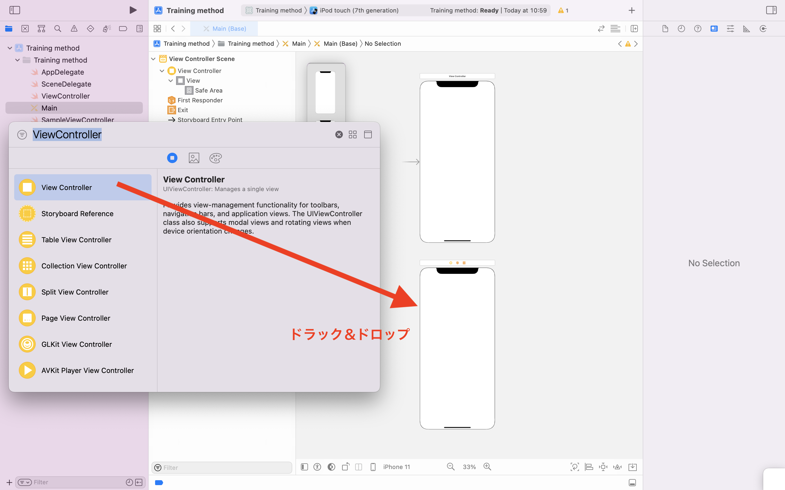
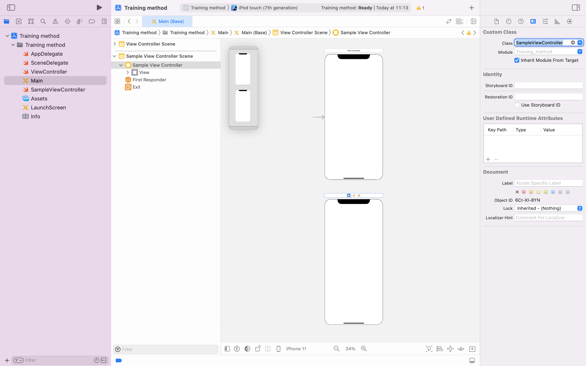
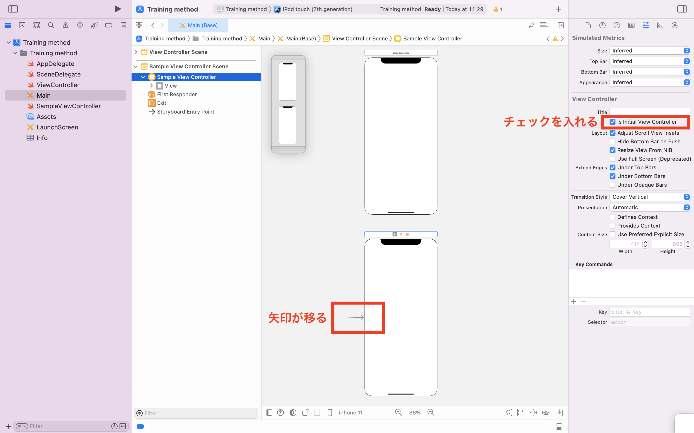
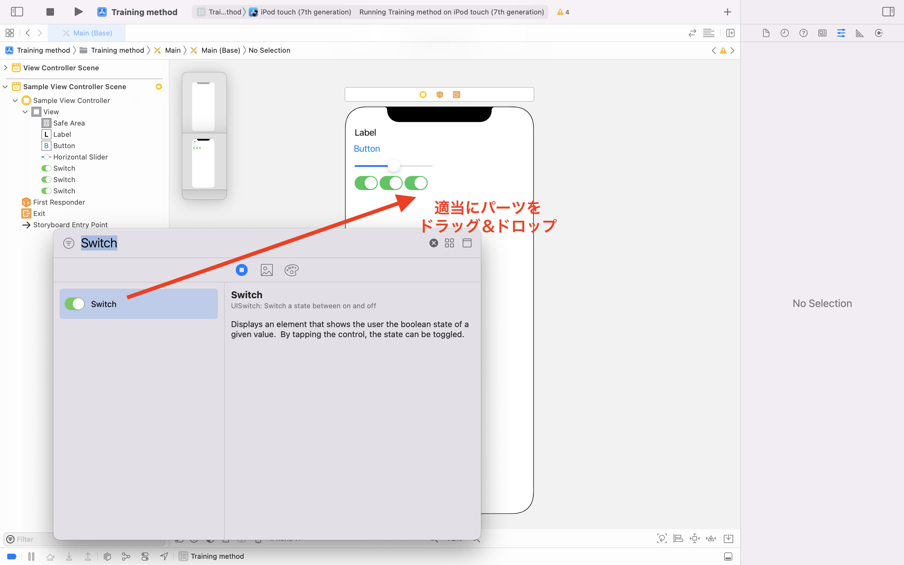
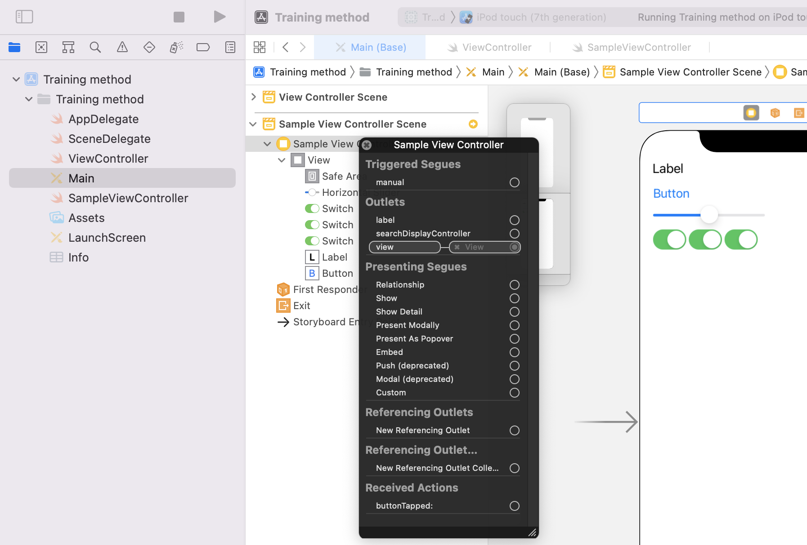
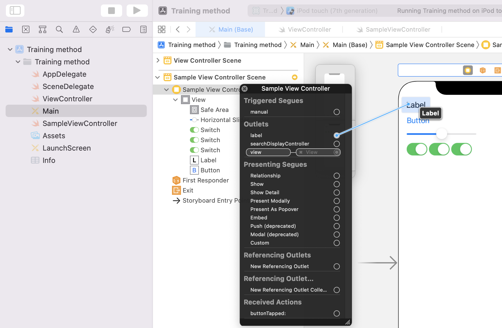
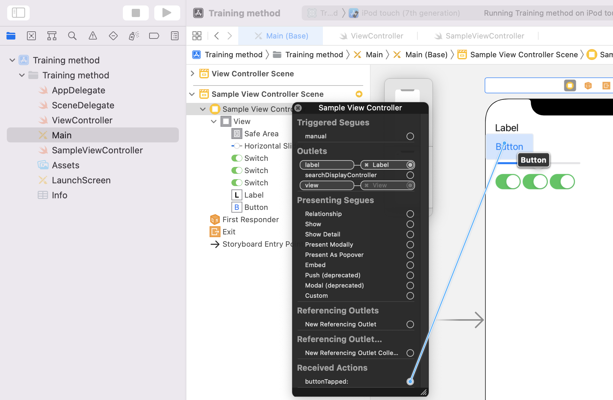
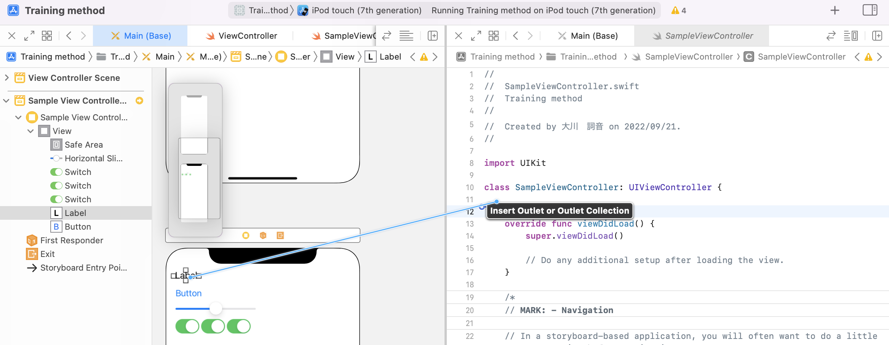

> 参考 [mixi-inc/iOSTraining 1.3 UIViewController1 UIViewController のカスタマイズ(storyboard)](https://github.com/mixi-inc/iOSTraining/wiki/1.3-UIViewController1---UIViewController-%E3%81%AE%E3%82%AB%E3%82%B9%E3%82%BF%E3%83%9E%E3%82%A4%E3%82%BA(storyboard))

参考 : [UIViewController Class Reference](https://developer.apple.com/library/ios/documentation/UIKit/Reference/UIViewController_Class/index.html) | [ViewController プログラミングガイド](https://developer.apple.com/jp/devcenter/ios/library/documentation/ViewControllerPGforiOS.pdf)

MVCの C。Viewの表示と管理やモデルとViewの連携などを行います。
iOSアプリケーションの画面の一単位として認識すると、比較的理解がしやすいと思います。

# UIViewControllerの役割

役割は大きく分けて三つあります。

1. **コンテンツを表示させる**
2. 複数の UIViewController を管理するコンテナ
3. [**他のViewControllerと連携する Modal**(1.4.1)](./1-4-1_ModalViewController-storyboard.md)

本節では1、3の解説をします(2 は次章)。そしてUIViewControllerの[**Lifecycle**(1.5)](1-5_UIViewController-lifecycle.md)に関しても説明します。

# コンテンツを表示させる

ViewControllerを用いてコンテンツを表示するとき、もっともよく使われる方法はUIViewControllerを継承したクラスを作り、カスタマイズしていく方法です。
以下ではその方法について説明します。

UIViewControllerのデザインのカスタマイズ方法は大きく分けてxibを用いる方法とstoryboardを用いる方法があります。

xibはUIViewやUIViewControllerのパーツや画面単位でのUIをGUIを用いてデザインするツールです。storyboardは複数のViewController間の連携や画面遷移などをよりデザインしやすくしたツールです。
細かいパーツや再利用性の高いパーツを作る際はxibを用いるほうが利便性が高く、ViewController間の連携を考えるときはstoryboardの方が便利なケースがあります。
そのためどちらを使うかはケースバイケースだと認識すればよいでしょう。

このページではstoryboardを用いた資料の作り方について解説します。xibの資料をご覧になりたい場合はこちらをご覧ください。
[1.3.2 UIViewControllerのカスタマイズ(xib)](./1-3-2_UIViewController-customization-xib.md)

## はじめに

おそらくXcodeのプロジェクトをプロジェクトテンプレートから作成した場合

* Main.storyboard
* ViewController.swift

などのファイルが初期状態で作成されています。Main.storyboardの中にはViewControllerが一つあり、またViewController.swiftではまさにViewControllerのカスタマイズを行っています。

以下では、新規でサブクラスを作成し、新しくカスタマイズしたViewControllerを表示するところまでを行います。

## 新しいUIViewControllerのサブクラスを作成

まず、新規クラスファイルを生成します。クラス名はここではSampleViewControllerとします。

1. `command + n`あるいはメニューの`File → New → File`と選んで新しいファイルを作成します
* `Cocoa Touch Class`を選択
* Class **SampleViewController** , Subclass of **UIViewController**, Also create XIB Fileのチェックは**外します**
* `Next → Create` とすると新規ファイル`SampleViewController.swift`が作成されます


## storyboard上での操作

新規ファイルが作れたら、次はstoryboard上で以下の操作を行います

* SampleViewControllerのViewControllerを作成
* Initial ViewControllerに指定
* SampleViewControllerのカスタマイズ


### SampleViewControllerのViewControllerを作成

Main.storyboardを選択して、右側のユーティリティエリアのオブジェクトライブラリからViewControllerを探し、中央の編集エリアにドラッグ&ドロップします。
こうすることで、このstoryboard上に新しいViewControllerが生成されます。



今新しく作ったViewControllerのクラスはデフォルトである UIViewControllerになります。このクラスを自分の作ったViewControllerに切り替えます。
ドラッグ&ドロップしたViewControllerを選択した上で右側のユーティリティエリアの上部左から三番目のIdentity inspectorの中にあるClassを**SampleViewController**にします



### Initial View Controllerに設定

storyboardにはデフォルトで最初にロードされるViewControllerを設定できます。そのViewControllerのことをInitial View Controllerと呼びます。

プロジェクトテンプレートから読み込まれた場合は最初に生成されるViewControllerというクラスがInitial View Controllerとして設定されています。その設定をSampleViewControllerに移行します。

storyboardでSampleViewControllerを選択した状態で、右側のユーティリティエリアの左から4番目のAttributes Inspectorを開きます。
その下のViewControllerの設定項目の中に**is Initial View Controller**のチェックがあると思うのでそこにチェックを入れます。
すると、ViewControllerに向かって付いていた矢印が SampleViewControllerに移ると思います。そうなっていればOKです。
この矢印はそのStoryboardのInitial View Controllerの印です。



### SampleViewControllerのカスタマイズ

SampleViewControllerの見た目をカスタマイズします。
ViewControllerには一つのUIViewインスタンスが割り当てられていて、それをカスタマイズしていく、というのが流れです。
UIViewについてはUIViewの項目をご覧頂く方がわかりやすいと思います。

ここではオブジェクトライブラリから適当にViewのパーツをこのViewController内にドラッグ&ドロップしてください。
ドロップできないものもいくつかあります。それらはこのケースだと使えないものとなってきます。何が使えて、なぜ使えないかは
UIKitに慣れてくると次第に理解が深まると思います。

まだAutolayoutの設定をしていないと思うのでパーツは左上に寄せておくと良いでしょう。
また次の章で利用するのでラベル(UILabel)とボタン(UIButton)を一つずつ配置しておいてください。



ここまでできれば、一度実行してみてください。シミュレータでカスタマイズしたViewControllerが表示されればOKです。


## 各パーツと実装を結びつける

storyboardやxib上のパーツとソースコードを結びつけます。先ほどView ControllerのクラスをSampleViewControllerを指定したのでこのViewControllerが生成されるときはSampleViewControllerのインスタンスが生成されるようになっています。
さらにView上のパーツを各クラスのプロパティと結びつけたり、ユーザーのアクションとView Controllerのメソッドを結びつけます。
(アウトレットという仕組みです)

### IBOutlet

各パーツとクラスのプロパティを結びつけるにはIBOutletを用います。手順としては、IBOutletのプロパティをコード上で作成し、そのプロパティをstoryboard上のパーツと結びつけます。

##### SampleViewControllerにプロパティを追加

SampleViewControllerに`@IBOutlet`キーワードを付けた`UILabel`のプロパティを作成してください

```swift
class SampleViewController: UIViewController {

    @IBOutlet weak var label: UILabel!

    override func viewDidLoad() {
        super.viewDidLoad()

        // Do any additional setup after loading the view.
    }
}
```

##### storyboard上で紐づける

プロパティの宣言ができれば再びstoryboardに戻ってSampleViewControllerを選択します。Document OutlineのSample View Controllerを選択して右クリックをすると次のようなパネルが出現します。



この中に先ほど作成した `label` という選択肢があると思います。labelの右側の円内からドラッグしてViewController上のラベルにドロップしてください。こうすることでコード上のプロパティとstoryboard上のUIとを結びつけることができます。




##### labelの中身を書き換える

実際に結びつけることができたら、ラベルの中身をコード上から書き換えて見ましょう。SampleViewControllerのviewDidLoadを次のように書き換えます。

```swift
override func viewDidLoad() {
    super.viewDidLoad()

    // Do any additional setup after loading the view.
    label.text = "Test"
}
```

labelプロパティが正しく紐付けができていれば、実行時にラベルの文字列が "Test" に変化すると思います。
(長めのテキストを入れた場合は自動的にTruncateされると思います)


### IBAction

UI上のパーツに対してユーザーが何かアクションを起こした時に、対応するメソッドを呼び出すにはIBActionを利用します。
手順としてはIBOutletと同様に、メソッドを宣言、定義し、storyboard上のパーツと結びつけます。

##### メソッドの定義

SampleViewControllerに以下のメソッドを定義してください

```swift
@IBAction func buttonTapped(_ sender: UIButton) {
    label.text = "YES"
}
```

このメソッドの戻り値の型がIBActionとなっていますが、これはInterface Builderが紐付けれるメソッドを探すためのキーワードとなります。
実際に何かreturnする、というものではなくvoidのようなもの、と思っておいて差し支えないと思います。

##### メソッドとパーツアクションの結びつけ

メソッドの実装ができれば先ほどと同様な結びつけを行います。

再びstoryboardに戻ってSampleViewControllerを選択し、Document OutlineのSampleViewControllerを選択して右クリックをすると次のようなパネルが出現します。
つぎは今定義したメソッドが増えていると思うので、ボタンにドラッグ&ドロップします。



ドロップしたときに、どのアクションと対応するかを聞かれると思います。ボタンタップ時には `Touch Up Inside` を選ぶのがよいでしょう。

これで結びつけは完了です。実行してボタンをタップするとラベルの文字が変わればOKです。

### 演習課題
ここまでで、storyboardを用いてUIViewControllerをカスタマイズすることができると思います。
ここでレクチャーした内容を実際に行うのが演習課題となります。

解答例については[samples/day1/sample1-3-1/VCCustomization](../../samples/day1/sample1-3-1)を参照してください。

##### 課題1.
新規プロジェクトを作成してください。
そのあと新しいViewControllerのクラスを作成し、storyboard上に追加し、起動時に表示されるViewControllerとなるようにしてください。

##### 課題2.
課題1.で作成したViewControllerにUILabelとUIButtonのパーツを配置してください。
UIButtonをタップしたらラベルの文字列が `YES` となるようにしてください。

### おまけ
Assistant Editorを表示した上で、`control + ドラッグ&ドロップ`でプロパティの追加とIBOutletやIBActionの結びつけを一発でできます。


