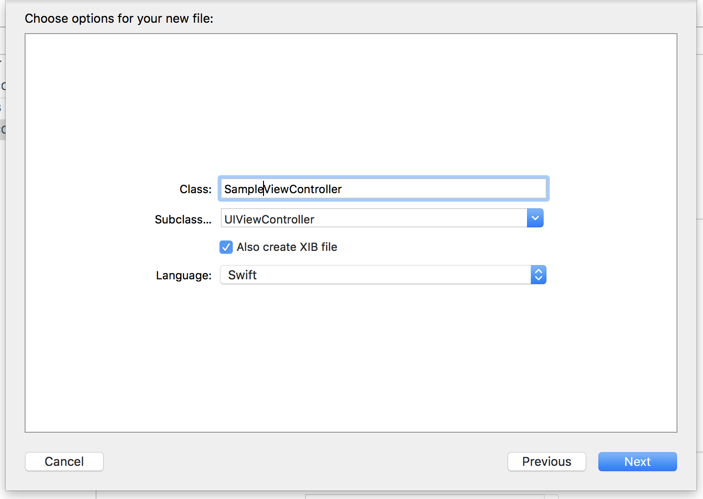
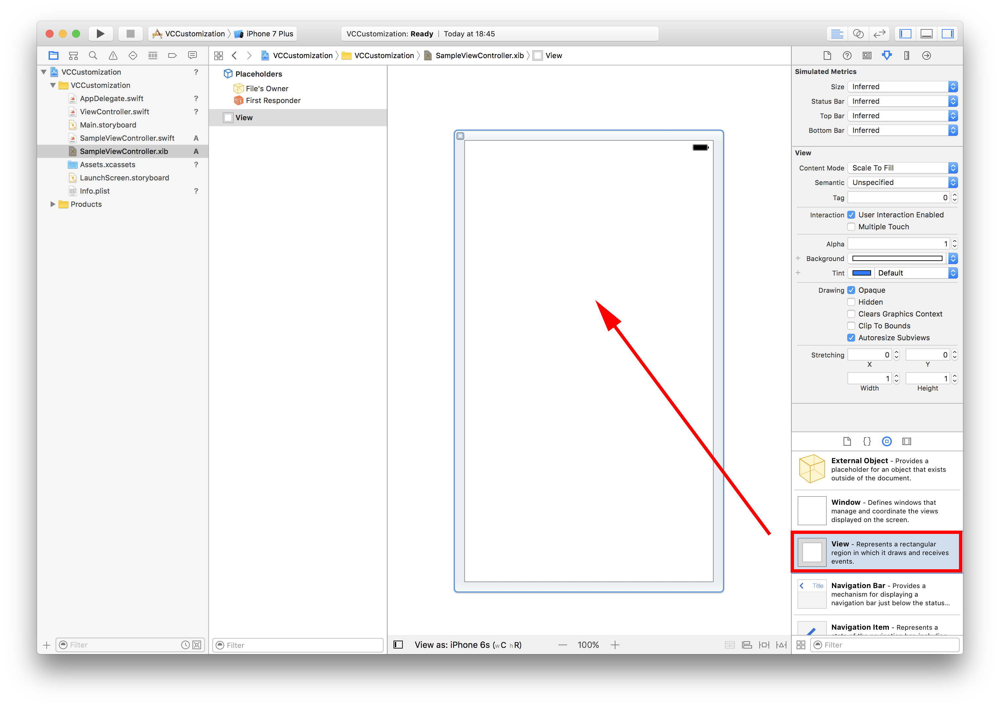
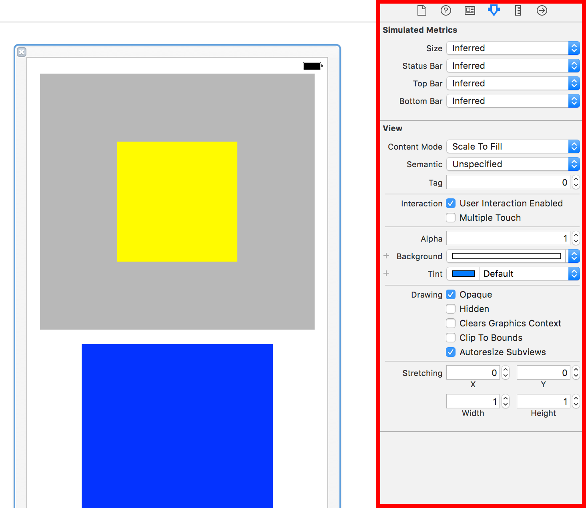
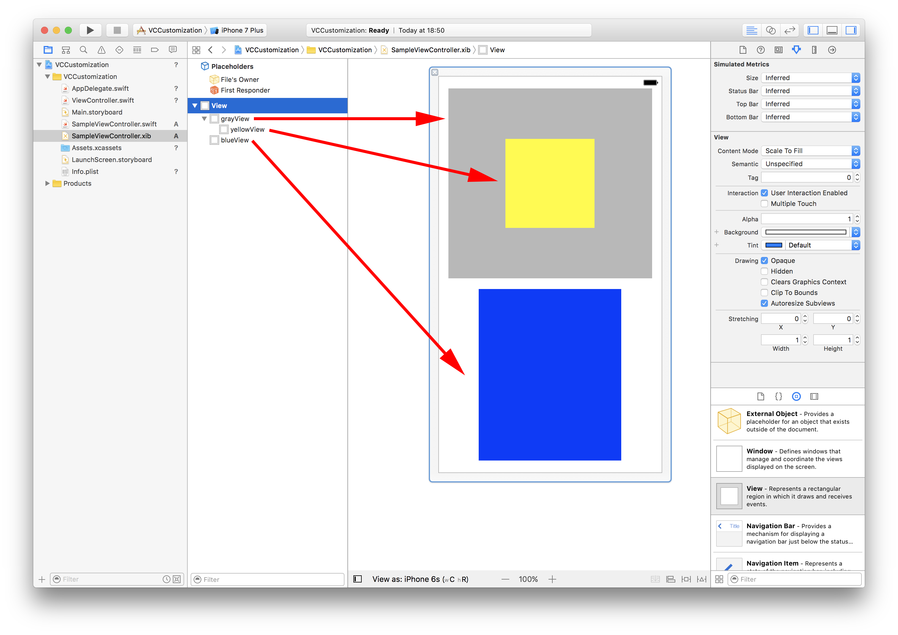
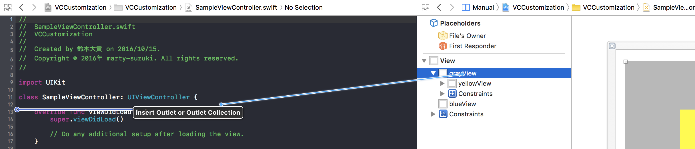
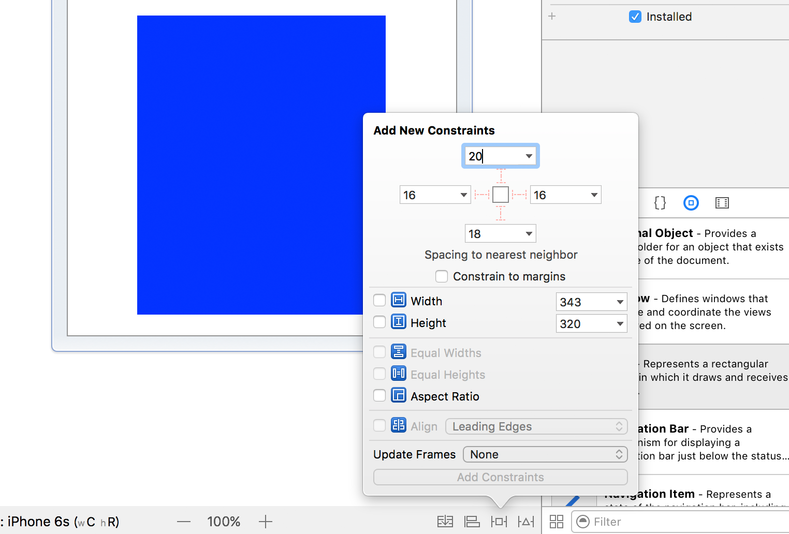
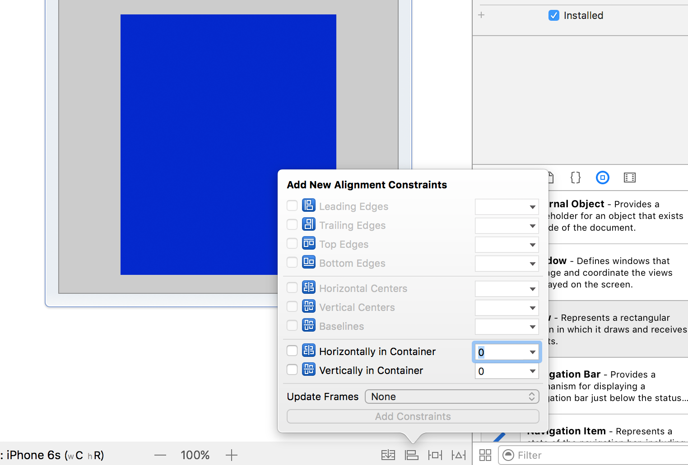
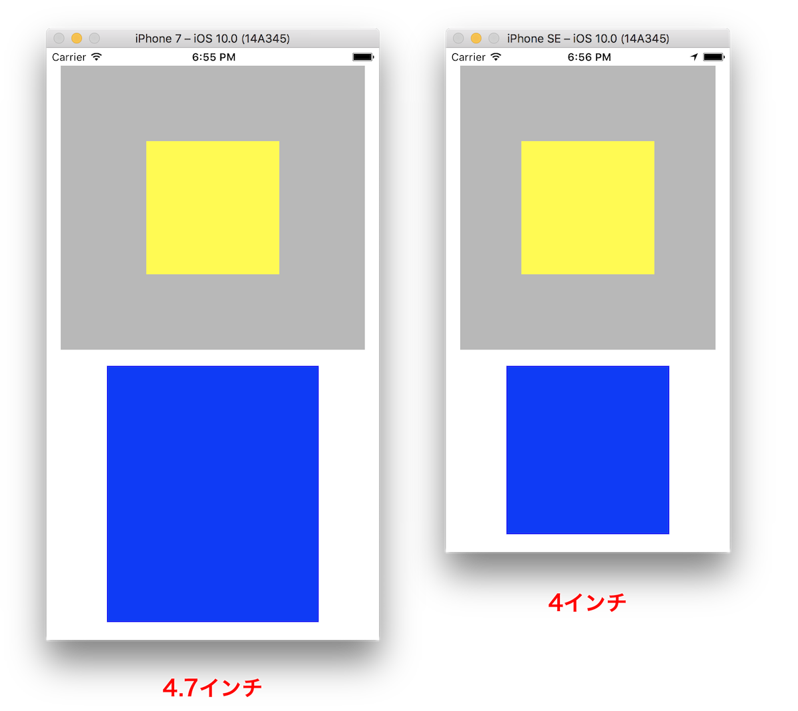

> 参考 [mixi-inc/iOSTraining 1.3 UIViewController1 UIViewController のカスタマイズ(xib, autoresizing)](https://github.com/mixi-inc/iOSTraining/wiki/1.3-UIViewController1---UIViewController-%E3%81%AE%E3%82%AB%E3%82%B9%E3%82%BF%E3%83%9E%E3%82%A4%E3%82%BA(xib,-autoresizing))

参考 : [UIViewController Class Reference](https://developer.apple.com/library/ios/documentation/UIKit/Reference/UIViewController_Class/index.html) | [ViewController プログラミングガイド](https://developer.apple.com/jp/devcenter/ios/library/documentation/ViewControllerPGforiOS.pdf)

MVCの C。Viewの表示と管理やモデルとViewの連携などを行います。
iOSアプリケーションの画面の一単位として認識すると、比較的理解がしやすいと思います。

# UIViewControllerの役割

役割は大きく分けて三つあります。

1. **コンテンツを表示させる**
2. 複数の UIViewControllerを管理するコンテナ
3. [**ユーザの操作のなかに一時的に割り込む Modal**(1.4.2)](./1-4-2_ModalViewController-xib.md)

本節では1、3の解説をします(2 は次章)。そしてUIViewControllerの[**Lifecycle**(1.5)](1-5_UIViewController-lifecycle.md)に関しても説明します。

# コンテンツを表示させる

ViewControllerを用いてコンテンツを表示するとき、もっともよく使われる方法はUIViewControllerを継承したクラスを作り、カスタマイズしていく方法です。
以下ではその方法について説明します。

UIViewControllerのデザインのカスタマイズ方法は大きく分けてxibを用いる方法とstoryboardを用いる方法があります。

そのため、xibの資料を残しつつstoryboardを用いたViewControllerのカスタマイズについては別ページをご覧ください。

[1.3.1 UIViewControllerのカスタマイズ(storyboard)](./1-3-1_UIViewController-customization-storyboard.md)

## UIViewControllerの初期化

まず、新規クラスファイルをSampleViewControllerとして生成します。  
`command + n`あるいはメニューの`File → New → File`と選んで新しいファイルを作成します。  
`Also create XIB file`にチェックを入れてください。



生成されたSampleViewControllerは下記のコードで初期化できます。

```swift
let sampleVC = SampleViewController(nibName: "SampleViewController", bundle: nil)
```

## Object libraryからViewの配置

ドラッグしてviewの上に重ねます。



## Viewの初期設定

Attributes Inspectorで各属性設定しましょう。



## Viewの階層関係を意識

どのViewにaddするのかを考えながら配置しましょう。



ViewController の view 上に SampleViewController の view を表示させる。

```swift
view.addSubview(sampleVC.view)
```

## レイアウトした ViewController の表示

## IBOutletの設定
xib上のUIView componentと実装ファイルをつなげてます。これで実装ファイルからxibのViewを操作できるようになります。

SampleViewController.swiftを選択した状態で `option`を押しながら.xibを選択することで二面で開くことが出来きます。  
そこから`control`を押しながらviewの上から左のソースコードへドラッグします。



下記のコードをSampleViewController書いて、Viewを操作します。

```swift
override func viewDidLoad() {
    super.viewDidLoad()

    // Do any additional setup after loading the view.
    grayView.backgroundColor = .red
}
```

## Auto Layoutの設定

各Viewにsuperviewやsubviewに対しての制約を設定します。

#### Constraint

- SampleViewControllerのviewのtopとgrayのviewのtopのスペースが20px
- SampleViewControllerのviewのleftとgrayのviewのleftのスペースが16px
- SampleViewControllerのviewのrightとgrayのviewのrightのスペースが16px
- grayのviewのheightを320pxに固定



#### Alignment Constraint

- grayのviewの縦方向のcenterとyellowのviewの縦方向のcenterのスペースが0px
- grayのviewの横方向のcenterとyellowのviewの横方向のcenterのスペースが0px



blueのviewに対しても任意のConstraintを設定することで、下図のように画面サイズが変わってもConstraintにしたがったレイアウトになります。



サンプルについては[samples/day1/sample1-3-2/VCCustomization](../../samples/day1/sample1-3-2)を参照してください。
