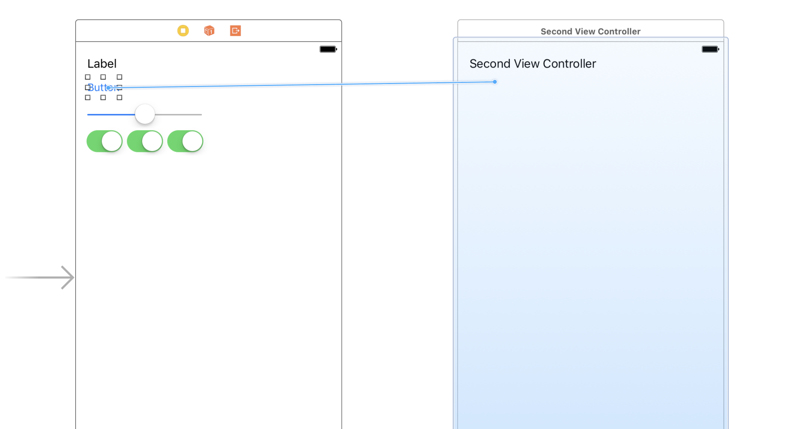
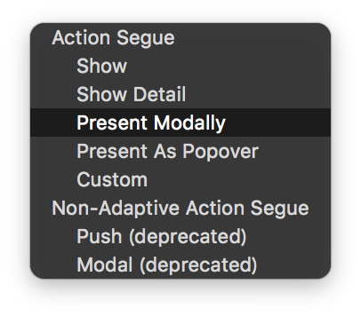
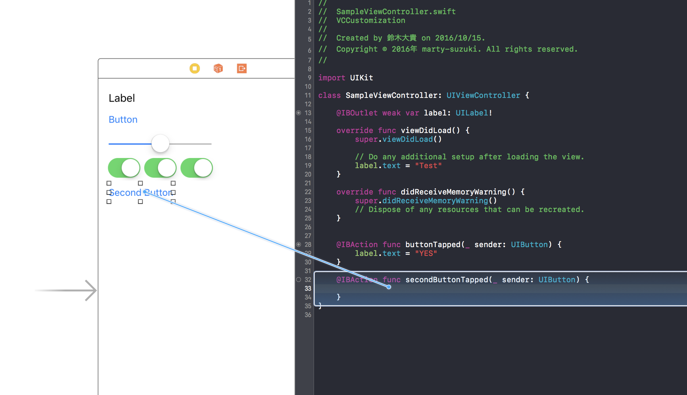
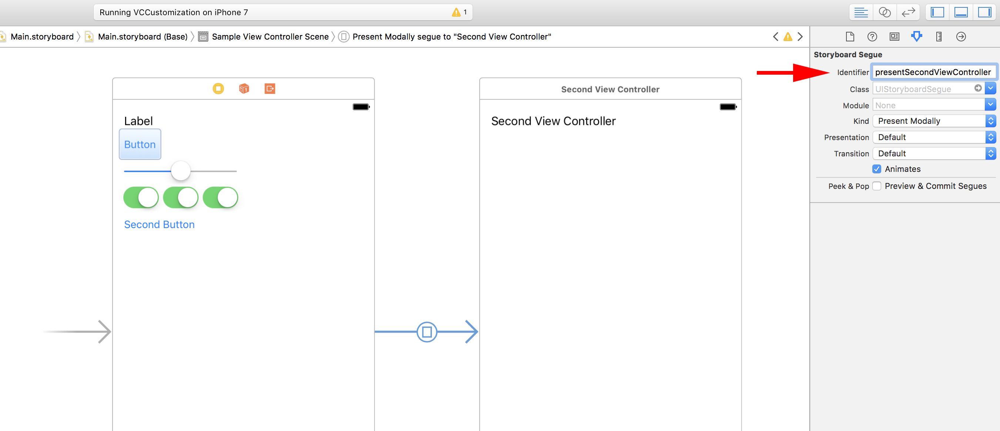
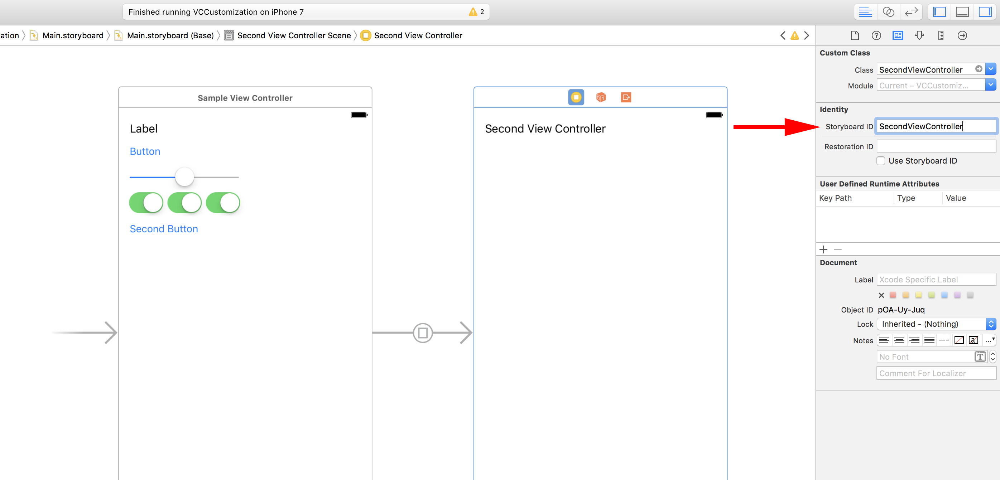
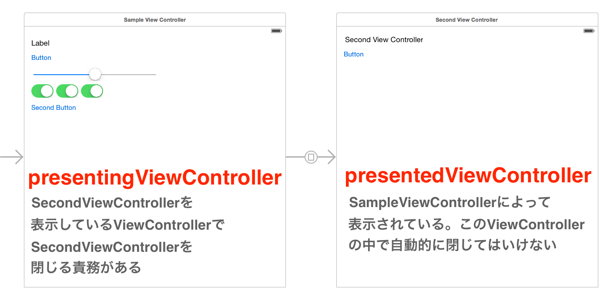
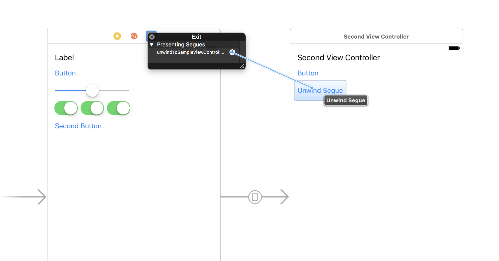

> 参考 [mixi-inc/iOSTraining 1.4 UIViewController2 ModalViewController (storyboard)](https://github.com/mixi-inc/iOSTraining/wiki/1.4-UIViewController2-ModalViewController-(storyboard))

参考 : [UIViewController Class Reference](http://developer.apple.com/library/ios/#documentation/uikit/reference/UIViewController_Class/Reference/Reference.html) | [View Controller Programming Guide for iOS](http://developer.apple.com/library/ios/featuredarticles/ViewControllerPGforiPhoneOS/ViewControllerPGforiOS.pdf)

# 概要

UIViewControllerには他のViewControllerと連携して新しいViewControllerを表示するなどの役割もあります。
連携のやり方には代表的なものに Modal, Navigation Controller, TabBarController などの方法があり、この章ではModalを用いた方法を解説します。

Modal View Controllerは「現在のViewControllerで行っている操作を一時中断して新しいViewControllerを表示する」というケースで利用されます。公式ドキュメントには以下のようなケースで使うことを想定しています。

- ユーザから直ちに情報を収集するため
- 何らかのコンテンツを一時的に表示するため
- 作業モードを一時的に変更するため
- デバイスの向きに応じて代替のインターフェイスを実装するため
- 特殊なアニメーショントランジションを使用する(またはトランジションなしの)新しいビュー 階層を表示するため

UIViewController は一つの ModalView を表示することが可能で、そのときに、Modal を表示する ViewController と ModalViewController には親子関係ができます。

> 
>
> [View Controller Programming Guide for iOS](https://developer.apple.com/library/content/featuredarticles/ViewControllerPGforiPhoneOS/PresentingaViewController.html) から引用

また、ViewControllerの上にViewControllerをだすこともできる。

>   
> [View Controller Programming Guide for iOS](https://developer.apple.com/library/content/featuredarticles/ViewControllerPGforiPhoneOS/TheViewControllerHierarchy.html#//apple_ref/doc/uid/TP40007457-CH33-SW1) から引用


# 表示方法

表示方法は storyboard から直接表示する方法と、コード上からViewControllerを生成して表示する方法があります。

### storybaordから直接表示する方法

1.3のサンプルプロジェクトをさらに改造します。[samples/day1/sample1-3-1/VCCustomization](../../samples/day1/sample1-3-1)

追加で新しい View Controller のサブクラスを作ってください。クラス名は "SecondViewController" としました。
できたら1.3と同様にstoryboardにViewControllerを追加して、クラスを"SecondViewController"にしてください。
わかりやすくするために、SecondViewController上に何かラベルを配置しておくと良いかもしれません。

#### segueを追加して表示する

segue(セグエ)とは二つのシーン間の遷移方法についての設定のことです。どのViewControllerからどのViewControllerを、どのように表示するか、などを設定します。
主に、storyboard上で遷移を決めるときに利用します。

storyboard上にViewControllerを追加できたら、SampleViewController上のボタンをタップした時に、SecondViewControllerを表示できるようにsegueを追加しましょう。

storyboardのSampleViewControllerの上のUIButtonをcontrolボタンを押しながらドラッグします。
するとマウスポインタ上とボタンの間に青い線が出ると思います。そのままSecondViewController上までドラッグします。(図3)


図3

SecondViewControllerまできたらドロップしてください。すると、図4のようなパネルが出ると思うので、その中から "present modally" を選択します。


図4

ここまでできれば、segueの追加は完了です。
実はここまでできれば、SecondViewControllerは表示することができます。シミュレータから実行して、SampleViewControllerのボタンをタップするとSecondViewControllerが表示されると思います。

#### プログラム上からsegueを実行する

今のサンプルではボタンをタップした時に自動的にsegueが実行され、SecondViewController が表示されました。
実際にアプリを作る際はデータのロード完了時まで遷移したくない、などのケースもあるため任意のタイミングで実行する必要があります。
そのようなケースではプログラム上からsegueを実行します。

SampleViewControllerにもう一つボタンを追加し、ボタンタップ時に呼ばれるメソッドを一つ追加してください。
今回は `secondButtonTapped:` というメソッドにしています。



次にstoryboard上でsegueを選択し、Xcodeの右側にあるユーティリティのAttribute Inspectorから Stroryboard Segue Identifierを入力します。
このIdentifierはstoryboard上で実行されるsegueの識別子でプログラムから呼び出す時などに使います。名前については他とIdentifierと重複しない限り自由につけることができます。
今回は "presentSecondViewController" としました。



それではボタンタップ時に呼ばれるメソッドにこのsegueを呼び出します。呼び出すには UIViewControllerのインスタンスメソッドである [`performSegue(withIdentifier:sender:)`](https://developer.apple.com/reference/uikit/uiviewcontroller/1621413-performsegue) を利用します。
先ほど定義したメソッドの中で `performSegue(withIdentifier:sender:)` を呼び出します。一つ目の引数はSegueのIdentifierで、先ほどstoryboard上で設定したものを利用します。二つ目のsegueはこのsegueを呼び出したクラスです。よく`self`を代入します。

```swift
@IBAction func secondButtonTapped(_ sender: UIButton) {
    performSegue(withIdentifier: "presentSecondViewController", sender: self)
}
```

新たに追加したボタンをタップしたときにSecondViewControllerが出ればOKです。

#### segueで表示するViewControllerにデータを与える

segueを用いて画面遷移を行うとき、表示したいViewControllerに何かデータを渡して遷移することがよくあります。
そのようなケースではUIViewControllerのインスタンスメソッド[`prepare(for:sender:)`](https://developer.apple.com/reference/uikit/uiviewcontroller/1621490-prepare)を利用します。
UIViewControllerのサブクラスを作った際に自動的にコードスニペットが.mファイルにコメントアウトで記述されています。
このコメントアウトを外して実際に実装します。

この`prepare(for:sender:)`はsegueが呼ばれて実際に実行されるまでの間、その遷移に関して追加で行う処理がある場合に実装するメソッドとなります。
引数は実行されるsegueとsenderです。

画面遷移は一つの画面に対して複数あることがあります。そのためどの画面遷移かを見分けて処理を行う必要があります。
その際は `segue.identifier` を用いて切り分けます。

また、遷移先のViewControllerが必要な場合は `segue.destinationViewController` で必要なViewControllerを取得することができます。

以下のようなサンプルになります。

```swift
// MARK: - Navigation

// In a storyboard-based application, you will often want to do a little preparation before navigation
override func prepare(for segue: UIStoryboardSegue, sender: Any?) {
    // Get the new view controller using segue.destinationViewController.
    // Pass the selected object to the new view controller.
    guard let identifier = segue.identifier, identifier == "presentSecondViewController" else {
        return
    }
    let destination = segue.destination
}
```

### segueを使わずにViewControllerを表示する

segueを一切使わず、ViewControllerを表示することもできます。iOS4以前はstoryboardがなくそれに伴ってsegueを利用することもできませんでした。
その際の資料については [1.4.2 ModalViewController（xib）](./1-4-2_ModalViewController-xib.md)
を見ていただくとよいと思います。

storyboardを使いつつ、ただsegueを利用しない、という方法について簡単に紹介します。
先ほど実装したメソッド `secondButtonTapped(_:)` を修正して利用します。

まずはstoryboard内にあるUIViewControllerにIdentifierをつけます。
ユーティリティのIdentity InspectorからStoryboard ID をつけます。このIDをつけることで、コード上から
このViewControllerを一つだけ生成することが可能になります。ここにつけるIDは他のものと被らなければ問題ありません。
ここではクラス名と同じで"SecondViewController"としました。



では実際に生成して表示します。

生成するには UIStroyboardのインスタンスメソッド [`instantiateInitialViewController()`](https://developer.apple.com/reference/uikit/uistoryboard/1616213-instantiateinitialviewcontroller)を用います。
このメソッドの引数に先ほど定義したstoryboardIDを渡します。UIViewControllerがstoryboardから生成された場合、プロパティにstoryboardがあるのでそれを利用します。

ViewControllerからViewControllerを表示するにはメソッド [`present(_:animated:completion:)`](https://developer.apple.com/reference/uikit/uiviewcontroller/1621380-present) を用います。
このメソッドの一つ目の引数に表示したいViewControllerを渡します
。

```swift
@IBAction func secondButtonTapped(_ sender: UIButton) {
    //performSegue(withIdentifier: "presentSecondViewController", sender: self)
    guard let secondViewController = storyboard?.instantiateViewController(withIdentifier: "SecondViewController") else {
        return
    }
    present(secondViewController, animated: true, completion: nil)
}
```

このような実装になります。同じく表示されればOKです。


## ModalViewControllerを閉じる

ModalViewControllerを表示できたら、次はModalViewControllerを閉じる方法について解説します。
閉じ方はdelegateパターンを用いる方法とUnwind Segue を使う方法の２パターンがあります。

### delegateパターンを用いて閉じる
まずは表示しているSecondViewController上にボタンとボタンタップ時に呼ばれるメソッドを定義してください。
サンプルコードではメソッド名を `buttonTapped(_:)` としました。
ボタンがタップされた時 `buttonTapped(_:)` が呼ばれます。このメソッドが呼ばれた時に画面を閉じるコードを書いていきます。

##### モーダルを閉じるメソッド

表示したModalViewControllerを閉じるにはUIViewControllerのインスタンスメソッド [`dismiss(animated:completion:)`](https://developer.apple.com/reference/uikit/uiviewcontroller/1621505-dismiss) を用います。

SampleViewControllerか、SecondViewControllerの内部でこのメソッドを呼ぶことでモーダルを閉じることができます。
どちらのViewControllerからも閉じることができるのですが、SampleViewControllerに閉じる責務があります。

モーダルでViewControllerを表示する時、表示するViewControllerと表示されるViewControllerの関係が存在します。
今回のケースでは SampleViewControllerが表示する側、SecondViewControllerが表示される側となります。
またプロパティとして、表示している側は presentingViewController、表示されている側は presentedViewControllerとなります。

そして、**表示している** 側のViewControllerに表示したViewControllerを閉じる責務が発生します。
あるクラスのインスタンスを生成したら、生成したクラスが責任を持って処理を行う、という原則に則っています。

ただ、実際にモーダルを表示して何か操作を行った時、使った側がその操作の完了を検知できないと処理に不都合がある場合があります。
そのために表示した側が閉じる処理を行う、というルールになっています。



##### delegateを使わないとすると

さて、このように表示されたSecondViewControllerを閉じるのは表示したSampleViewControllerになります。
SecondViewControllerのボタンがタップされた時に、どうすれば SampleViewController が閉じるアクションを行えるのでしょうか。
SecondViewControllerからSampleViewControllerにボタンがタップされた、あるいは作業が完了したことを通知する必要があります。

一番簡単な方法は、SecondViewControllerがプロパティとしてSampleViewControllerのインスタンスへの参照を持っておき、
ボタンがタップされた時にそのインスタンスメソッドを呼ぶ方法です。


```swift
class SecondViewController: UIViewController {
    // SecondViewControllerがSampleViewControllerのプロパティを持つ
    weak var sampleViewController: SampleViewController?

    override func viewDidLoad() {
        super.viewDidLoad()

        // Do any additional setup after loading the view.
    }
}    
```

```swift
guard let secondViewController = storyboard?.instantiateViewController(withIdentifier: "SecondViewController") as? SecondViewController  else {
    return
}
// SecondViewControllerのSampleViewControllerプロパティにselfをセット
secondViewController.sampleViewController = self
present(secondViewController, animated: true, completion: nil)}
```

```swift
// SecondViewControllerのタップハンドラ
@IBAction func buttonTapped(_ sender: UIButton) {
    // sampleViewControllerのメソッドを読んでいる
    sampleViewController?.dismiss(animated: true, completion: nil)
}
```

この方法で、ViewControllerを閉じることができますが、

* 結局SecondViewControllerが自分でモーダルを閉じている
* SecondViewControllerがSampleViewController に依存している

という問題点があります。

##### Swfitにおけるdelegateパターン

そこでこのようなケースでは、delegateパターンを用いて解決します。
Delegateパターンを端的に言うと、メソッドのインタフェースだけ宣言しておき、あるクラスはそのメソッドを実装します。このメソッドを利用する側は、そのクラスについて知る必要はなく、インタフェースに従うのみとすることでクラス間の依存を取り除くデザインパターンです。


今回のモーダルを閉じるケースをサンプルにDelegateパターンを実装します。
Delegateパターンを用いる際、Swiftでは **プロトコル** という仕組みを利用します。
このプロトコルのメソッドを実装することを **プロトコルに準拠する** と呼ぶことが多いのですが、メソッドを実装してプロトコルを準拠します。

```swift
// SecondViewController.swift 内
protocol SecondViewControllerDelegate: class {
    func secondViewController(_ viewController: SecondViewController, didTapButton button: UIButton)
}
```

このケースでは、 `SecondViewControllerDelegate` がプロトコル名で `secondViewController(_:didTapButton:)` がこのプロトコルに準拠したクラスが実装するメソッドになります。

次に、SampleViewControllerがプロトコル `SecondViewControllerDelegate` を準拠させます。
クラスの宣言の際に `class クラス名 : スーパークラス名, 準拠するプロトコル名 {` または `extension クラス名 : 準拠するプロトコル名 {` とすることで、このクラスはこのプロトコルに準拠しています、という宣言になります。

```swift
class SampleViewController: UIViewController, SecondViewControllerDelegate {
// 中略
}
```

次に実装側でプロトコルのメソッドを実装します。

```swift
class SampleViewController: UIViewController, SecondViewControllerDelegate {
    // 中略
    func secondViewController(_ viewController: SecondViewController, didTapButton button: UIButton) {
        // 後で実装します。
    }
    // 中略
}
```

こうすることでプロトコルを採用したDelegateパターンを使うことができます。

##### 実際にdelegateパターンを利用する

さて、実際にこのパターンを用いてモーダルを閉じます。
まず、SecondViewControllerにプロパティを一つ追加します。

```swift
class SecondViewController: UIViewController {

    weak var delegate: SecondViewControllerDelegate?
    // 中略
}
```

ポイントとしては

* プロパティのタイプが `weak` になっている点。これは循環参照を避けるためにあります。
* `SecondViewControllerDelegate` という型。これはSecondViewControllerDelegateに準拠していたらどんなクラスでもOKということです。


次にSecondViewControllerのボタンタップハンドラを次のように修正します。

```swift
@IBAction func buttonTapped(_ sender: UIButton) {
    delegate?.secondViewController(self, didTapButton: sender)
}
```

SecondViewControllerのdelegateプロパティのメソッドである `secondViewController(_:didTapButton:)` を呼び出しています。
delegateプロパティはどんなクラスかは分かりませんが、SecondViewControllerDelegateに準拠しているのでこのメソッドがあるはずなので呼び出すことができます。

次はSampleViewControllerを修正します。SecondViewControllerを表示するときのメソッド `secondButtonTapped(_:)` と `secondViewController(_:didTapButton:)` を合わせて以下のようにします。

```swift
@IBAction func secondButtonTapped(_ sender: UIButton) {
    guard let secondViewController = storyboard?.instantiateViewController(withIdentifier: "SecondViewController") as? SecondViewController  else {
        return
    }
    secondViewController.delegate = self
    present(secondViewController, animated: true, completion: nil)
}

func secondViewController(_ viewController: SecondViewController, didTapButton button: UIButton) {
    dismiss(animated: true, completion: nil)
}
```

これで正しくモーダルを閉じることができるようになります。表示してからモーダルを閉じるまでの一連の流れを見てみましょう。

1. SampleViewControllerのsecondButtonTappedが呼ばれる
* SecondViewControllerインスタンスを生成し、delegateプロパティに self (SampleViewControllerインスタンス) を代入する
* `present(_:animated:completion:)` でSecondViewControllerを表示する
* SecondViewControllerのボタンをタップすると、タップハンドラ (`buttonTapped(_:)`) が呼ばれる
* SecondViewControllerの `self.delegate` すなわち 2.でセットした SampleViewControllerインスタンス のメソッド `-secondViewControllerButtonTapped` が呼ばれる
* SampleViewControllerのsecondViewControllerButtonTapped内で `dismiss(animated:completion:)` を呼ぶことでモーダルが閉じる

以上を実装してみて、正しくモーダルが閉じればOKです！

### Unwind Segue

Unwind Segueとはstoryboardで遷移を行った元のView Controllerまで戻るSegueになります。例えばモーダルを表示した、Navigation Controllerでpushしたなどの遷移を元に戻すことができます。設定はstoryboardベースになります。
Unwind Segueのリファレンスについてはこちらをご覧ください。 [Technical Note TN2298: Using Unwind Segues](https://developer.apple.com/library/ios/technotes/tn2298/_index.html)

先ほどのケースではdelegateを用いてModalを閉じましたが、ここではUnwind Segueを用いてモーダルを閉じるサンプルになります。
SecondViewController上に新しくボタンを追加し、そのボタンをタップしたら表示したモーダルが閉じる、というサンプルになります。

##### Unwind Segue実行時のメソッドを定義

まずはUnwind Segueが実行されたときのメソッドを定義します。メソッドの定義を行うのは、遷移が戻った後に表示されるViewController上になります。
今回のケースでは モーダルが閉じた後に表示されるViewControllerは SampleViewController になるので、SampleViewControllerにメソッドの定義を行います。モーダルとして表示されている SecondViewController 上ではないので注意してください。

定義するメソッドには以下の制約を満たさなければなりません。

* 戻り値の型は `IBAction` 型
* 引数は一つだけで、その型は `UIStoryboardSegue` への参照 (i.e. `UIStoryboardSegue  *`型)

これはstoryboardとこのメソッドを紐づけるための制約になります。メソッド名には特に制約はありません。
例えば以下のようにメソッドを定義してください。

```swift
@IBAction func unwindToSampleViewController(segue: UIStoryboardSegue) {
    // segue実行時にここが実行される
}
```

#### ボタンを追加し、Segueを紐づける

次はstoryboard上での操作になります。まずSegueをトリガーするためのボタンを配置します。SecondViewControllerが表示されている時に行うアクションなのでSecondViewController上にボタンを一つ配置してください。

次にSampleViewController上部にアイコンが "Sample View Controller", "First Responder", "Exit" などが並んでいると思うのですが、この中からExitを右クリックするとパネルが表示されます。
ここに表示されているSegueがSampleViewControllerに巻き戻ってくることのできるSegueとなります。おそらくここに先ほど定義したメソッドが表示されていると思います。このメソッドをドラッグアンドドロップで今追加したボタンと接続します。



このように接続を行うことができれば、作業は完了です。Runボタンから実行し、今追加したボタンをタップするとモーダルが閉じると思います。
無事閉じれば完了です。

### 演習課題

ここまででモーダルを出現、閉じるという一連の画面遷移について学びました。この章での演習課題は、
この一連の画面遷移を再現することになります。

1.3章のプロジェクトの続きから行います。

##### 演習1.

新しいViewControllerのサブクラスを追加してstoryboardに追加してください。
次に、ボタンをタップしたときにこのViewControllerがモーダルで表示されるようなsegueをstoryboardのみで作ってください。

##### 演習2.

演習1.に引き続き、新しいボタンを追加し、ボタンがタップされた時に同じsegueが実行されるようにしてください。ただし演習1.とは異なり、コード上からsegueを実行してください。(i.e. `
performSegue(withIdentifier:sender:)`を使う)

##### 演習3.

さらに引き続き、新しいボタンを追加し、ボタンがタップされたときに新しいViewControllerをsegueを使わず、`
present(_:animated:completion:)` を用いてモーダルが表示されるようにしてください。

##### 演習4.

新しいViewControllerにボタンを追加し、ボタンをタップしたら表示されたViewControllerが閉じるようにしてください。
ただし新しいViewController自身が閉じるのではなくdelegateを使うようにしてください。
またどのボタンをタップしても閉じるようにしてください。

※ヒント

segue経由で画面を表示するときのdelegateの設定は `prepare(for:sender:)` の中で行います。

##### 回答

回答については [samples/day1/sample1-4-1/VCCustomization](../../samples/day1/sample1-4-1) をごらんください。
