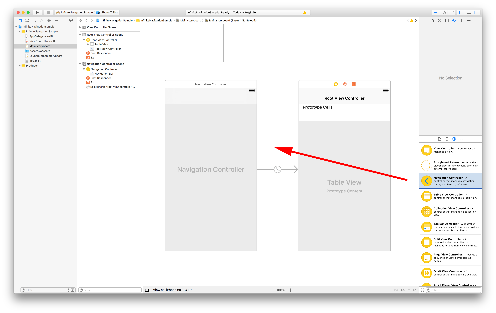
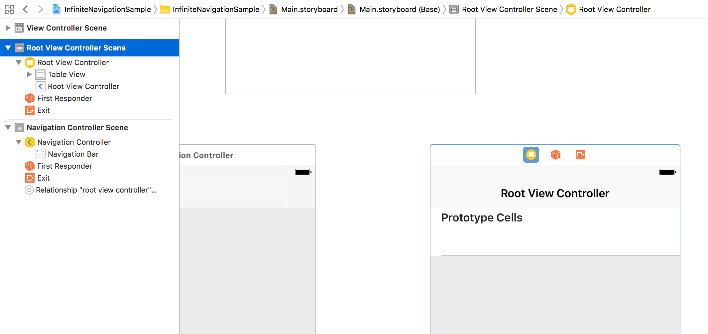
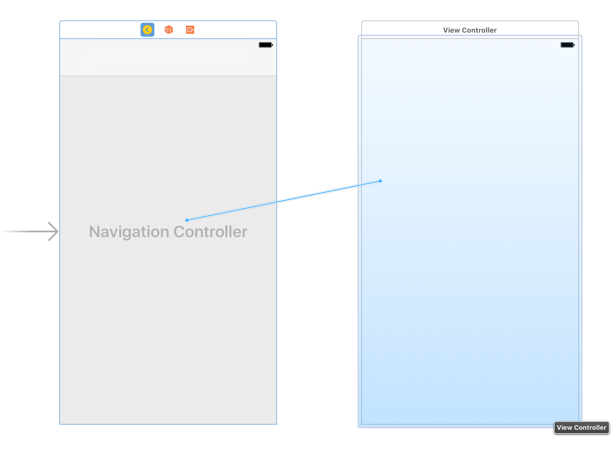
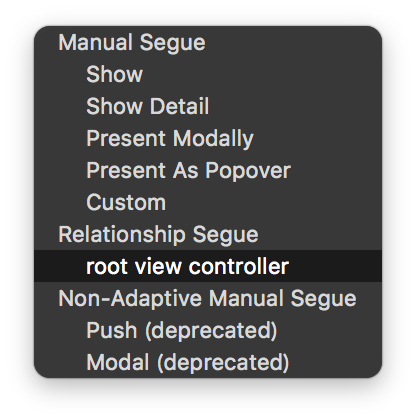
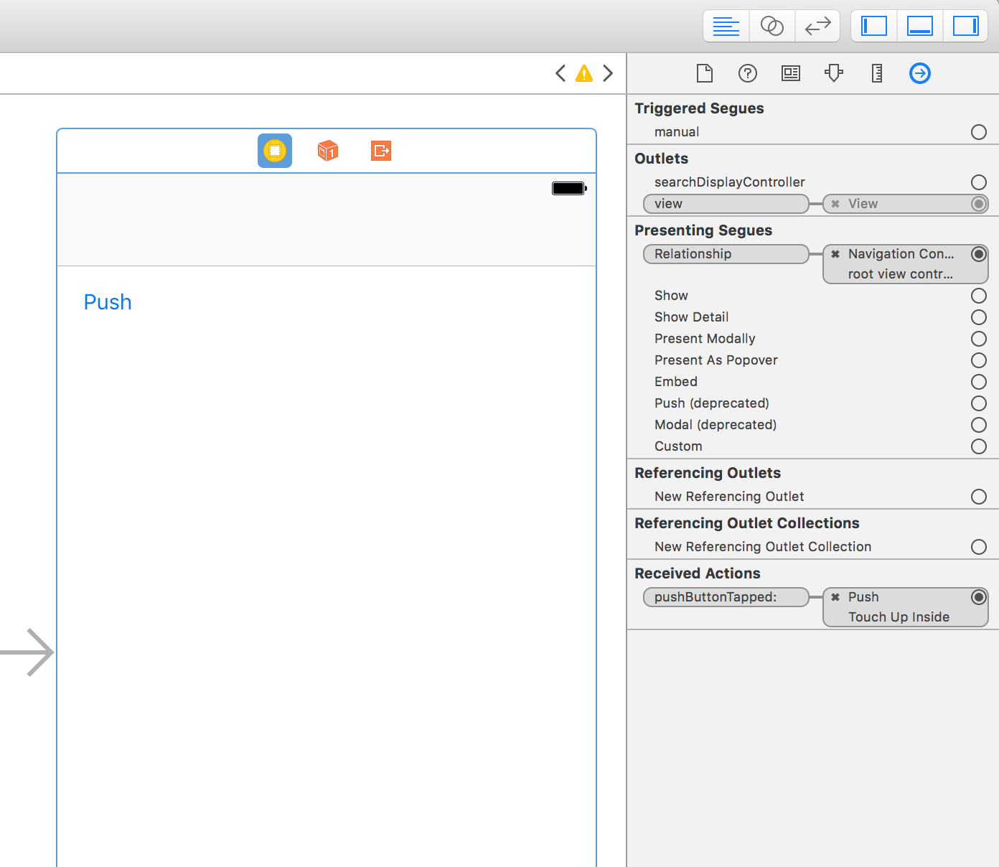
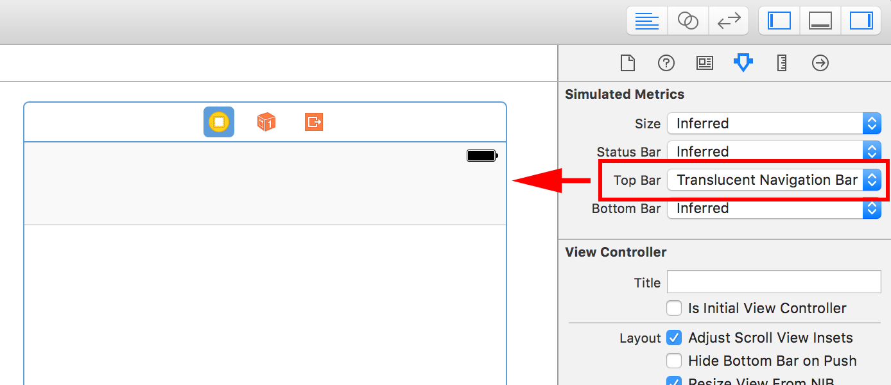

> 参考 [mixi-inc/iOSTraining 2.1 UINavigationController](https://github.com/mixi-inc/iOSTraining/wiki/2.1-UINavigationController)

[UINavigationController Class Reference](https://developer.apple.com/reference/uikit/uinavigationcontroller) | [View Controller Programming Guide for iOS](https://developer.apple.com/jp/documentation/featuredarticles/ViewControllerPGforiPhoneOS/Introduction/Introduction.html)

# 概要

> 

> [API Reference UINavigationController](https://developer.apple.com/reference/uikit/uinavigationcontroller) から引用

UINavigationController は UIViewController を階層的に管理するコンテナです。複数の UIViewController はスタックで管理されます。またその各 UIViewController にナビゲートするインタフェース（UINavigationBar, UIToolBar）も管理します。

> 
> [View Controller Programming Guide for iOS](https://developer.apple.com/jp/documentation/featuredarticles/ViewControllerPGforiPhoneOS/TheViewControllerHierarchy/TheViewControllerHierarchy.html#//apple_ref/doc/uid/TP40007457-CH33-SW1) から引用

UINavigationController における重要なプロパティとメソッドは以下の通りです。

##### プロパティ

| プロパティ名 | 説明 |
| ------------| ---- |
| [viewControllers](https://developer.apple.com/reference/uikit/uinavigationcontroller/1621873-viewcontrollers) | NavigationControllerで管理されているViewControllerのスタックを取得できます。 |
| [navigationBar](https://developer.apple.com/reference/uikit/uinavigationcontroller/1621877-navigationbar) | NavigationControllerを使っているときに画面上部に表示されるバー。ViewControllerのタイトルや画面遷移に関するボタンを配置します。 |
| [toolbar](https://developer.apple.com/reference/uikit/uinavigationcontroller/1621882-toolbar) | NavigationControllerを使っているときに画面下部に表示されるバー。表示しているViewControllerに固有の操作や、あまり重要でない操作を行うボタンなどを配置することが多いです。 |

##### メソッド

| メソッド名 | 説明 |
| --------- | ---- |
| [`init(rootViewController:)`](https://developer.apple.com/reference/uikit/uinavigationcontroller/1621858-init) | 最初に表示するViewControllerとしてrootViewControllerを渡してUINavigationControllerを生成するイニシャライザです。 |
| [`pushViewController(_:animated:)`](https://developer.apple.com/reference/uikit/uinavigationcontroller/1621887-pushviewcontroller) | 引数として渡したViewControllerへ遷移します。このViewControllerはスタックに積まれ、遷移の階層が一つ深くなります。 |
| [`popViewController(animated:)`](https://developer.apple.com/reference/uikit/uinavigationcontroller/1621886-popviewcontroller) | 一つ前の階層に戻る画面遷移を行います。またスタックの階層は一つ浅くなります。|

# 実装

プロジェクトについては[before/day2/1.1/InfiniteNavigationSample](../../before/day2/1.1/InfiniteNavigationSample)をご覧ください。

## navigationController の表示、push

無限に push する画面遷移を実装しましょう。プロジェクトテンプレートで Single View Applicationを作って以下の手順で実装を行います。

1. UINavigationControllerを配置して、Initial View Controllerに指定
2. 無限に表示されるViewControllerのクラス(ViewController)を作成
3. このクラスをstoryboard上で定義し、ボタンを追加、ボタンタップ時のハンドラをソースコードに記述して紐づける
4. ボタンタップ時に新しいViewControllerにpushするようにコードを記述する

##### 1 UINavigationControllerを配置して、Initial View Controllerに指定  

storyboard上にUINavigationControllerを配置してください。



配置時についているRoot View Controllerは、今回使用しないので削除してください。



Initial View Controllerの指定方法は、[day1 1.3.1 UIViewControllerのカスタマイズ（stroyboard）](https://ghe.ca-tools.org/suzuki-taiki/natibootcamp-ios/blob/master/pages/day1/1-3-1_UIViewController-customization-storyboard.md#initial-view-controller%E3%81%AB%E8%A8%AD%E5%AE%9A)で説明しているので割愛します。

##### 2 ViewControllerをNavigationControllerのRoot View Controllerに指定  

UINavigationControllerから`control`を押しながら、ViewControllerにドラッグをすると  



このようにRoot View Controllerに指定できるポップアップが表示されるので、Root View Controllerに指定してください。



##### 3 このクラスをstoryboard上で定義し、ボタンを追加、ボタンタップ時のハンドラをソースコードに記述して紐づける

このあたりは、 [1.4.1 UIViewControllerのModalViewController（storyboard）](https://ghe.ca-tools.org/suzuki-taiki/natibootcamp-ios/blob/master/pages/day1/1-4-1_ModalViewController-storyboard.md)で行った内容なので割愛します。
ViewControllerのstoryboard ID はクラス名と同じで、ViewController
ボタンタップ時のハンドラは `pushButtonTapped(_:)` としています。



##### 4 ボタンタップ時に新しいViewControllerにpushするようにコードを記述する

新しいViewControllerをstoryboardから生成して、pushします。

```swift
// ViewController.swift
@IBAction func pushButtonTapped(_ sender: UIButton) {
    guard let viewControlelr = storyboard?.instantiateViewController(withIdentifier: "ViewController") as? ViewController else {
        return
    }
    navigationController?.pushViewController(viewControlelr, animated: true)
}
```

UIViewControllerはプロパティとして [`navigationController`](https://developer.apple.com/reference/uikit/uiviewcontroller/1621860-navigationcontroller) を持っています。このプロパティが自分を管理しているUINavigationControllerになるので、このプロパティに対して `pushViewController(_:animated:)`を実行します。

シミュレータを実行するとViewControllerが表示され、ボタンをタップすると次々画面遷移できれば完了です。


Main.storyboard


rootView の TopBar を NavigationBar にすると、NavigationBar が現れます。これは実際に NavigationBar を設置しているのでは無く、NavigationBar がある体でレイアウトをするという意味です。この ViewController には NavigationBar が入ってくるので、それを考慮して他のレイアウトを作ることが出来ます。

**確認**　: navigationController.viewControllers にスタックされていることを、ログで確認してください。

### 演習

1. 上記で解説した、"無限にPushできる画面遷移" を実装してください
2. 1.の課題にさらに、各階層をNavigationBarに表示するようにしてください。

ヒント : UIViewControllerのプロパティ [`title`](https://developer.apple.com/reference/uikit/uiviewcontroller/1621364-title)を使います。

回答は [after/day2/1.1/InfiniteNavigationSample](../../after/day2/1.1/InfiniteNavigationSample) をごらんください。

## NavigationBar UINavigationItem

[UINavigationBar Class Reference](https://developer.apple.com/reference/uikit/uinavigationbar)

[UINavigationItem Class Reference](https://developer.apple.com/reference/uikit/uinavigationitem)

UINavigationBar は UINavigationItem を管理するためのコンテナです。UINavigationItem は各 ViewController が持っていて、NavigationBar に表示させる情報を管理しています。

> 
> [iOS View Controller
カタログ](https://developer.apple.com/jp/documentation/ViewControllerCatalog.pdf) から引用

NavigationBar 右上方にボタンを設置してみましょう。ボタンタップで pop を実装しましょう。

VIewController.swift

```swift
override func viewDidLoad() {
    super.viewDidLoad()
    // Do any additional setup after loading the view, typically from a nib.
    let rightButton = UIBarButtonItem(title: "pop", style: .plain, target: self, action: #selector(ViewController.rightButtonTapped(_:)))
    navigationItem.rightBarButtonItem = rightButton
}

func rightButtonTapped(_ sender: UIBarButtonItem) {
    navigationController?.popViewController(animated: true)
}
```

## カスタマイズ と UIAppearance protocol

[UIAppearance Protocol Reference](https://developer.apple.com/reference/uikit/uiappearance)

UIAppearance を用いると、特定の UIComponent のデザインを一括して変更することが出来ます。

AppDelegate.swift

```swift
func application(_ application: UIApplication, didFinishLaunchingWithOptions launchOptions: [UIApplicationLaunchOptionsKey: Any]?) -> Bool {
    // 省略
    if let navigationController = window?.rootViewController as? UINavigationController {
        navigationController.navigationBar.setBackgroundImage(UIImage(named: "customNavBarImage1"), for: .default)
    }
    UINavigationBar.appearance().backgroundColor = .red
    UIBarButtonItem.appearance().tintColor = .black
    // 省略
}
```

画像データはこちら [customNavBarImage1.png](https://raw.github.com/mixi-inc/iOSTraining/master/SampleProjects/2.1/MixiNavigationSample/MixiNavigationSample/customNavBarImage1.png)

画像はAssets.xcassetsに追加することで、使用できるようになります。  
画像は1x、2x、3xのものをそれぞれ設定する必要があります。  
最近では、pngではなくてpdfとして出力されたベクター画像を使うことが多いです。


変更できるコンポーネントとできないコンポーネントがあるんですが、 `UI_APPEARANCE_SELECTOR` というアノテーションのついたプロパティは変更できます。

詳しくは [http://nshipster.com/uiappearance/](http://nshipster.com/uiappearance/) をご覧ください。


### 演習2.

以下の画面遷移を行うアプリケーションを作ってください。

プロジェクトについては[before/day2/1.1/NavigationSample](../../before/day2/1.1/NavigationSample)をご覧ください。

##### 遷移の仕様

* 最初に表示される画面にボタンが三つ並んでいる (ボタンタイトルはそれぞれ "Button A", "Button B", "Button C")
* それぞれのボタンをタップすると次のViewControllerにpushされる
* 遷移先の画面の中央にどのボタンがタップされて遷移されたかが表示される


##### ヒント

上の遷移図のようにstoryboardで遷移先のViewControllerを３つ全て別々に組み上げることもできますが、遷移先のViewControllerをひとつのクラスにまとめるほうがシンプルです。

* Segueを使わずに、NextViewControllerに遷移するようにしてください。
* NextViewControllerを1つにまとめてください。

##### 回答

以下のプロジェクトをごらんください。  
[after/day2/1.1/NavigationSample](../../after/day2/1.1/NavigationSample)
