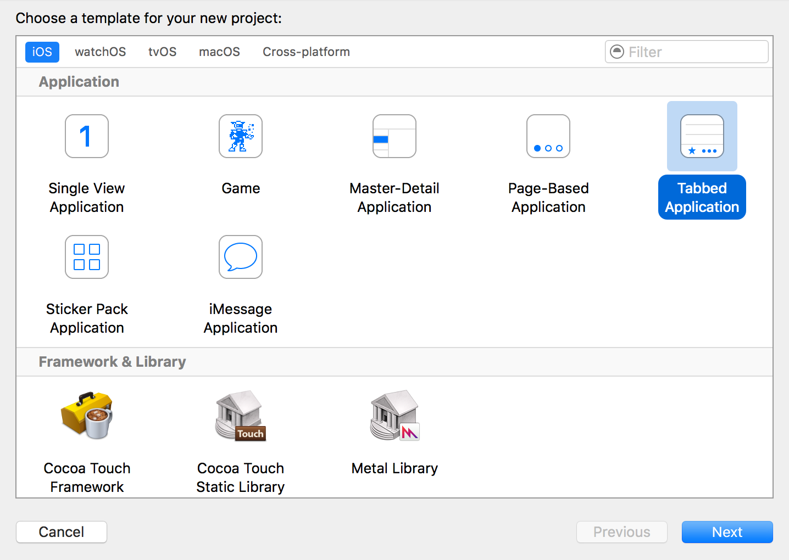

> 参考 [mixi-inc/iOSTraining 2.2 UITabController](https://github.com/mixi-inc/iOSTraining/wiki/2.2-UITabController)

[UITabBarController Class Reference](http://developer.apple.com/library/ios/#documentation/uikit/reference/UITabBarController_Class/Reference/Reference.html)

[iOS View Controllerプログラミングガイド](https://www.google.co.jp/url?sa=t&rct=j&q=&esrc=s&source=web&cd=1&cad=rja&ved=0CDMQFjAA&url=http%3A%2F%2Fdeveloper.apple.com%2Fjp%2Fdevcenter%2Fios%2Flibrary%2Fdocumentation%2FViewControllerPGforiPhoneOS.pdf&ei=UGlnUYi7K87ykAXXiYCQAQ&usg=AFQjCNGdaDn2IS1bJpHD08rsGEroiXr9RQ&sig2=qKCoJdJvpNipFuAD2NXfQw&bvm=bv.45107431,d.dGI)

# 概要

> 
> [UITabBarController Class Reference](https://developer.apple.com/reference/uikit/uitabbarcontroller) から引用

UITabBarController は TabBar インタフェースを用いて ViewController を管理するコンテナです。

> 
> [View Controller Programming Guide for iOS](https://developer.apple.com/jp/documentation/ViewControllerPGforiOS.pdf) から引用

UITabBarController における重要な property と method は以下の通りです。

- viewControllers - viewController が含まれている NSArray
- selectedViewController - 現在表示されている ViewController を取得、別のViewControllerに変更可能なプロパティ
- delegate - 表示変更などのイベントを取得できる delegate
[UITabBarControllerDelegate Protocol](https://developer.apple.com/reference/uikit/uitabbarcontrollerdelegate)

tab の表示は ViewController の UITabBarItem を設定することで変更可能

# 実装
## プロジェクト作成


## moreViewControllers と tabBarItem
viewControllers に 5 つ以上の ViewController を管理させる場合、Tab では 4 つを管理し、それ以外の ViewController は more として管理されます。

> 

> [iOS View Controllerプログラミングガイド](https://developer.apple.com/jp/documentation/ViewControllerPGforiOS.pdf) から引用

FirstViewController.swift
```swift
init(imageName: String) {
    super.init(nibName: "FirstViewController", bundle: nil)
    title = imageName
    tabBarItem?.image = UIImage(named: imageName)
}
```

`init(nibName:bundle:)`を呼ぶためには、`FirstViewController.xib`が必要になります。

AppDelegate.swift
```swift
func application(_ application: UIApplication, didFinishLaunchingWithOptions launchOptions: [UIApplicationLaunchOptionsKey: Any]?) -> Bool {
    // Override point for customization after application launch.
    if let tabBarContorller = window?.rootViewController as? UITabBarController {
        let viewControllers: [UIViewController] = [
            FirstViewController(imageName: "first"),
            FirstViewController(imageName: "second"),
            FirstViewController(imageName: "third"),
            FirstViewController(imageName: "fourth"),
            FirstViewController(imageName: "fifth"),
            FirstViewController(imageName: "sixth")
        ]
        tabBarContorller.viewControllers = viewControllers
    }
    return true
}
```

画像ファイルは[こちら](./images/day2/1_2/icons)

## tab のバッジ
> 

> [iOS View Controllerプログラミングガイド](https://www.google.co.jp/url?sa=t&rct=j&q=&esrc=s&source=web&cd=1&cad=rja&ved=0CDMQFjAA&url=http%3A%2F%2Fdeveloper.apple.com%2Fjp%2Fdevcenter%2Fios%2Flibrary%2Fdocumentation%2FViewControllerPGforiPhoneOS.pdf&ei=UGlnUYi7K87ykAXXiYCQAQ&usg=AFQjCNGdaDn2IS1bJpHD08rsGEroiXr9RQ&sig2=qKCoJdJvpNipFuAD2NXfQw&bvm=bv.45107431,d.dGI) から引用

tabBar の上にバッジを表示することが可能です。

```swift
tabBarItem.badgeValue = "5"
```

# Storyboardを用いた方法
Storyboardを用いることで、視覚的にTabBarControllerとその中に入るViewControllerをデザインすることができます。
プロジェクトテンプレートから作成するときに"Tabbed Application"を選ぶと、起動時にTabBarControllerが表示されるアプリケーションが作成されます。


またそのUIはMain.storyboardに記載されています。


新しくViewControllerを追加する際は、ViewControllerをstoryboard上に追加し、Tab Bar Controller から controlを押しながらViewControllerへドラッグします


その後、segueは "view controllers" を選択します。


このように追加したViewControllerにSegueが追加されていれば完了です。


# 演習
* storyboard上のTabBarControllerに対して、新しくViewController（ThirdViewController）を追加してください。
* xibからロードしたViewContorller（FourthViewController）を更に追加してください。

解答は [after/day2/1.2/TabSample](../../after/day2/1.2/TabSample) をごらんください
