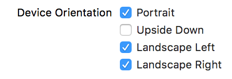

> 参考 [mixi-inc/iOSTraining 2.4 Supporting Multiple Interface Orientations](https://github.com/mixi-inc/iOSTraining/wiki/2.4-Supporting-Multiple-Interface-Orientations)

 [View Controller Programming Guide for iOS](https://developer.apple.com/jp/documentation/ViewControllerPGforiOS.pdf)

> 
> [View Controller Programming Guide for iOS](https://developer.apple.com/jp/documentation/ViewControllerPGforiOS.pdf) から引用

iPhone の複数の向きに対応する方法を説明します。

まずアプリを作成する前に、
- このアプリはどの方向に対応させるのか
- 回転対応する場合、どの画面を回転対応させるのか
- 回転中のアニメーションはどうするのか
を考えましょう。

回転対応させる方法は大きく分けて二つあります。

- ViewController 内で回転時に再レイアウトする
- Portrait 用 Landscape 用の二つの ViewController を用意する

# ViewController 内で回転時に再レイアウトする

下の完成系を目指します。


## 回転処理の流れ

> 

> [View Controller Programming Guide for iOS](https://developer.apple.com/jp/documentation/ViewControllerPGforiOS.pdf) から引用


## 回転方向の宣言

1. プロジェクトファイルの summary でサポートする回転を設定


2. 回転させたい ViewController で回転宣言

```swift
// [1] rootViewController から回転通知が各 ViewController に通達される
// 各 ViewController は自身が回転に対応するかどうかを返答する

// 書かなくても project summary で設定している方向に回転する
// 書いた場合は、こちらの設定が優先される
override var supportedInterfaceOrientations: UIInterfaceOrientationMask {
    return [.portrait, .landscape]
}
```

## 回転時のアニメーション設定

```swift
// [2] view の描画
override func viewWillLayoutSubviews() {
    super.viewWillLayoutSubviews()
    print("will layout subviews")
}

// [3] 回転前処理
override func viewWillTransition(to size: CGSize, with coordinator: UIViewControllerTransitionCoordinator) {
    if size.width > size.height {
        print("to Landscape")
    } else {
        print("to Portrait")
    }
}

// [4] traitCollectionが変更される場合、任意のアニメーションをここで設定
override func willTransition(to newCollection: UITraitCollection, with coordinator: UIViewControllerTransitionCoordinator) {
    print("will change collection")
}

// [5] traitCollection変更完了処理
override func traitCollectionDidChange(_ previousTraitCollection: UITraitCollection?) {
    print("did change collection")
}
```

# Portrait 用 Landscape 用の二つの ViewController を用意する

同じモデルを使って portrait, landscape の view を表現する必要がある場合、二つの ViewController を実装して出し分けるとシンプルに対応できます。

下の完成系を目指します。


ViewController.m

```swift
class ViewController: UIViewController {

    lazy var landscapeVC: LandscapeViewController? = {
       return self.storyboard?.instantiateViewController(withIdentifier: "LandscapeViewController") as? LandscapeViewController
    }()

    override var shouldAutorotate: Bool {
        return false
    }

    override func viewDidLoad() {
        super.viewDidLoad()
        // Do any additional setup after loading the view, typically from a nib.

        // UIDevice オブジェクトからの回転通知生成を宣言
        UIDevice.current.beginGeneratingDeviceOrientationNotifications()

        // UIDevice からの通知受け取り登録
        NotificationCenter.default.addObserver( self,
                                      selector: #selector(ViewController.orientationChanged(_:)),
                                          name: NSNotification.Name.UIDeviceOrientationDidChange,
                                        object: nil)
    }

    // 通知時のメソッド
    func orientationChanged(_ notification: Notification) {
        switch UIDevice.current.orientation {
        case .portrait:
            guard let landscapeVC = landscapeVC, presentedViewController == landscapeVC else { return }
            dismiss(animated: false, completion: nil)
        case .landscapeLeft, .landscapeRight:
            guard let landscapeVC = landscapeVC, presentedViewController != landscapeVC else { return }
            present(landscapeVC, animated: false, completion: nil)
        default:
            return
        }
    }
}
```

LandscapeViewController.swift

```swift
override var supportedInterfaceOrientations: UIInterfaceOrientationMask {
    return .landscape
}
```
