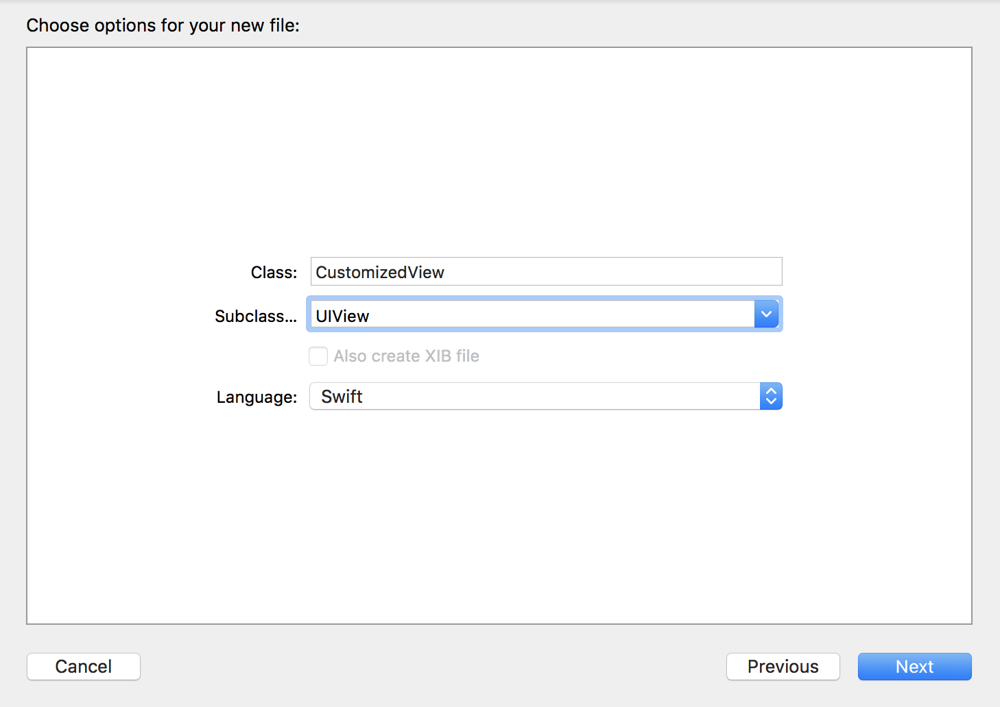
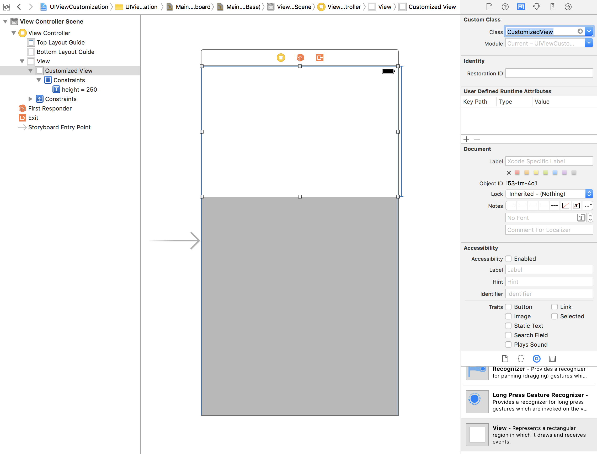
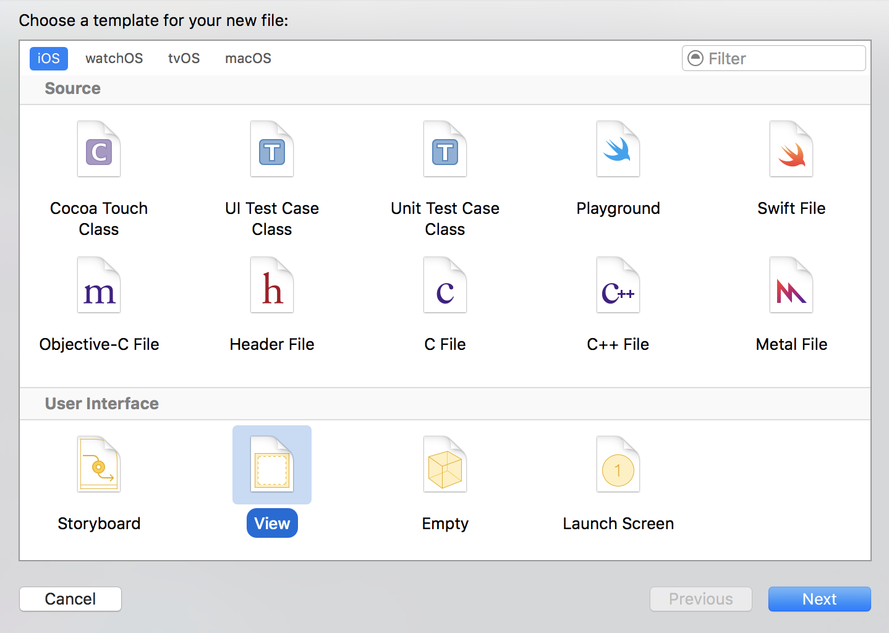
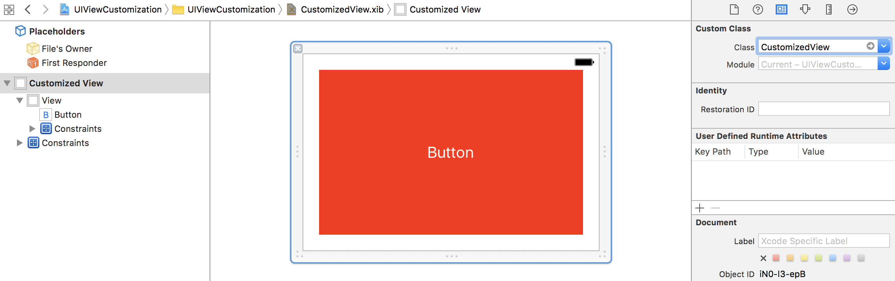
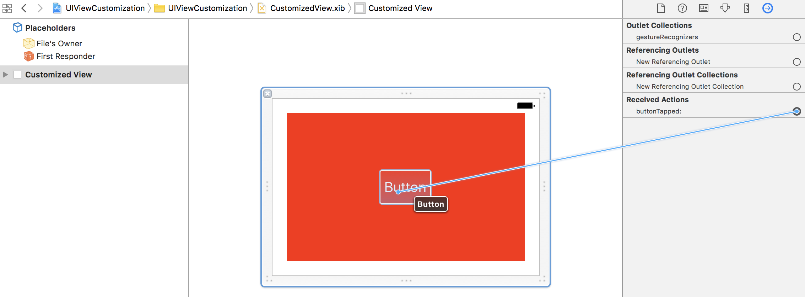

> 参考 [mixi-inc/iOSTraining 3.2 UIView のカスタマイズ](https://github.com/mixi-inc/iOSTraining/wiki/3.2-UIView-%E3%81%AE%E3%82%AB%E3%82%B9%E3%82%BF%E3%83%9E%E3%82%A4%E3%82%BA)

UIKit で提供されている view component を組み合わせてカスタムビューを作成すれば、あらゆる場面で再利用可能になり開発効率があがります。

ここではカスタムビューコンポーネントの作成方法として xib を使用した方法と使用しない方法の二つを紹介します。

## xib を使用しないカスタムビューコンポーネントの作成方法

### 1. UIView のサブクラスファイル作成



### 2. UIView サブクラスの実装

CustomizedView.swift

```swift
class CustomizedView: UIView {
    private struct Const {
        static let subviewFrame = CGRect(x: 10, y: 10, width: 300, height: 100)
        static let labelFrame = CGRect(x: 10, y: 10, width: 220, height: 30)
    }

    // コードで初期化する場合
    override init(frame: CGRect) {
        super.init(frame: frame)
        initializeView()
    }

    // xibを使用する場合
    required init?(coder aDecoder: NSCoder) {
        super.init(coder: aDecoder)
    }

    // xibを使用した場合に呼ばれる
    override func awakeFromNib() {
        super.awakeFromNib()
        initializeView()
    }

    private func initializeView() {
        let subview = UIView(frame: Const.subviewFrame)
        subview.backgroundColor = .red
        addSubview(subview)

        let label = UILabel(frame: Const.labelFrame)
        label.text = "hogehoge"
        label.backgroundColor = .clear
        subview.addSubview(label)
    }
}
```

### 3. 使用するクラスの xib に設定



## xib を使用するカスタムビューコンポーネントの作成方法
[NSBundle UIKit Additions Reference](https://developer.apple.com/reference/foundation/nsbundle#//apple_ref/doc/uid/TP40007485-CH1-DontLinkElementID_1)

### xib ファイル作成



### xibのviewにCustomizedViewを割り当てる



### xib から view 読み込みを実装

CustomizedView.swift
```swift
class CustomizedView: UIView {
    class func view() -> CustomizedView {
        return Bundle.main.loadNibNamed("CustomizedView", owner: nil, options: nil)?.last as! CustomizedView
    }

    // xibを使用した場合に呼ばれる
    override func awakeFromNib() {
        super.awakeFromNib()
    }
}
```

### ボタンアクションを紐付ける

ボタンアクションなどのひも付けも可能です。

CustomizedView.xib



```swift
class CustomizedView: UIView {
    class func view() -> CustomizedView {
        return Bundle.main.loadNibNamed("CustomizedView", owner: nil, options: nil)?.last as! CustomizedView
    }

    // xibを使用した場合に呼ばれる
    override func awakeFromNib() {
        super.awakeFromNib()
    }

    @IBAction func buttonTapped(_ sender: UIButton) {
        print("tapped!")
    }
}
```
