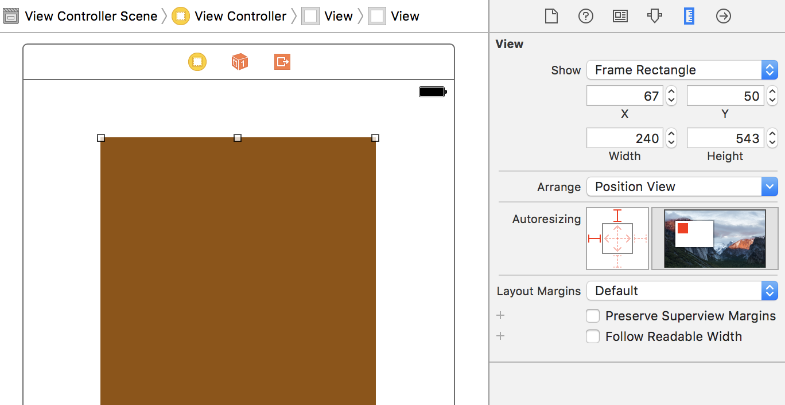
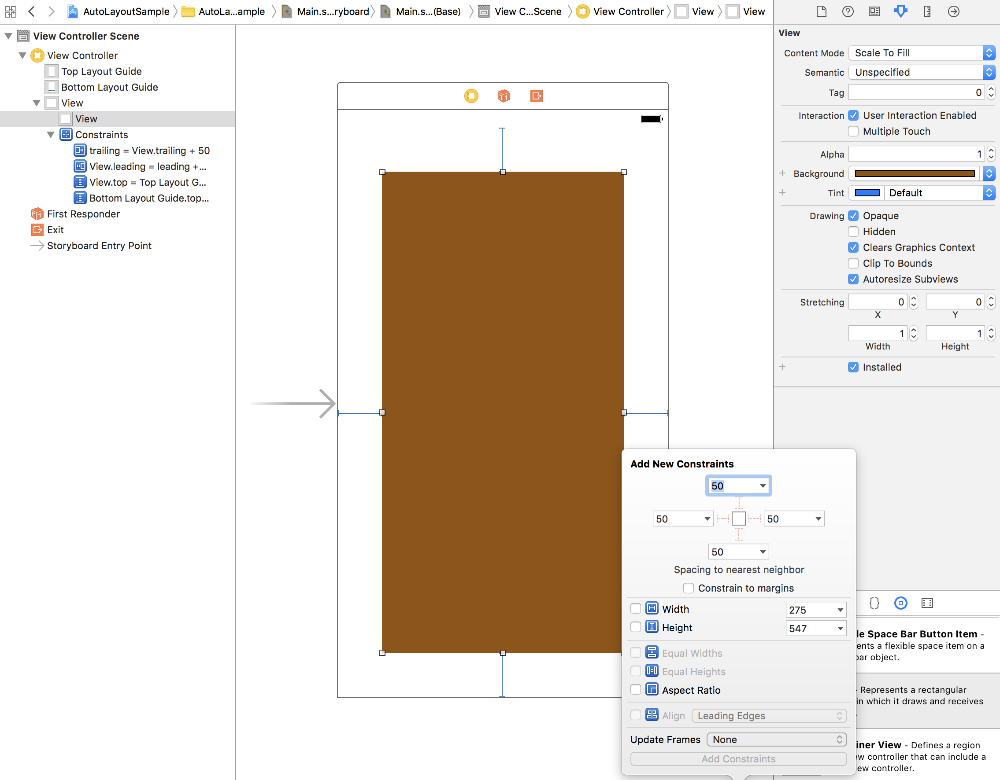
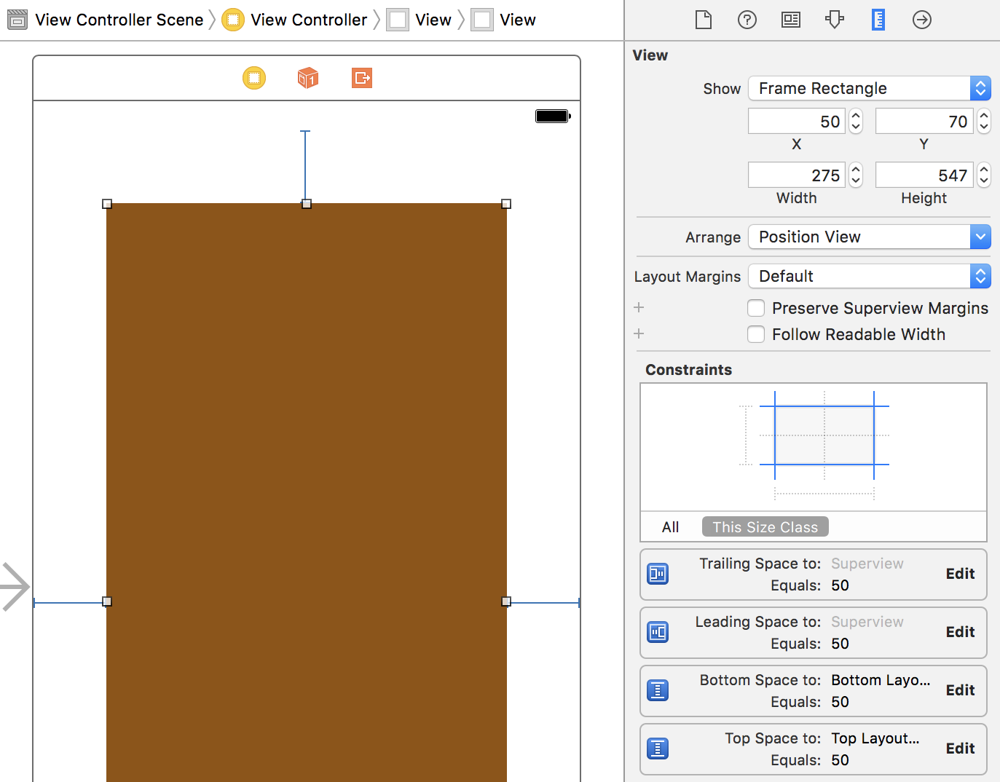
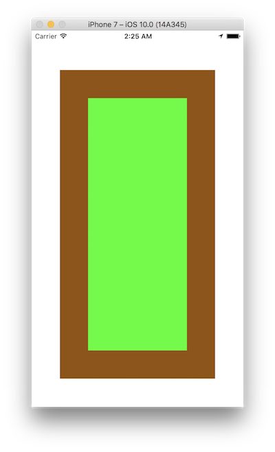
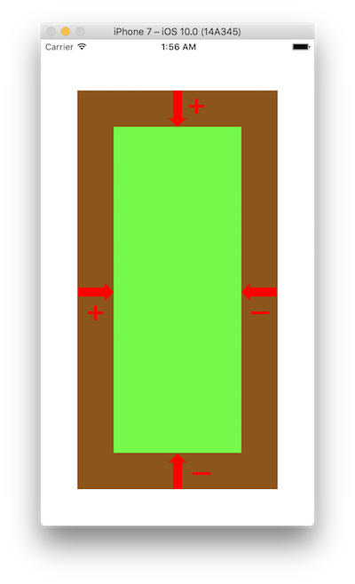

[Auto Layoutガイド](https://developer.apple.com/jp/documentation/UserExperience/Conceptual/AutoLayoutGuide/GettingStarted/GettingStarted.html#//apple_ref/doc/uid/TP40010853-CH2-SW1) | [NSLayoutConstraint class documentation](https://developer.apple.com/reference/uikit/nslayoutconstraint)

# 概要

Auto Layoutの基本的な概念となる、制約（Constraint）という概念があります。画面上に配置されたView要素に対して、「ある要素から右に20pt離す」、「ある要素の中心に揃える」などの制約を追加することでレイアウトを決定していきます。  
InterfaceBuilder上で制約を追加する方法と、コード上で制約を追加する方法の2つがあります。

>   
> 参考 [Auto Layoutガイド](https://developer.apple.com/jp/documentation/UserExperience/Conceptual/AutoLayoutGuide/GettingStarted/GettingStarted.html#//apple_ref/doc/uid/TP40010853-CH2-SW1)より

## InterfaceBuilder上で制約を追加

まず、ViewControllerのview上にviewを置きます。この時点では制約がついていないので、AutoresizingMaskが有効になっています。



このviewにsuperviewに対して、上下左右に50pxずつのスペースを持たせる制約をつけます。



制約をつけるとAutoLayoutが有効になるので、Size Inspectorの表示が変わります。



AutoLayoutが有効になることで上下左右に50pxずつのスペースを持たせたレイアウトが、画面サイズが変わったしても有効になります。

## コード上で制約を追加

コード上で制約を追加するためには、 `NSLayoutConstraint`をしようします。  
下図ではbrownViewに対して、greenViewの上下左右に50pxのスペースがあります。



これをコードで制約を追加しようとした場合、以下のようにあります。

```swift
class ViewController: UIViewController {

    @IBOutlet weak var brownView: UIView!

    override func viewDidLoad() {
        super.viewDidLoad()
        // Do any additional setup after loading the view, typically from a nib.

        let greenView = UIView()
        greenView.backgroundColor = .green
        // AutoresizingMaskが自動的にconstantに変換されてしまうので、falseにします。
        greenView.translatesAutoresizingMaskIntoConstraints = false
        brownView.addSubview(greenView)
        // brownViewに制約を追加
        brownView.addConstraints([
            //greenViewのtopがbrownViewのtopから見て、+50 * 1の位置になる。
            NSLayoutConstraint(item: greenView, attribute: .top, relatedBy: .equal, toItem: brownView, attribute: .top, multiplier: 1, constant: 50),
            //greenViewのleftがbrownViewのleftから見て、+50 * 1の位置になる。
            NSLayoutConstraint(item: greenView, attribute: .left, relatedBy: .equal, toItem: brownView, attribute: .left, multiplier: 1, constant: 50),
            //greenViewのrightがbrownViewのrightから見て、-50 * 1の位置になる。
            NSLayoutConstraint(item: greenView, attribute: .right, relatedBy: .equal, toItem: brownView, attribute: .right, multiplier: 1, constant: -50),
            //greenViewのbottomがbrownViewのbottomから見て、-50 * 1の位置になる。
            NSLayoutConstraint(item: greenView, attribute: .bottom, relatedBy: .equal, toItem: brownView, attribute: .bottom, multiplier: 1, constant: -50)
        ])
    }
}
```

コードで制約を追加した場合は、画面に対するx座標、y座標の方向に適した数値を指定する必要があります。  
これは、制約をつけるviewがどちらがtoItemになるかによっても変わるので注意が必要です。



superviewに対する制約だけではなく、subview同士での制約を追加することも可能です。

使用できる`NSLayoutAttribute`は[こちら](https://developer.apple.com/reference/uikit/nslayoutattribute)確認できます。

このサンプルは[samples/day2/sample2-4](../../samples/day2/sample2-4)にあります。
