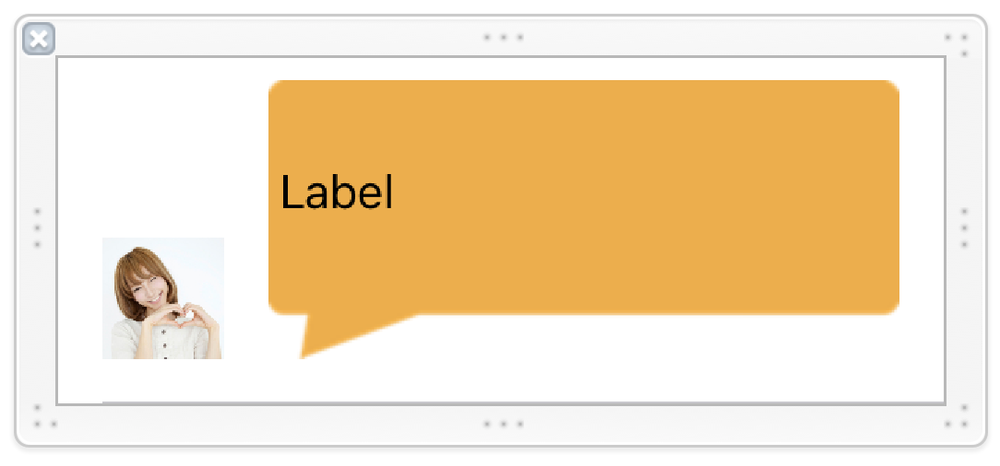
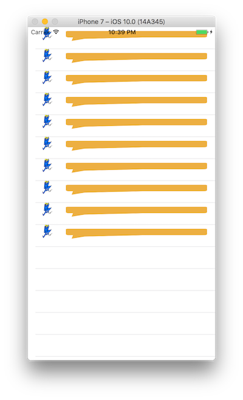
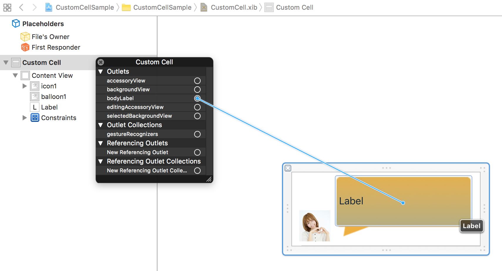
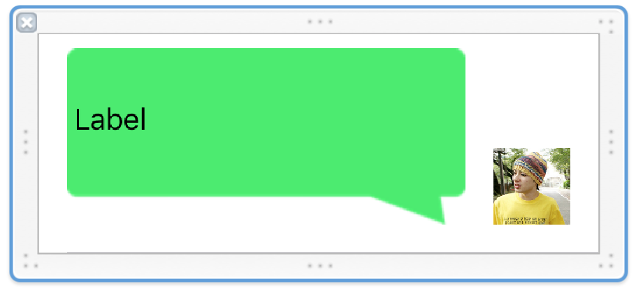
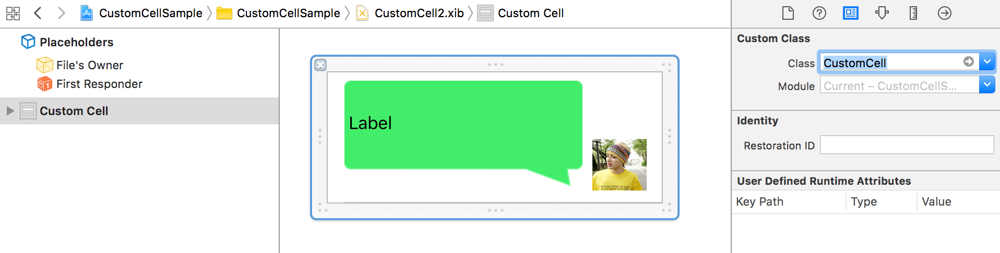
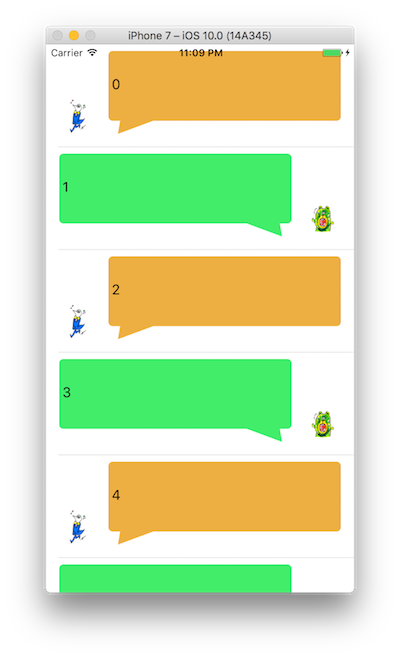

> 参考 [mixi-inc/iOSTraining 4.3 セルのカスタマイズ](https://github.com/mixi-inc/iOSTraining/wiki/4.3-%E3%82%BB%E3%83%AB%E3%81%AE%E3%82%AB%E3%82%B9%E3%82%BF%E3%83%9E%E3%82%A4%E3%82%BA)

UITableViewCellには、デフォルトでいくつかのオプションがあります。

例):
- detailLabel : タイトルより小さめのUILabel。
- accessoryType : このボタンを押したらこういうアクションですよ、というのを伝える目印
- imageView : 画像を貼れる、ただしアイコンサイズ

このようなオプションはありますが、カスタマイズ性は低く、オリジナルなデザインを用いることは難しいです。


そこで、ここではxibを使ってカスタムセルを作り、tableviewに表示する方法を紹介します。

# UITableViewとカスタムセル

カスタムセルを作り、tableviewで用いるには以下の手順が必要です
- xibでセルを作る
  - さらに動的な変更を加える場合は.mファイルを追加しその中で変更を加える、ということも可能です
- 作ったtableviewのセルとして登録
- セルの高さに合わせてcellの高さを変える

この手順に沿って、実装を進めて行きます。
プロジェクトファイルは4.2のものから引き続きで問題ありません。
(注:TableViewのスタイルはPlainにしておいてください）

今回は以下の画像を使うので、サンプルプロジェクトに追加してください


###カスタムセルのxibの追加

- XcodeのNewFileから Cocoa Touch Class を選択し、UITableViewCellのサブクラスとしてクラスを作成します。
クラス名は、CustomCellとしました。
- 次に同じ名前のxibファイルを作ります。NewFileからUserInterface → Empty を選んで、セルのクラス名と同じ名前で保存してください。(サンプルではTVSCustomCellです)
この辺りは、前回のviewをxibから作る、とほぼ同じです。
- Interface builder から TableViewCell をドラッグアンドドロップしてCellを作り、以下のようにカスタマイズしてください。
    1. 高さを125pxくらいにする
    2. 左下16,16くらいの位置に正方形(44×44くらいの大きさ)のUIImageViewを置いて、imageをicon1.png か icon2.png を指定してください
    3. (x,y) = (76, 8), (width, height) = (228, 101) くらいの位置と大きさでUIImageViewを置いて、imageにballoon1.pngを指定してください。ストレッチが少しおかしいので、(x,y) = (0.75, 0.5), (width, height) = (0, 0) として、角が変に伸びないように調整します。
    4. 吹き出し画像の上にLabelを貼ります。
      - (x,y) = (80, 12), (width, height) = (220, 73) の位置と大きさ
      - フォントは system 15pt くらいに指定します。

- 以下のようにできていればOKです。




### カスタムセルの登録と利用

カスタマイズしたセルをUITableViewで表示するためには、viewDidLoadで以下のメソッドを呼び出します。
```swift
tableView.register(UINib(nibName: "CustomCell", bundle: nil), forCellReuseIdentifier: "cell")
```
- このメソッドでは、指定されたCellReuseIdentifierに対して再利用できるセルがなかった時に自動的にロードするxibファイルを指定できます
- nibNameは今自作したxibファイル名を指定してください。
- CellReuseIdentifierには再利用する際のキーを指定します。今回は"cell"を用いているので、それにあわせています。
- そうすると、`dequeueReusableCell(withIdentifier:)`は以下のようになります


```swift
let cell = tableView.dequeueReusableCell(withIdentifier: "cell") as! CustomCell
```

実行すると以下のような画面になります。作成したCellを利用できていればOKです！




### セルの高さの調整やレイアウトの調整

自分で作ったセルを再利用することはできましたが、セルがオーバーラップしていたり、裏側にテキストがあったりして、なかなかに見づらいです。
そこで、これらのレイアウトの調整を行います

#### セルの高さの調整

セルがオーバーラップしているのは、セルの高さが固定でデフォルト値の44pxとなっているためです。セルの内容に合わせて高さを動的に変更する場合、delegateメソッドである`tableView(_:heightForRowAt:)`を実装する必要があります。

```swift
func tableView(_ tableView: UITableView, heightForRowAt indexPath: IndexPath) -> CGFloat {
    return 125
}
```
今回、セルの高さを125pxとしたので、固定で125pxを返しています。

注)hogeのような文字が表示される、と言う場合はとりあえずtextをセットしないとうまくきます。


#### テキストを動的に変更する
カスタムセルを使うことは出来るようになりましたが、中身は動的に変化させることができていません。
そこで、カスタムセルの中でテキストラベルのプロパティを作り、その中でセットさせます。

###### 1. プロパティの追加 - カスタムセルのヘッダファイルで以下のようにプロパティを追加してください

```swift
@IBOutlet weak var bodyLabel: UILabel!
```

###### 2. xibで接続

カスタムセルを選択し、右クリックをして出てきたポップアップのbodyLabelと紐付けていきます。



###### 3. datasourceでの変更の反映

ViewControllerでカスタムセルを定義したヘッダファイルをインポートし、`tableView(_:cellForRowAt:)` 内で以下のようにテキストをセットします。

```swift
let cell = tableView.dequeueReusableCell(withIdentifier: "cell") as! CustomCell
cell.bodyLabel.text = "\(indexPath.row)"
```
実行して、以下のようにテキストが反映されればOKです！


# 複数のカスタムセル

マイマイに引き続き、大輔のセルを追加して、会話させているようにしましょう。  
手順は以下の通りです

1. 新しいxibの追加
2. 異なるCellReuseIdentifierをつける
3. 各行ごとに用いるCellReuseIdentifierを使い分ける

#### 1. 新しいxibの追加

CustomCell2という名前で新しいxibファイルを追加してください。  
xibにTable View Cell を追加し、以下のようにパーツを配置して行ってください



- クラス設定は`CustomCell`にする



#### 2. 異なるCellReuseIdentifierをつける

今、二つのセルのxibを作りました。tableviewではCellReuseIdentifierを用いて出し分けを行っているので、それぞれのxibに異なるcellReuseIdentifierを設定します。

viewControllerのviewDidLoadでregisterNibをしていた箇所を以下のように変更します。

```swift
tableView.register(UINib(nibName: "CustomCell", bundle: nil), forCellReuseIdentifier: "cell")
tableView.register(UINib(nibName: "CustomCell2", bundle: nil), forCellReuseIdentifier: "cell2")
```
CustomCell.xibのidentifierにcellを、CustomCell2.xibのidentifierにcell2を、それぞれ設定しています。

呼び出しでは以下のように変更します。

```swift
let identifier = indexPath.row % 2 == 0 ? "cell" : "cell2"
let cell = tableView.dequeueReusableCell(withIdentifier: identifier) as! CustomCell
cell.bodyLabel.text = "\(indexPath.row)"
```
(行が偶数の時はマイマイを、奇数の時はダイスケを表示するようにしています)
呼び出す時に、viewDidLoadで登録したidentiferを利用してdequeueすると、登録したxibのセルが返ってきます。

実行すると次のようになります。



カスタムセルの利用はここまでとなります。お疲れ様でした。


### TIPS : 同じクラスに対して二つのxibを登録できるのか？
登録することができます。というのも、xibとクラスは必ずしも一対一で対応していないためです。
例えばViewControllerの挙動は一緒だけど、見た目(xib)だけは変えたい、とか今回のように表示する項目は同じだけどセルの見た目は変えたいということがあります。iPadとiPhoneで同じコントローラ使いたいけどxibは別物がいい、と言う時ですね。

そういう時のために、一つのクラスに対して複数のxibを登録することができるようになっています。view controller の `init(nibName:bundle:)`などがその例で、同じクラスだけどxibを切り替えて使えるようになっています。

※classが違っても、protocolで宣言するpropertyを共通化するパターンもあります。

サンプルは[samples/day2/sample3-3](../../samples/day2/sample3-3)にあります。
