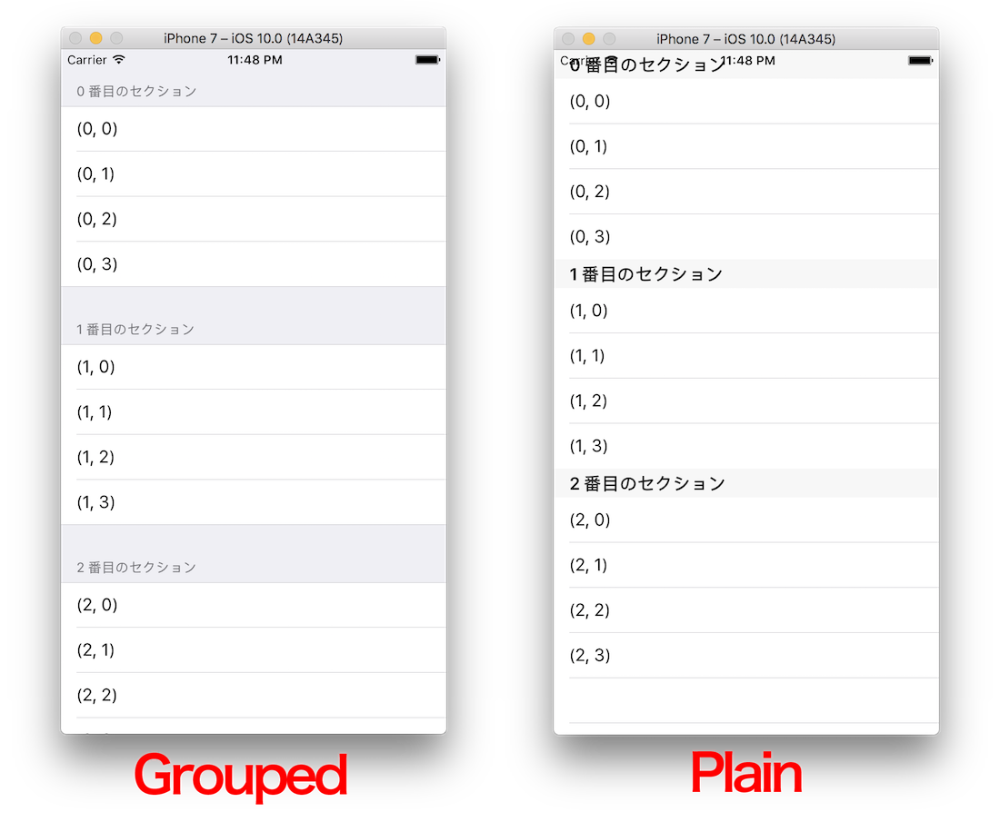
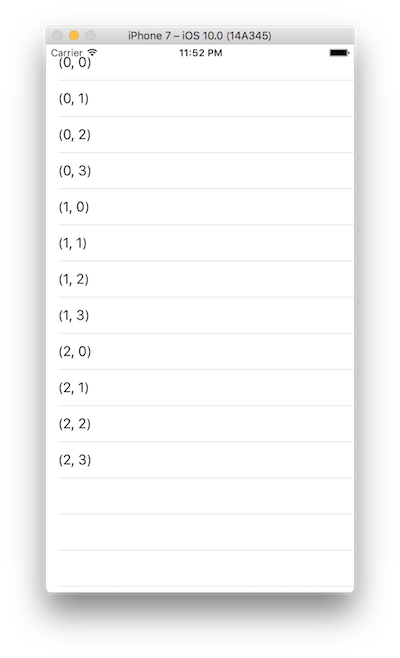
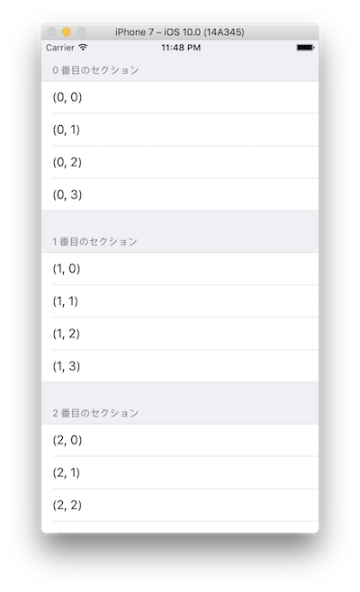
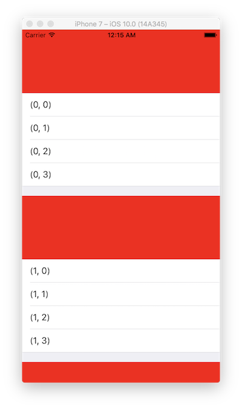
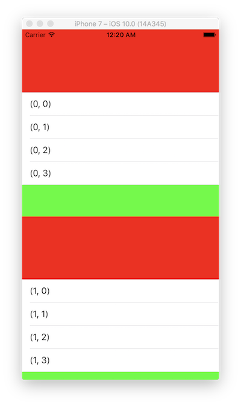

> 参考  [mixi-inc/iOSTraining 4.4 UITableViewのその他のオプション、カスタマイズ](https://github.com/mixi-inc/iOSTraining/wiki/4.4-UITableView%E3%81%AE%E3%81%9D%E3%81%AE%E4%BB%96%E3%81%AE%E3%82%AA%E3%83%97%E3%82%B7%E3%83%A7%E3%83%B3%E3%80%81%E3%82%AB%E3%82%B9%E3%82%BF%E3%83%9E%E3%82%A4%E3%82%BA)

3.3までで、最低限のUITableViewの使い方は紹介しました。
この章では、3.3までで説明できなかったけど、よく用いられるtableviewの機能を紹介します。

**目次**

1. Section
2. Header, Footer
3. RefreshControll

# 1. Section

3.1で紹介したように、UITableViewは行ごと(cell)だけでなく、Sectionによって区切ることができます。
セクションで区切ることで、表示するデータをグルーピングして表示することができます。



セクションを追加する時に必要なメソッドは`numberOfSections(in:)`のみで、TableViewに表示するセクションの数を返してやります。  
行数は各セクションごとに区切られ、tableview全体で通しの番号でないので注意してください

### セクションを実際に使ってみる

3.1の終了時のものまで一度戻してみてください

新しく作り直す時、必要な処理は

1. サンプルプロジェクトを作る
2. xibでviewControllerにtableviewを貼付け、ソースコードと紐づける
3. ヘッダファイルで UITableViewDataSourceとUITableViewDelegateの委譲を宣言し、実装する。必要なメソッドは以下の二つです
  - `tableView(_:numberOfRowsInSection:)`
  - `tableView(_:cellForRowAt:)`

以上です。

では実際にセクションを追加します。

```swift
func tableView(_ tableView: UITableView, numberOfRowsInSection section: Int) -> Int {
    // 行数を返す
    return 3
}
```

この状態で実行すると、次のようになると思います。
表示するテキストは `"(\(indexPath.section), \(indexPath.row))"`としました。





セクションの区切りが出来ているのが分かるかと思います。
tableviewのスタイルをgroupedにすると、より分かれて表示できます。

セクションにはタイトルを付けることもできます。delegateメソッドの一つである、tableView:titleForHeaderInSection:でタイトルを返すことができます。
例えば、以下のように実装すると

```swift
func tableView(_ tableView: UITableView, titleForHeaderInSection section: Int) -> String? {
    return "\(section) 番目のセクション"
}
```

実行結果は次のようになります




# 2. Header, Footer

タイトルだけでなく、各セクションごとにヘッダとフッタを作ることで、よりリッチな表現をすることができます。
ヘッダをカスタマイズする場合は、次のメソッドを実装します。

```swift
func tableView(_ tableView: UITableView, heightForHeaderInSection section: Int) -> CGFloat
```
このメソッドでは、headerの高さを返します。

```swift
func tableView(_ tableView: UITableView, viewForHeaderInSection section: Int) -> UIView?
```
このメソッドでは、実際にheaderとなるviewを作って返します。

この二つを実装することでヘッダを表示することが出来ます。

### 実際にヘッダを作ってみる。

上述の通り、二つのメソッドを追加することでヘッダを追加することができます。

```swift
func tableView(_ tableView: UITableView, heightForHeaderInSection section: Int) -> CGFloat {
    return 120
}

func tableView(_ tableView: UITableView, viewForHeaderInSection section: Int) -> UIView? {
    let view = UIView(frame: .zero)
    view.backgroundColor = .red
    return view
}
```
今回は高さ120pxで、背景色が赤のviewを貼付けました。
以下のようになれば正解です！




### フッタについて

フッタもヘッダと同様に高さを返すメソッドと、viewを作るメソッドを実装すれば実現することが出来ます。

```swift
func tableView(_ tableView: UITableView, heightForFooterInSection section: Int) -> CGFloat
```

と

```swift
func tableView(_ tableView: UITableView, viewForFooterInSection section: Int) -> UIView?
```

の二つです。headerと同じ処理になるので、詳解は割愛します。



# 3. UIRefreshControl

UIRefreshControlとは、引っぱり更新やPullToRefreshと呼ばれるアクションをサポートするUIで、tableviewを一番上までスクロールしてさらに引っ張ることでデータを更新するUIです。

### 前提条件など

このコンポーネントは、UITableViewControllerというview controller の機能の一つとして提供されています。
そのため、UITableViewControllerを継承したクラスを作り、その中で実装する必要があります。

### 仕組み

- UIRefreshControl は UIView > UIControl を継承しているview コンポーネントです。
- ある一定量以上引っ張られると UIControlEvent.ValueChanged のcontrol eventが飛ばされます
  - このイベントを取得できるようにセレクタを登録しておきます
  - 一定量以上引っ張ると、tableview上部でクルクル回り続けます
- 処理が終わったら、`endRefreshing`を呼ぶことでrefresh control をしまうことができます。


### 実際に使ってみる

###### 1. UIRefreshControlはUITableViewControllerのプロパティとして利用できるので、UITableViewControllerのサブクラスを一つ作ります。
  - storyboard上のUITableViewControllerとTableViewControllerを紐付けてください
  - .swiftファイルのなかで、セクションの数と行の数を適宜修正してください

###### 2. Initial View ControllerをTableViewControllerにしてください

(TableViewControllerはUITableViewControllerを継承したクラスです)
下準備はここまでです。

###### 3. UIRefreshControlの準備 - view controllerのviewDidLoadに以下を追加してください

```swift
// UIRefreshControlの生成
let refreshControl = UIRefreshControl()

// refreshControllがforControlEvents:UIControlEventValueChangedを発火した時に受け取るメソッドをneedRefreshにする
refreshControl.addTarget(self, action: #selector(TableViewController.needRefresh(_:)), for: .valueChanged)

// tableViewControllerのrefeshControlとしてセット
self.refreshControl = refreshControl
```

###### 4. 受け取るメソッドの実装 - 引っぱり更新されたときのメソッドです -

先ほど、needRefreshというメソッドを指定したのでそのメソッドを追加します。

```swift
func needRefresh(_ sender: UIRefreshControl) {
    perform(#selector(TableViewController.finishRefresh), with: nil, afterDelay: 3)
}
```

実際のコードではここにモデルの更新などの処理が含まれます。ここでは3.0秒後にfinishRefreshというメソッドを実行します。finishRefreshは次のように、refreshControlにendRefreshingを送るだけのメソッドとなっています。

```swift
func finishRefresh() {
    refreshControl?.endRefreshing()
}
```

ここまで実装すると、おそらく引っぱり更新ができるようになっていると思います。

この章はここまでです。お疲れ様でした。
