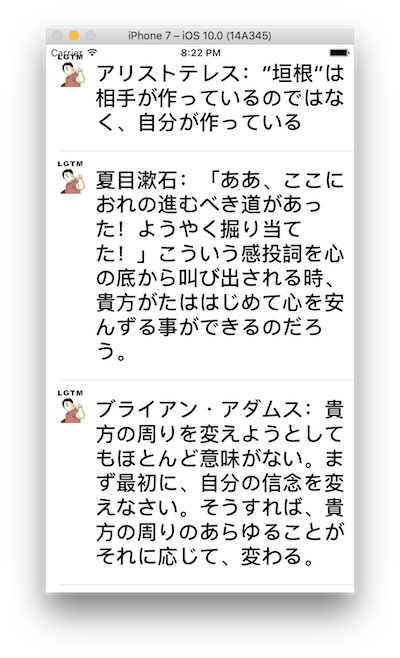
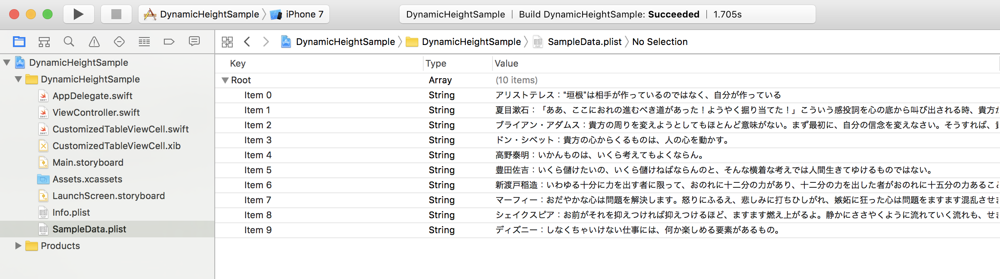

> 参考 [mixi-inc/iOSTraining HomeWork 4.1 Dynamic height with a custom uitableviewcell](https://github.com/mixi-inc/iOSTraining/wiki/HomeWork-4.1-Dynamic-height-with-a-custom-uitableviewcell)

動的に tableViewCell の高さを変えてみよう。

以下のように、テキストの量によって高さを変える tableView を作ってみましょう。



この課題では以下のことを調べてください。

## plist からデータの読み込み

plist は apple が用いているデータの定義で、XML で記述されているファイルです。



SampleData.plist
```xml
<?xml version="1.0" encoding="UTF-8"?>
<!DOCTYPE plist PUBLIC "-//Apple//DTD PLIST 1.0//EN" "http://www.apple.com/DTDs/PropertyList-1.0.dtd">
<plist version="1.0">
<array>
	<string>アリストテレス：“垣根”は相手が作っているのではなく、自分が作っている</string>
	<string>夏目漱石：「ああ、ここにおれの進むべき道があった！ようやく掘り当てた！」こういう感投詞を心の底から叫び出される時、貴方がたははじめて心を安んずる事ができるのだろう。</string>
	<string>ブライアン・アダムス：貴方の周りを変えようとしてもほとんど意味がない。まず最初に、自分の信念を変えなさい。そうすれば、貴方の周りのあらゆることがそれに応じて、変わる。</string>
	<string>ドン・シベット：貴方の心からくるものは、人の心を動かす。</string>
	<string>高野泰明：いかんものは、いくら考えてもよくならん。</string>
	<string>豊田佐吉：いくら儲けたいの、いくら儲けねばならんのと、そんな横着な考えでは人間生きてゆけるものではない。</string>
	<string>新渡戸稲造：いわゆる十分に力を出す者に限って、おのれに十二分の力があり、十二分の力を出した者がおのれに十五分の力あることがわかってくる。</string>
	<string>マーフィー：おだやかな心は問題を解決します。怒りにふるえ、悲しみに打ちひしがれ、嫉妬に狂った心は問題をますます混乱させます。問題の解決は心のおだやかな時にしなさい。</string>
	<string>シェイクスピア：お前がそれを抑えつければ抑えつけるほど、ますます燃え上がるよ。静かにささやくように流れていく流れも、せき止められればカンシャクを起こしたように暴れ出すわね。だけどそのさわやかな流れが阻まれなければ、エナメルをかけた石に触れて快い音を奏でるわね。</string>
	<string>ディズニー：しなくちゃいけない仕事には、何か楽しめる要素があるもの。</string>
</array>
</plist>
```
これを読み込んで NSArray オブジェクトを生成することが出来ます。どのように生成するか調べてみましょう。

## 文字列から高さを計算する

NSStringのインスタンスメソッド

```swift
func boundingRect(with size: CGSize, options: NSStringDrawingOptions, attributes: [String : Any]?, context: NSStringDrawingContext?) -> CGRect
```

 を用います。(ドキュメントはこちら[`boundingRect(with:options:attributes:context:)`](https://developer.apple.com/reference/foundation/nsstring/1524729-boundingrect))

引数には以下のように指定します。

* `size` : NSStringを描画する最大サイズ. 横幅を固定して縦をできるだけ伸ばす場合は `size.width = "固定値"`、`size.height = CGFloat.greatestFiniteMagnitude` のように指定します。
* `options` : NSStringを描画するときに利用するオプションです。複数行のテキストを描画する際は `NSStringDrawingOptions.usesLineFragmentOrigin` を指定します。
* `attributes` にはNSStringを描画するときに用いるattributeを指定します。(サイズや、フォントなどが指定できます。詳細ははこちら[Attributed String Programming Guide](https://developer.apple.com/library/ios/documentation/Cocoa/Conceptual/AttributedStrings/Articles/standardAttributes.html)をご覧ください)
* `context` : 描画のスケールなどを指定するときに `NSStringDrawingContext` のインスタンスを渡します。

##### 例)

"夏目漱石：「ああ、ここにおれの進むべき道があった！ようやく掘り当てた！」こういう感投詞を心の底から叫び出される時、貴方がたははじめて心を安んずる事ができるのだろう。"という文字列をフォントサイズ17pt, 最大幅320pt で表示する際の高さを求めます

```swift
let string = "夏目漱石：「ああ、ここにおれの進むべき道があった！ようやく掘り当てた！」こういう感投詞を心の底から叫び出される時、貴方がたははじめて心を安んずる事ができるのだろう。"
let maxSize = CGSize(width: 320, height: CGFloat.greatestFiniteMagnitude)
let attribute = [NSFontAttributeName : UIFont.systemFont(ofSize:17.0)]
let rect = (string as NSString).boundingRect(with: maxSize, options: .usesLineFragmentOrigin, attributes: attribute, context: nil)
print("\(rect)"); // (0.0, 0.0, 311.814, 101.435546875)
```

出力結果は、NSStringを描画する最小のサイズになります。UILabelなどのサイズを決める時はceilを使って切り上げます。

```swift
let sizeOfString = CGSize(width: ceil(rect.size.width), height: ceil(rect.size.height))
print("\(sizeOfString)") // (312.0, 102.0)
```

サンプルは[samples/day2/sample3-5](../../samples/day2/sample3-5)にあります。
