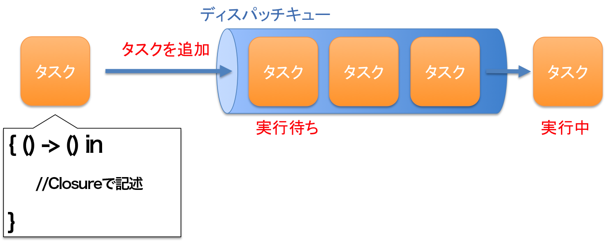

> 参考 [mixi-inc/iOSTraining 8.2 Grand Central Dispatch](https://github.com/mixi-inc/iOSTraining/wiki/8.2-Grand-Central-Dispatch)

この章では、iOSにおけるマルチスレッドの手法であるGCD(Grand Central Dispatch)の使い方と、使う上での注意点について解説します

この章では、次のAppleのドキュメントを参考に作成しています。
https://developer.apple.com/jp/devcenter/ios/library/documentation/ConcurrencyProgrammingGuide.pdf


## iOSにおけるマルチスレッド

iOSにおける並列処理の手法にはいくつかの手法があります。

- Thread : スレッドを立てて、そのスレッドの中で処理を行う。スレッドの管理やキューイングなどの管理はアプリケーションが行う。
- GCD (DispatchXxxx) : スレッドの管理などをOSレベルで実装したもの。処理をしたいタスクをClosureで渡す。渡されたタスクはキューに挿入されて逐次実行される。
  - Operation : GCDと同じように振る舞うオブジェクト。

この中で、GCDがよく利用されています。Threadだとスレッドの処理などを自前で書かないといけないのでコードが冗長になってしまい大変です。

そこで今回は、よく用いられるiOSにおける並列処理実行技術、GCDについて解説を進めて行きます。

### スマートフォンアプリにおける並列処理の必要性

3G回線などのよくない通信環境において使われるスマートフォンは、当然ながら通信の処理に時間を要します。またファイルへのアクセスやDBへのアクセスなどでも待ち時間が発生します。これらの処理を画面を描画するスレッド(iOSではメインスレッド)で行った場合、画面描画やユーザーのアクションへの反応ができなくなり、いわゆる"固まった"状態になってしまいます。(AppStoreの審査基準にも、起動後10秒以内にユーザーに何かしらの情報を提示しないとリジェクトの対象となる、とあります。)

一方で、最近のスマートフォンにはマルチコアのCPUが搭載されており、iPhone5に搭載されているApple A6プロセッサもコアを二つ搭載しています。しかし、並列して処理を行わない限り、各ステップは一つのスレッド上で実行されるので、複数のコアを持つ場合は持て余してしまいます。

そこで、待ち時間の発生する処理は別のスレッドで処理を行うことで、アプリケーションの応答性を上げることができ、また計算に時間のかかる処理などは複数のスレッドを用いて並列に処理を行うことでCPUのパワーを存分に発揮することができます。

こういった観点から、スマートフォンにおける並列処理は不可欠なのです。

# GCDとDispatchQueue

スマートフォンアプリにおいて、並列処理は必要不可欠ですが、スレッドのコードをアプリ内で記述するのはとても骨が折れます。そこで、並列処理を簡単に行うことのできる仕組みとしてGCDが登場しました。

GCDの仕組みを簡単に説明すると

- `DispatchQueue` というキューに処理を行いたい内容(タスク)を追加して行く
- キューに追加されたタスクはFIFOで順番に実行される
- タスクの実行は別スレッド上で実行される

となります。またさらに

- タスクはClosureとして登録する
- キューの管理はアプリケーション独自に作ったもの、アプリケーション起動時にシステム内で自動的に生成されるもの、の二種類がある
- 適切なスレッドへのタスクの振り分けはOSが行う
- アプリケーション内部で自動生成されたキューと、そのキューに追加されたタスクを実行するスレッドの管理はOSが自動的に行ってくれる

という特徴があります。


図にするとこんなイメージです。


ディスパッチキューを利用するにあたって必要なことはリファレンスに次のように述べられています

> タスクを非同期に実行する技術のひとつとして、Grand Central Dispatch（GCD）というものがありま
す。通常はアプリケーション中に記述するスレッド管理用のコードを、システムレベルで実装したも
のです。開発者がしなければならないのは、実行したいタスクを定義し、適切なディスパッチキュー
に追加することだけです。するとGCDは、必要なスレッドを生成し、そこでタスクを実行するよう適
切にスケジューリングします。
>
> [並列プログラミングガ
イド](https://developer.apple.com/jp/devcenter/ios/library/documentation/ConcurrencyProgrammingGuide.pdf) より

スレッドの生成や管理はシステムがやってくれるので、開発を進めて行く上で必要なことは、

- 実行したいタスクを定義する
- 適切なディスパッチキューに追加する

の2点になります。次項以降で、キューへの追加の方法と適切なキューの選び方を説明します。
またあわせて、GCDで利用できる他のAPIについても解説します.


## DispatchQueue への追加

DispatchQueue への追加には次の関数を使います。

| 関数名 | 説明 |
| ---- | ---- |
| `func async(group: DispatchGroup? = default, qos: DispatchQoS = default, flags: DispatchWorkItemFlags = default, execute work: @escaping () -> Void)  ` | Closureで定義された処理をqueueに追加する。タスクの処理は非同期で実行され、タスクの実行完了を待たずに制御は進む |
| `func sync(execute block: () -> Swift.Void) ` |  Closureで定義された処理をqueueに追加する。タスクの処理は同期的に実行され、タスクの実行が完了するまで制御は止まる |


それぞれの関数の引数は、処理をキューイングしたいキューを指定するqueueと、処理したい内容を記述したClosureです。
実際に用いてみると次のようになります

```swift
DispatchQueue.global(qos: .background).async(execute: {
    print("Hello GCD!")
})
```

この例では、queueとして優先度がバックグラウンドのglobal queueを取得しています(後述します）。また処理内容は、"Hello GCD!"と出力するものを指定しました。

これを適当な箇所で実行すると、コンソールに"Hello GCD!"と表示されます


## dispatch queue で用いることの出来るキューの種類

dispatch queueで用いられるキューにはいくつかの種類があります。まず大きく分類してみましょう。

| キューの種類 | 説明 |
| ---------- | ----|
| 直列 serial dispatch queue | タスクを同時に一つずつ追加された順に実行する仕組み。あるタスクの実行が終わると次のタスクの実行を行う。タスクは他のキューと独立したスレッド上で動作。 |
| 並列 concurrent dispatch queue | 複数のタスクを同時に実行する。実行の順番はキューに追加した順番になるが、終了のタイミングの順序は保証されない。同時に実行するタスクの数はシステムの状況に応じて変化する。アプリケーションが所有するglobal queueとアプリケーション内部で生成するqueueを持つことができる。キューには優先度をつけることができる |
| メインディスパッチキュー | アプリケーションのどこからでも利用することの出来るシリアルキューで、アプリケーションのメインスレッド上で実行される。UIの更新などはこのキューを用いて行う必要があります |


serial dispatch queue と concurrent dispatch queue の違いは以下のようになります


serial queue は同時に一つしか実行されないので、一つ前のタスクの結果によって次のタスクの処理が変わる場合に用いられることが多いです。例えばファイルやDBへのアクセスなどがそれに該当します。

一方でconcurrent queue は同時にいくつものタスクを並列に実行することができます。処理一つ一つが前回のタスクに依存しないとき、他のスレッドとデータを共有しないときなどで幅広く用いることができます。例えばダウンローダなどはこの仕組みを利用することができると思います。

### キューの生成と取得

これらのキューはどのようにして取得することができるのでしょうか、その点について次に説明します。

#### グローバルなコンカレントキューの取得

各アプリケーションには初めから優先度の異なる４つのグローバルキューが生成されており、アプリケーションのどこからでも取得できるようになっています。
次の関数で取得することができます。

```swift
class func global(qos: DispatchQoS.QoSClass = default) -> DispatchQueue
```

priorityには次のうち一つを指定してください。上から順に優先度が高いものになっています。

| キー名 | 優先度 |
| ----- | ----- |
| userInteractive | The user-interactive quality of service class. |
| userInitiated | The user-initiated quality of service class. |
| default | The default quality of service class. |
| utility | The utility quality of service class. |
| background | The background quality of service class |
| unspecified | The absence of a quality of service class. |

> 参考 [DispatchQoS.QoSClass](https://developer.apple.com/reference/dispatch/dispatchqos.qosclass)

#### メインキューの取得

メインキューを取得するには次の関数を利用します。

```swift
class var main: DispatchQueue
```

#### キューの生成

キューはグローバルなキューを取得するだけでなく、アプリケーションの一部のみで利用されるキューをアプリケーション内部で生成して利用することも出来ます。直列、並列なキューのどちらも生成することができます。

生成には次の関数を使います。

```swift
// concurrent queue
DispatchQueue(label: "com.example.myqueue", attributes: .concurrent)

//  serial queue
DispatchQueue(label: "com.example.myqueue")
```

labelには、キューのラベルをつけます。システム中で用いることはありませんが、デバッグを行った時のスタックトレースなどに出力されます。Appleのリファレンスによると、逆DNS記法でつけることが推奨されています(例:com.example.myqueue)

キューのタイプが直列か並列を指定します。直列の場合はattributesを指定せず、並列の場合はattributesを.concurrentに指定します。


### GCD用例

実際にGCDを用いて、どのように動作するかを確かめます。
適当なサンプルプロジェクトを作り、最初に表示されるviewControllerのviewDidLoadに書いていきます

検証は、

- 並列なキュー と 直列なキュー
- DispatchQueue async と DispatchQueue sync

をそれぞれ使った時にどうなるかを検証します。タスクの内容はコンソールにログを吐き出すだけとします。


#### 並列なキューで DispatchQueue async

並列に実行するので、実行の順番は保証されません。またasyncなので、タスクをキューに追加したら完了まで待ちません。

実行したコード

```swift
for i in 0..<100 {
    DispatchQueue.global().async {
        print(i)
    }
}
print("here!!")
```

ログのうち、最初の11行を抜粋

```
0
1
3
2
4
here!!
5
6
7
8
```

順番に実行されていること、"here!!"が全てのタスクの完了より前に来ていることがわかるかと思います。

**あるタスクは時間もかかり、かつその後の処理でこのタスクの結果を用いない、といったケースに向いています。**

#### 並列なキューで DispatchQueue sync

並列なキューなので、実行が完了する順番は保証されません。syncを用いているので、完了するまでキューに追加したスレッドは停止します。タスクの実行は本来まちまちになりますが、タスクの完了まで処理が進まないので、結果的に全てのタスクが順番に実行されます。

```swift
for i in 0..<100 {
    DispatchQueue.global().sync {
        print(i)
    }
}
print("here!!")
```

コンソールログ

```
0
1
2
3
~~ 中略 ~~
98
99
here!!
```

追加したタスクが実行完了するまで次に進まないので、"here!!"は最後に出力されています。

**DispatchQueueで行った内容を後ほど使う必要がある、と言う場合に使います。**

一般的には、syncを使わなくてもタスクを実行しないと次のステップに進まないのであえて使う必要はあまりないと思います。
例えば、タスクの内容を別スレッドにあえて投げて、現在実行中のスレッドを別のタスクで利用できるようにする、といった使い方はできるかもしれません。


#### 直列なキューで DispatchQueue async

直列なキューでは同時に実行されるタスクの数が1つに限られているので順番が前後することはありません。またasyncとしているので、キューにタスクを追加したらコードは次に進みます。

```swift
let queue = DispatchQueue(label: "com.example.queue")
for i in 0..<100 {
    queue.async {
        print(i)
    }
}
print("here!!")
```

```
0
here!!
1
2
3
4
5
6
```

出力は順番になっており、タスクを追加し終わると次に進んでいるのが分かるかと思います。


**直列なキューを使うので、キューでの処理内容に一意性が求められる時に使います。例えばファイルへのアクセスなどが該当します。ファイルへのアクセスなどは時間がかかるのでasyncで非同期実行するといった使い方ができます**


#### 直列なキューでDispatchQueue sync

直列なキューではタスクが同時に一つしか実行しないので競合が起きるなどの心配がなく、またsyncを用いるのでタスクの終了まで次のステップに進みません。

```swift
let queue = DispatchQueue(label: "com.example.queue")
for i in 0..<100 {
    queue.sync {
        print(i)
    }
}
print("here!!")
```

```
0
1
2
3
~~ 中略 ~~
98
99
here!!
```

**ファイルはDBなどのように不整合が起きうる箇所で、かつその読み込んだ内容を次で使う、といった場合に使います**


## GCDのその他のAPI

### DispatchGroup

いくつかの処理を分散して行いたい、そして分散して処理を行った結果をまとめて利用したい、といった時に利用できるのがDispatchGroupです。
DispatchGroup の利用の手順は以下のようになります。

1. DispatchGroupの作成
2. groupとqueueを指定して、タスクをqueueに追加
3. wait関数を用いてタスクの終了まで待機

以下にサンプルを示します。

```swift
let group = DispatchGroup() // 1. dispatch group の生成
for i in 0..<100 {
    // 2. タスクをdispatch queue に追加
    DispatchQueue.global().async(group: group) {
        print(i)
    }
}
// 3. タスクの終了まで待機
_ = group.wait(timeout: .distantFuture)

print("here!")
```

この時のコンソールへのログは以下のようになります。

```
0
4
3
5
~~~ 中略 ~~~
98
99
here!
```

例えば、ファイルへの分散の読み込みなどが使用例としてあげられます。


### DispatchWorkItemFlags.barrier

serial queueを用いることで一意性を保証することができます。しかしながら、例としてファイルへのアクセスなどでは、読み込みに関しては並列に行い、書き込みに関しては直列で行いたい、といった状況が想定できます。そのような時に用いるのがDispatchWorkItemFlags.barrierです。.barrierを使って追加されたタスクについては同時に実行されるタスクの数は１つのみとなります。

例えば、以下のような0..99までのループで10の剰余が0のときに文字列を書き換え、それ以外の時はその文字列をprintするサンプルを考えます。

```swift
var string = ""
for i in 0..<99 {
    guard i % 10 == 0 else {
        print("\(i) : string = " + string)
        continue
    }
    let range = string.startIndex..<string.index(string.startIndex, offsetBy: string.characters.count)
    string.removeSubrange(range)
    string += "\(i)"
}
```

この処理をDispatchQueueを使って並列に処理してみます。.barrierを使わずに書くと次のようになります。

```swift
let queue = DispatchQueue(label: "com.sample.barrier", attributes: .concurrent)
var string = ""
for i in 0..<99 {
    guard i % 10 == 0 else {
        queue.async { // 読み込み処理
            print("\(i) : string = " + string)
        }
        continue
    }
    queue.async { // 書き込み処理
        let range = string.startIndex..<string.index(string.startIndex, offsetBy: string.characters.count)
        string.removeSubrange(range)
        string += "\(i)"
    }
}
```

この時の処理結果は次のようになります

```
4 : string =
7 : string = 0
3 : string =
1 : string =
6 : string =
2 : string =
5 : string = 0
8 : string = 0
9 : string = 0
```

43162のタイミングではおそらく、removeSubrangeが完了したタイミングで呼ばれているのだと思います。このようにデータの不整合などを引き起こしかねません。

.barrierを使うと次のようになります。

```swift
let queue = DispatchQueue(label: "com.sample.barrier", attributes: .concurrent)
var string = ""
for i in 0..<99 {
    guard i % 10 == 0 else {
        queue.async { // 読み込み処理
            print("\(i) : string = " + string)
        }
        continue
    }
    // ここを変えた
    queue.async(flags: .barrier) { // 書き込み処理
        let range = string.startIndex..<string.index(string.startIndex, offsetBy: string.characters.count)
        string.removeSubrange(range)
        string += "\(i)"
    }
}
```

この時の結果は次のようになります。

```
6 : string = 0
7 : string = 0
8 : string = 0
9 : string = 0
11 : string = 10
13 : string = 10
12 : string = 10
15 : string = 10
14 : string = 10
```

データの不整合が起きていないことが分かると思います。このように.barrierはデータの書き込みなど、不整合を防ぐ目的で使うことができます。

## マルチスレッドを行う際の注意点

マルチスレッドプログラミングを行う際には、シングルスレッドの場合とは異なる注意点がいくつか存在します。
ここではその注意点のうち、注意したいものを紹介します。

### データの競合

複数のタスクが、同一のデータソース(ファイルやデータベースなど)にアクセスする際に、データの整合性が取れなくなることです。あるスレッドから読み込んだデータが実は他のスレッドでは書き込み中だった、といった時などに発生します。
上記、DispatchWorkItemFlags.barrierなどの例がデータに競合が起こっている例です。

回避策としては、

- DispatchWorkItemFlags.barrier
- 直列なキュー

などを使うことで同時にアクセスできるスレッドを制御するという方法があげられます。さらに粒度の高い制御が必要な場合、ディスパッチセマフォという機構も用意されています。

### デッドロック

デッドロックとは、複数のスレッドがお互いのスレッドの終了を待っているため、結果的にどちらの処理も進めることができなくなってしまうことを指します。GCDを用いる場合デッドロックを簡単に引き起こしてしまうので注意が必要です。特にsyncなどの処理を待つ使い方をする場合は注意が必要です。

たとえば次のようなコードはデッドロックを引き起こします。

```swift
let queue = DispatchQueue(label: "com.sample.deadlock") // serial queue
queue.sync {
    print("a")
    queue.sync {
        print("b")
    }
    print("c")
}
print("d")
```

`a`を出力したところで止まってしまいます。serial queueに対して、タスクを挿入して、さらに同じqueueにsyncでタスクを挿入しています。
タスクを追加して終了を待つも、自分自身も同じqueueの中で動いているので、そのタスク自体開始することができないので、処理が止まってしまいます。

回避するには、あるスレッドから同じスレッドのsyncを呼び出さないようにすることが必要です。そのために、必要以上にsyncを使わず、出来る限りasyncを使うことが推奨されます。

### メモリ管理

並列で複数の処理を行いたい場合、次のようにGCDを使うことは推奨されていません。

```swift
for i in 0..<100 {
    let queue = DispatchQueue(label: "com.sample.queue")
    queue.async {
        print(i)
    }
}
// ↓
let queue = DispatchQueue(label: "com.sample.queue", attributes: .concurrent)
for i in 0..<100 {
    queue.async {
        print(i)
    }
}
```

この例では、直列なキューを100個作り、そのキューの中にタスクを追加しています。キューを生成するということはコストの高い演算となります。シリアルなキューはリソースの保護やアプリケーション内での同期を計りたいなどの際に利用してください。純粋に並列実行する場合ならconcurrent queueを用いた方が効率が良いです。

また、生成したキューに関するメモリ管理はリファレンスカウンタ方式を用いてカウントしています。
