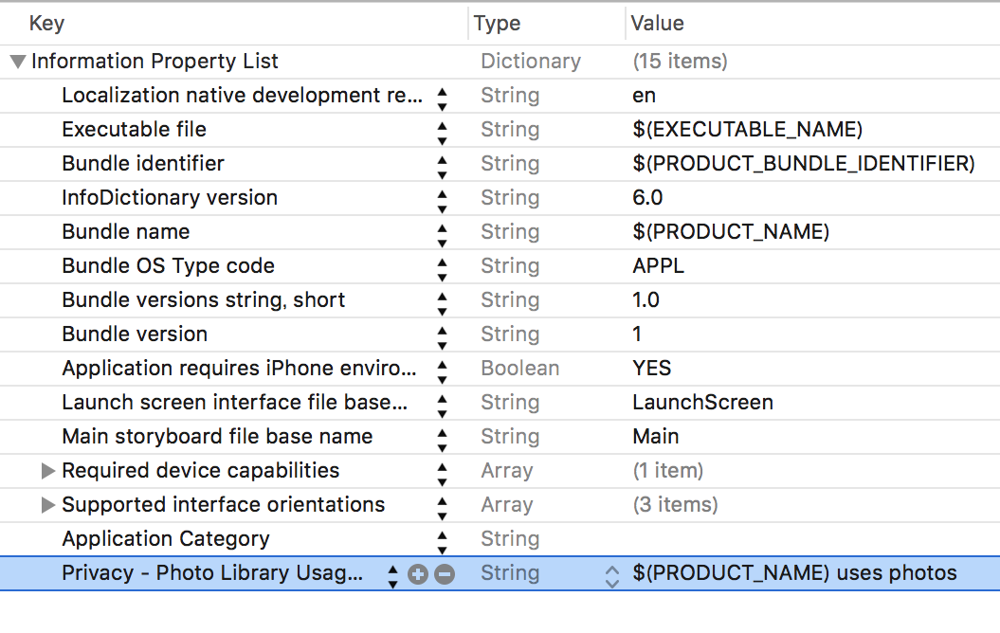

> 参考 [mixi-inc/iOSTraining 5.1 UIImagePickerController](https://github.com/mixi-inc/iOSTraining/wiki/5.1-UIImagePickerController)

### class reference

[UIImagePickerController Class Reference](https://developer.apple.com/reference/uikit/uiimagepickercontroller)

[UIImagePickerController Delegate Protocol](https://developer.apple.com/reference/uikit/uiimagepickercontrollerdelegate#//apple_ref/occ/intf/UIImagePickerControllerDelegate)

### プログラミングガイド

[カメラ操作のプログラ ミング（iOS用）につ いて](https://developer.apple.com/jp/devcenter/ios/library/documentation/CameraAndPhotoLib_TopicsForIOS.pdf)

UIImagePickerController を使って iPhone の中にあるメディアを参照してみましょう。

（UIImagePicker を使うことでデバイスのカメラ機能も呼び出すことが出来ますが、実機のみの確認となりますので本研修からは省略します）

## プライバシー情報へのアクセス

iOS10からプライバシー情報へアクセスする際に、Info.plistに使用するプライバシー情報のキーと説明文を明記しなくてはいけなくなりました。



これを明記しなかった場合、プライバシー情報にアクセスした際にクラッシュします。  
フォトライブラリにアクセスする場合は`NSPhotoLibraryUsageDescription`を記述します。

```
<key>NSPhotoLibraryUsageDescription</key>
<string>$(PRODUCT_NAME) uses photo</string>
```

## UIImagePickerController の呼び出し

実際にインスタンスを作成してモーダルとして表示させます。

UIImagePickerController 作成時に重要なプロパティがあります。

* sourceType : イメージッピッカーをカメラキャプチャとして起動するか、フォトライブラリへの参照として起動するか
* allowsEditing : 選択したメディアの編集（拡大縮小など）を許可する
* mediaTypes : Photo, Movie のどのメディアを選択可能にするか

mediaTypes


allowEditing


```swift
@IBAction func cameraButtonTapped(_ sender: UIButton) {
    let imagePickerVC = UIImagePickerController()
    // UIImagePickerControllerSourceType.savedPhotosAlbum だと直接写真選択画面
    imagePickerVC.sourceType = .photoLibrary
    // 選択したメディアの編集を可能にするかどうか
    imagePickerVC.allowsEditing = true

    // 選択可能なメディアの制限 デフォルトは photo のみ。
    // movie を選択可能にするには
    // imagePickerVC.mediaTypes = UIImagePickerController.availableMediaTypes(for: imagePickerVC.sourceType)!
    imagePickerVC.delegate = self
    present(imagePickerVC, animated: true, completion: nil)
}
```

UIImagePickerController の mediaType は public.image で写真のみの選択が可能となっています。

## delegate の実装

```swift
func imagePickerController(_ picker: UIImagePickerController, didFinishPickingMediaWithInfo info: [UIImagePickerController.InfoKey : Any]) {
```

を実装して、写真選択完了のイベントを取得しましょう。

```swift
extension ViewController: UIImagePickerControllerDelegate, UINavigationControllerDelegate {
    func imagePickerController(_ picker: UIImagePickerController, didFinishPickingMediaWithInfo info: [UIImagePickerController.InfoKey : Any]) {
       dismiss(animated: true, completion: nil)

       imageView.image = info[.originalImage] as? UIImage
    }
}
```

photo 選択の場合 info の中身

```swift
[
    "UIImagePickerControllerEditedImage": <UIImage: 0x61000009ea50> size {750, 750} orientation 0 scale 1.000000,
    "UIImagePickerControllerMediaType": public.image,
    "UIImagePickerControllerCropRect": NSRect: {{131, 547}, {1406, 1406}},
    "UIImagePickerControllerReferenceURL": assets-library://asset/asset.JPG?id=99D53A1F-FEEF-40E1-8BB3-7DD55A43C8B7&ext=JPG,
    "UIImagePickerControllerOriginalImage": <UIImage: 0x61000009f720> size {1668, 2500} orientation 0 scale 1.000000
]
```


### 問題

下図のような画面遷移を実装してください。

