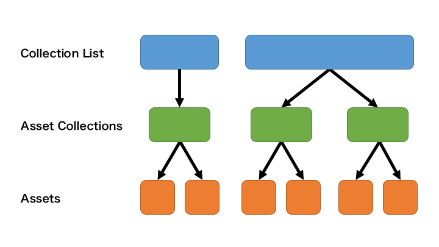
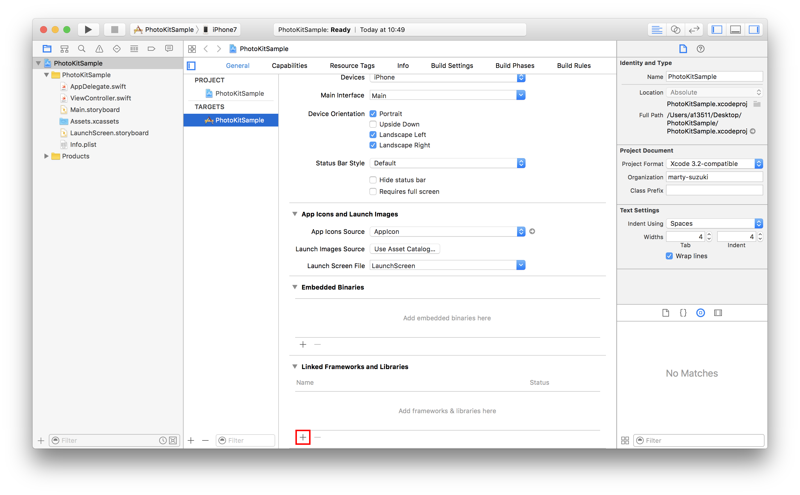
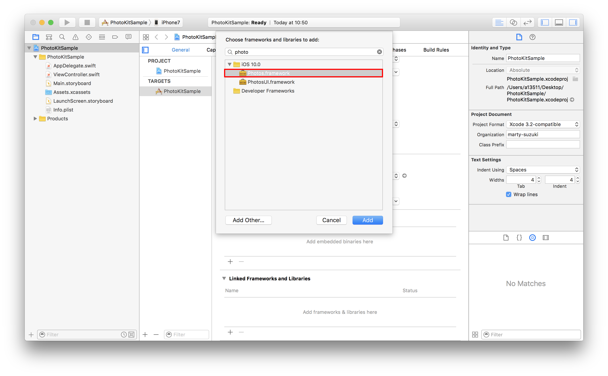

> 参考 [mixi-inc/iOSTraining 5.2 Assets Library](https://github.com/mixi-inc/iOSTraining/wiki/5.2-Assets-Library)

iOS8.0 から導入された PhotoKit を使うことで、個々のメディア(asset)をオブジェクトとして扱うことが出来ます。またそのメディアのメタデータへのアクセスも可能になります。これによって、UIImagePicker では実現できなかった写真の複数枚選択や、写真に含まれている位置情報を使うなど、様々な表現を実現できるようになります。

今回の章で主に扱うPhotoKitのクラスは下記になります。

* [PHCollectionList](https://developer.apple.com/reference/photos/phcollectionlist) - PHAssetCollectionの集合のオブジェクト。
* [PHAssetCollection](https://developer.apple.com/reference/photos/phassetcollection) - PHAssetの集合のオブジェクト。
* [PHAsset](https://developer.apple.com/reference/photos/phasset) - フォト、ビデオを表現するオブジェクト。内部のメタデータ（フォトのロケーション情報、向きなど）にアクセス可能
* [PHFetchResult](https://developer.apple.com/reference/photos/phfetchresult) -　Fetch Requestで取得したcollectionやassetの結果を保持するオブジェクト。
* [PHImageManager](https://developer.apple.com/reference/photos/phimagemanager) - assetから画像を取得するオブジェクト。



## PhotoKit を使うための準備

PhotoKit を使うには、別途 Framework を追加する必要があります。下記画像の通りに追加してください。

project -> Build Phases -> Link Binary With Libraries



photos でインクリメンタルサーチの結果を選択し add



`UIImagePickerController`と同様に、プライバシー情報へのアクセス許可を取る必要があります。  
上記については[2.1 UIImagePickerController プライバシー情報へのアクセス](./2-1_UIImagePickerController.md#プライバシー情報へのアクセス)に記載済みですので省略します。

## PHAssetCollection の取得

下記のようなアルバムを全て取得してみましょう。


```swift
let fetchResult: PHFetchResult<PHAssetCollection> = PHAssetCollection.fetchAssetCollections(with: .smartAlbum, subtype: .any, options: nil)
fetchResult.enumerateObjects({ (collection, index, stop) in
    print("Asset Collection = \(collection)")
})
```

console

```
Asset Collection = <PHAssetCollection: 0x13ed69750> 98D34F16-E3F6-4DB4-BCDE-F8148FFD491C/L0/040 Videos assetCollectionType=2/202
Asset Collection = <PHAssetCollection: 0x13ed54660> 02AA2D03-6520-4C29-A3A7-0A560B02929B/L0/040 Selfies assetCollectionType=2/210
Asset Collection = <PHAssetCollection: 0x13ed6a980> A9195D41-7584-4EFC-BF13-43A4E5A74FFD/L0/040 Screenshots assetCollectionType=2/211
Asset Collection = <PHAssetCollection: 0x13ed6b5f0> AAED945F-6B1F-4291-926F-DD27429B9D27/L0/040 Bursts assetCollectionType=2/207
Asset Collection = <PHAssetCollection: 0x13ed6b6e0> 4EA91730-1777-4E50-9D69-6A49BC3166E3/L0/040 Panoramas assetCollectionType=2/201
Asset Collection = <PHAssetCollection: 0x13ed69b70> 0A0BF53B-6D14-4A0A-B74A-9B15D582CB18/L0/040 Hidden assetCollectionType=2/205
Asset Collection = <PHAssetCollection: 0x13ed69c60> 9B6DF026-85AF-4550-B14C-86EEE794C30D/L0/040 Slo-mo assetCollectionType=2/208
Asset Collection = <PHAssetCollection: 0x13ed6a710> 0D5E0669-7571-4E39-985D-ACCA3CCEF4D5/L0/040 Favorites assetCollectionType=2/203
Asset Collection = <PHAssetCollection: 0x13ed6a800> 79DDC1A5-B52A-4F48-8ABE-7A60CC35CDA8/L0/040 Time-lapse assetCollectionType=2/204
Asset Collection = <PHAssetCollection: 0x13ed69e20> 59228319-DD1A-4CD9-AEEE-83A0813AABA8/L0/040 Recently Added assetCollectionType=2/206
Asset Collection = <PHAssetCollection: 0x13ed69f10> DA1B3394-76E4-44DD-9ADB-85EC7AD72BAA/L0/040 All Photos assetCollectionType=2/209
```

closure が AssetCollection 毎にコールされていることがわかります。
PHAssetCollectionType.smartAlbumでもともと入っているアルバムの取得、PHAssetCollectionType.albumで自身で生成したアルバムの取得となります。

## Asset の取得

```swift
let fetchResult: PHFetchResult<PHAsset> = PHAsset.fetchAssets(in: collection, options: nil)
fetchResult.enumerateObjects({ (asset, index, stop) in
    print("Asset = \(asset)")
})
```

console

```
Asset = <PHAsset: 0x13f6eff80> 092476AF-0717-41E8-BCDF-2F3A334C7D1C/L0/001 mediaType=1/0, sourceType=1, (3840x2160), creationDate=2012-09-08 01:28:58 +0000, location=0, hidden=0, favorite=0
Asset = <PHAsset: 0x13f6efd20> 3444B365-A35A-4468-BB99-C433C153D514/L0/001 mediaType=1/0, sourceType=1, (2880x1800), creationDate=2014-06-07 15:59:40 +0000, location=0, hidden=0, favorite=0
Asset = <PHAsset: 0x13f6ee7c0> C8C8D4C3-C049-41A2-980A-CDBC8A8A9473/L0/001 mediaType=1/0, sourceType=1, (1920x1200), creationDate=2014-06-07 16:07:58 +0000, location=0, hidden=0, favorite=0
Asset = <PHAsset: 0x13f54ddc0> 5034DF4C-BF6D-4C86-835B-F7C13D9CF53A/L0/001 mediaType=1/0, sourceType=1, (1280x1024), creationDate=2014-06-07 16:08:52 +0000, location=0, hidden=0, favorite=0
Asset = <PHAsset: 0x13f6ed850> F37BFD18-B444-42B0-AA0E-477B03D5E7DE/L0/001 mediaType=1/0, sourceType=1, (2560x1600), creationDate=2014-06-07 16:09:49 +0000, location=0, hidden=0, favorite=0
Asset = <PHAsset: 0x13f6ed720> 7161C8C9-3B4A-44D4-BC7C-E0E3C49C5D12/L0/001 mediaType=1/0, sourceType=1, (1920x1080), creationDate=2014-06-07 16:11:11 +0000, location=0, hidden=0, favorite=0
Asset = <PHAsset: 0x13f54dbe0> 2740C581-E88E-4FCE-97F4-9B5DA50BA41A/L0/001 mediaType=1/0, sourceType=1, (640x1136), creationDate=2014-06-07 16:31:01 +0000, location=0, hidden=0, favorite=0
```

### 画像の取得

画像を取得するために、`PHImageManager`を使います。
デフォルトの設定では非同期の取得となっているので、同期で取りたい場合は[`PHImageRequestOptions`](https://developer.apple.com/reference/photos/phimagerequestoptions)を設定してください。

```swift
PHImageManager.default().requestImage(for: asset, targetSize: CGSize(width: 320, height: 320), contentMode: .default, options: nil) { (image, info) in
    print("image = \(image)")
}
```

このように PhotoKit を使えば個々の asset にアクセスするが出来、画像を取得することができます。これを応用することで、写真選択画面のカスタマイズをしたり、写真の複数毎選択が可能になります。
