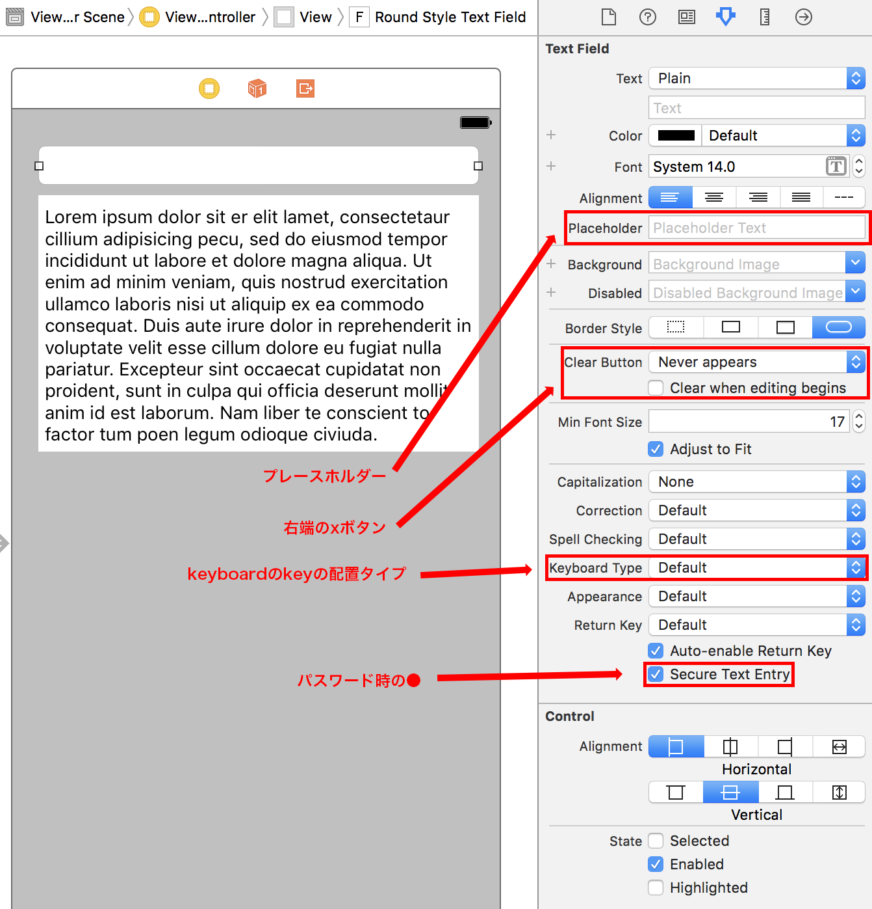
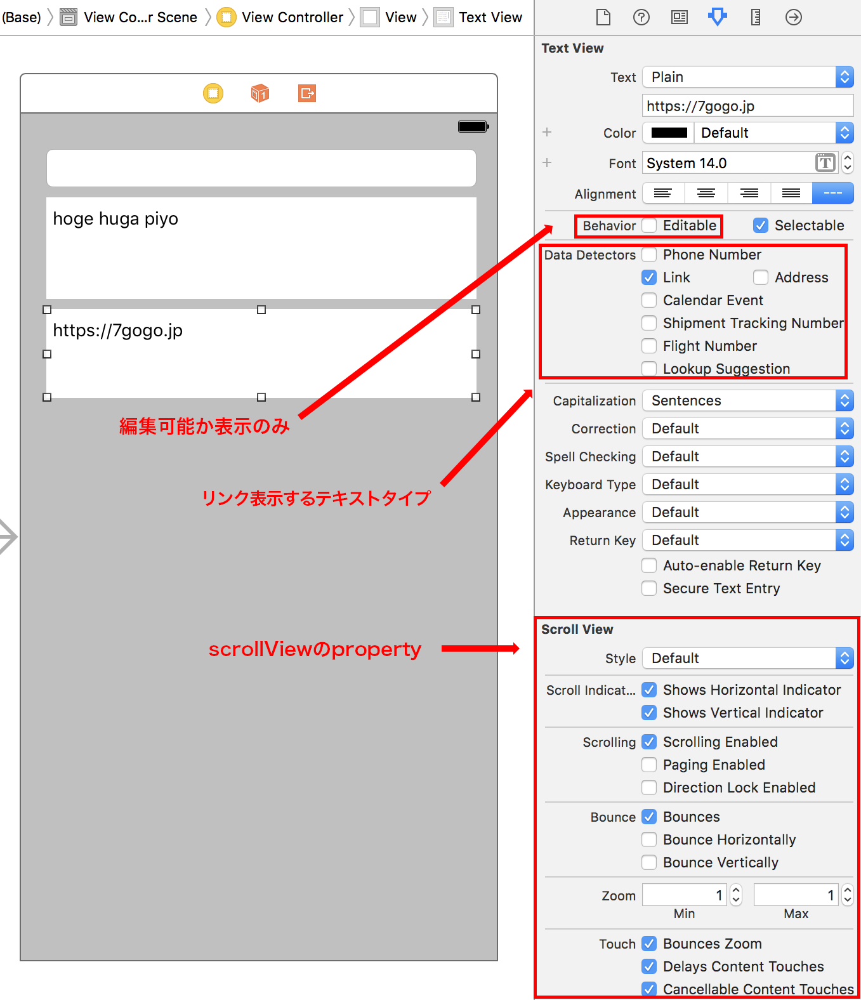

> 参考 [mixi-inc/iOSTraining 5.3 UITextFiled, UITextView](https://github.com/mixi-inc/iOSTraining/wiki/5.3-UITextFiled,-UITextView)

### class reference

[UITextField Class Reference](https://developer.apple.com/reference/uikit/uitextfield)

[UITextView Class Reference](https://developer.apple.com/reference/uikit/uitextview)

[UITextFieldDelegate Protocol Reference](https://developer.apple.com/reference/uikit/uitextfielddelegate)

[UITextViewDelegate Protocol Reference](https://developer.apple.com/reference/uikit/uitextviewdelegate)

## UITextField

少量のテキストを入力するためのコンポーネントです。検索窓やログインアカウント入力などのよく使われます。

## UITextView

複数行にわたるテキストを表示することが出来ます。また、ユーザからの入力を受け付けることも可能です。

表示モードにすると、link や email address, phone number などを探索して自動的にリンク処理を行ってくれます。

UITextView は UIScrollView を継承しておりますので、UIScrollView の property にもアクセスできます。

## Delegate Methods

UITextField, UITextView はそれぞれ Delegate Protocol が存在します。それらを採用することで、イベント通知を受け取ることが出来ます。例えば入力を始める時、入力したとき、入力を終えた時などです。詳しくは公式リファレンスをご確認ください。

## 問題

下記の図の遷移を実装してください。

**ポイント**
- `textField.resignFirstResponder()` でキーボードの非表示

この解答は[samples/day3/sample2-3-2](../../samples/day3/sample2-3-2)にあります。
