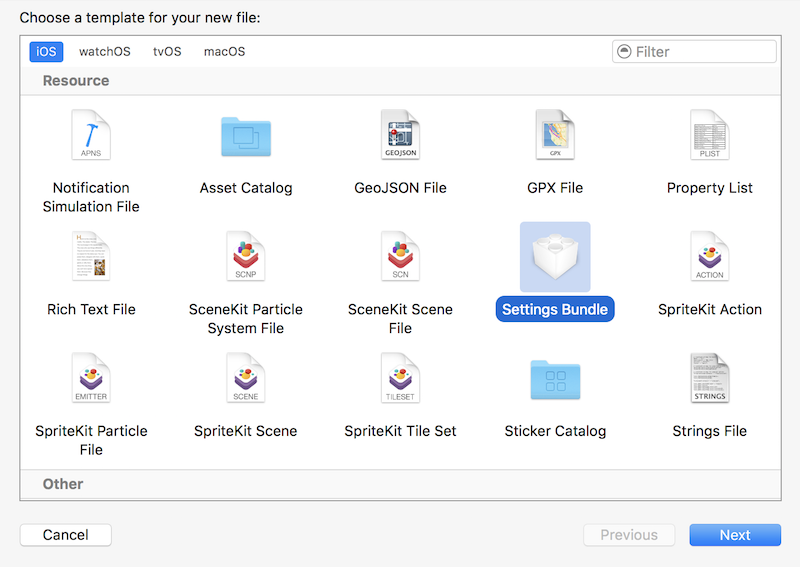
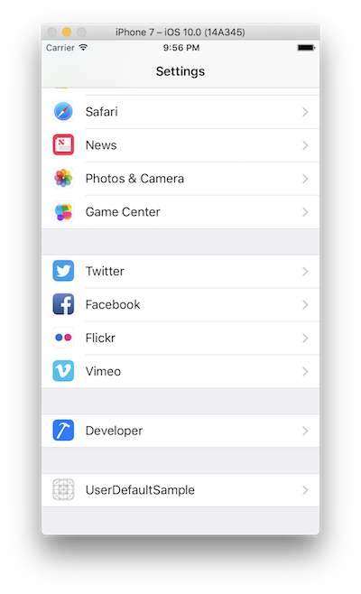
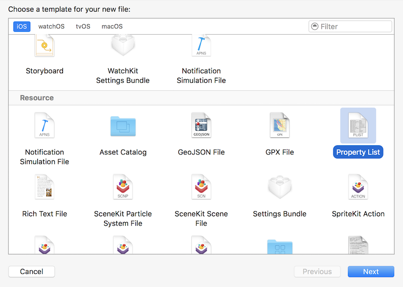
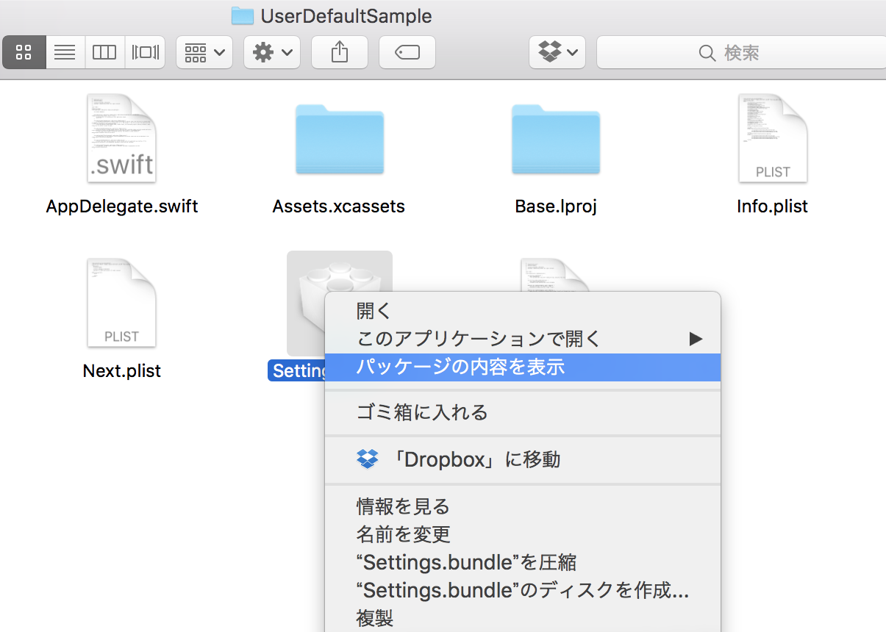
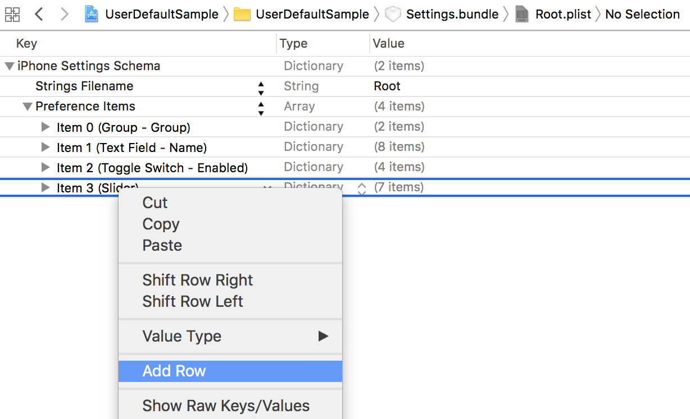
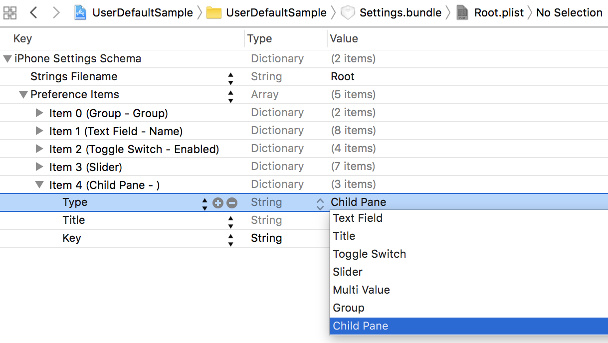
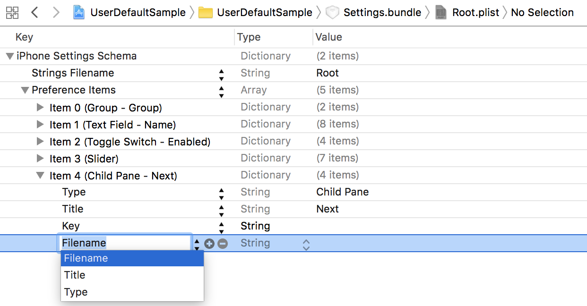
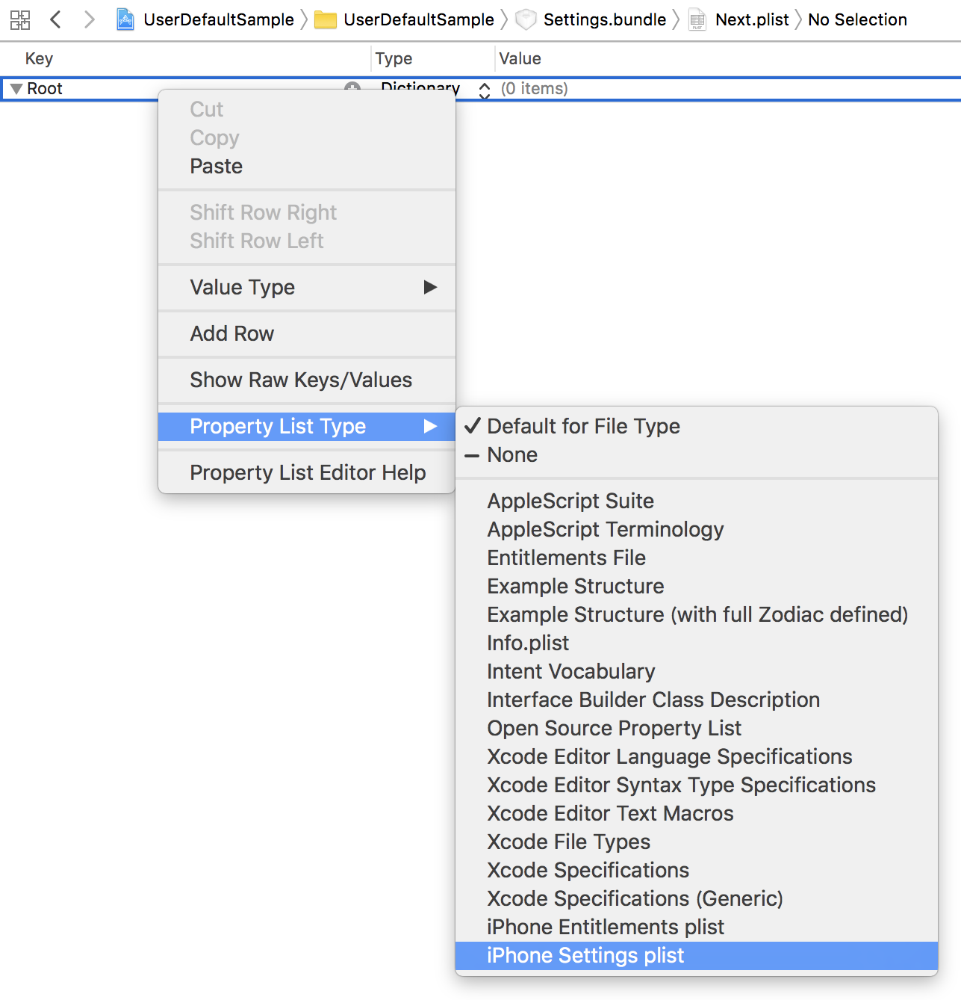
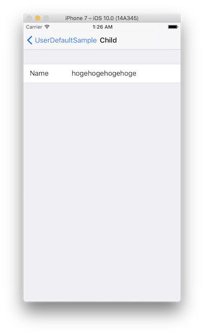

> 参考 [mixi-inc/iOSTraining 7.1 NSUserDefaults, Settings Bundle](https://github.com/mixi-inc/iOSTraining/wiki/7.1-NSUserDefaults,-Settings-Bundle)

[Preferences and Settings Programming Guide](https://developer.apple.com/library/content/documentation/Cocoa/Conceptual/UserDefaults/Introduction/Introduction.html)

[UserDefaults Class Reference](https://developer.apple.com/reference/foundation/userdefaults)

[Settings Application Schema Reference](https://developer.apple.com/library/content/documentation/PreferenceSettings/Conceptual/SettingsApplicationSchemaReference/Introduction/Introduction.html#//apple_ref/doc/uid/TP40007071)

## UserDefaults

UserDefaults はアプリケーション内にデータを永続化させるためのシンプルなインタフェースを提供しています。保存可能はインスタンスは Data, String, Date, Array, Dictionary です。

```swift
@IBAction func saveButtonTapped(_ sender: UIButton) {
    let array: [String] = (0..<10).map { "\($0)" }
    UserDefaults.standard.set(array, forKey: "array")
}

@IBAction func readButtonTapped(_ sender: UIButton) {
    guard let array = UserDefaults.standard.object(forKey: "array") as? [String] else { return }
    print(array)
}
```

console

```
["0", "1", "2", "3", "4", "5", "6", "7", "8", "9"]
```

**注意**

UserDefaults で保存した場合アプリ内の plist ファイルで保存されます。このファイルは特定のアプリケーションを使うと一般ユーザでも見ることが出来てしまいます。従ってパスワードや access token などの情報はこのファイルに保存しないようにしてください。

## Settings Bundle

iPhone の setting app 内に開発中のアプリの設定項目を追加することが出来ます。

### Settings.bundle の追加

ファイル追加画面で Settings Bundle を選びます。



この状態でビルドすると、設定アプリの中に開発中のアプリが表示されます。



この中の Root.plist を編集することで設定画面の項目を編集することが出来ます。
設定項目については公式リファレンスをご確認ください。  
[Settings Application Schema Reference](http://developer.apple.com/library/ios/#documentation/PreferenceSettings/Conceptual/SettingsApplicationSchemaReference/Introduction/Introduction.html#//apple_ref/doc/uid/TP40007071)

### 子ページの追加方法

>   
[Preferences and Settings
Programming Guide](https://developer.apple.com/library/content/documentation/Cocoa/Conceptual/UserDefaults/Preferences/Preferences.html) から引用

Root.plist の子ページを作りたい場合は、新たに plist ファイルを作成して、Settings.bundle のルートディレクトリに配置します。

まず、新規ファイルで property list を選択し、作成します。



次にファイルシステムの方で追加した plist を Settings.bundle の中に移動します。Finder で移動する場合は下の図のようにしてください。コマンドラインでする方が早いです。



Root.plist に子設定画面に移動するように plist を追加してみます。



追加したデータのタイプを child pane にします。Title はセルのテキスト、Filename は遷移する plist のファイル名を指定します。



Filenameを追加するために＋で列を追加してください。



最後に追加した plist の設定を行います。その際に iphone setting plist というタイプに変更すると編集しやすくなります。



**ポイント**

このような静的なメニューを TableView で作成する際には plist ファイルで必要項目を作成して、viewController でその plist を読み込むだけで TableView を生成するようにすると運用が楽になります。

### 問題

子の設定画面で下の図の表示になるように実装してください。



## Settings bundle と UserDefaults

Setting app で設定した項目は UserDefaults を使用してアプリ内でアクセスすることが可能になります。

plist で設定した Identifier (Key) を指定して UserDefaults から参照すると取得することができます。

### 問題

Setting bundle に textField を追加した、settings app から設定した値を取得してみましょう。
