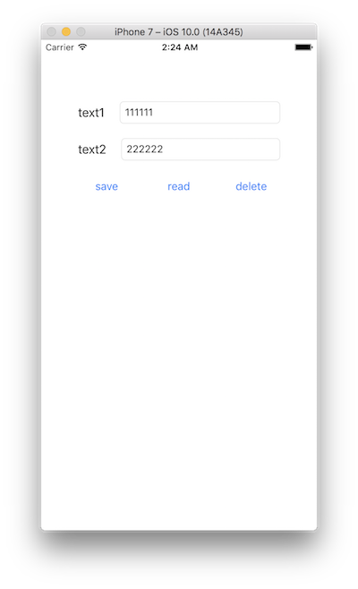

> 参考 [mixi-inc/iOSTraining 7.2 NSFileManager](https://github.com/mixi-inc/iOSTraining/wiki/7.2-NSFileManager)

[File System Programming Guide](https://developer.apple.com/library/content/documentation/FileManagement/Conceptual/FileSystemProgrammingGuide/Introduction/Introduction.html#//apple_ref/doc/uid/TP40010672)

[ファイルシステムプログラミングガイド](https://developer.apple.com/jp/devcenter/ios/library/documentation/FileSystemProgrammingGuide.pdf)

[NSFileManager Class Reference](https://developer.apple.com/reference/foundation/nsfilemanager)

## iOS のファイルシステム

> 

> [ファイルシステムプログラミングガイド](https://developer.apple.com/jp/devcenter/ios/library/documentation/FileSystemProgrammingGuide.pdf) から引用

| path | 説明 |
|-----|----|
| <Application_Home>/Documents/ | ユーザが作り出したデータをファイルとして保存したい場合ここに保存してください。iTunes によってバックアップされます。 |
| <Application_Home>/Library/Caches| システムが再度取得可能なデータをキャッシュしておきたい場合はここに保存してください。iTunes によってバックアップされません。|
| <Application_Home>/tmp/ | 一時的に保存しておきたいデータがあればここに保存してください。必要がなくなった際にはその都度削除するようにしてください。iTunes にはバックアップされません。|

## Document ディレクトリパス取得

```swift
let urls = FileManager().urls(for: .documentDirectory, in: .userDomainMask)
print(urls.first)
```

console log

```
Optional(file:///Users/Username/Library/Developer/CoreSimulator/Devices/CE1017AE-5E14-488C-B0B3-B364453B0413/data/Containers/Data/Application/F47D5EB7-5271-4528-85D6-A7E85B9D13B8/Documents/)
```

URL ベースのパスが取得できます。シミュレータだと Mac のファイルシステムパスが表示されます。

この URL に保存したいファイル名を追加して新たな URL を生成すれば保存が可能です。

## データの保存

```swift
let saveDict = [ "key1" : "value1", "key2" : "value2" ]
let fileUrl: URL ...

if NSKeyedArchiver.archiveRootObject(saveDict, toFile: fileUrl.path) {
    print("success")
} else {
    print("failed")
}
```

## データの読み込み

```swift
if FileManager.default.fileExists(atPath: fileUrl.path) { //[1] ファイルパスが存在するかどうかを確認
    let readDict = NSKeyedUnarchiver.unarchiveObject(withFile: fileUrl.path) //[2] 保存したファイルを dictionary として生成
    print(readDict)
} else {
    print("not exist")
}
```

console log

```
Optional({
    key1 = value1;
    key2 = value2;
})
```

## ファイルの削除

```swift
guard let fileUrl = fileURL(), FileManager.default.fileExists(atPath: fileUrl.path) else {
    print("not exist")
    return
}
do {
    try FileManager.default.removeItem(atPath: fileUrl.path)
} catch {
    print("failed")
}
```

## 問題
下図の画面を作成して、以下の仕様を満たすプログラムを作成してください。

- save ボタンを押すと textField のテキストが保存される。
- プロセスを切って再度プログラムを起動して read ボタンを押すと textField に保存したテキストが表示される
- delete ボタンで保存されたテキストを削除する


