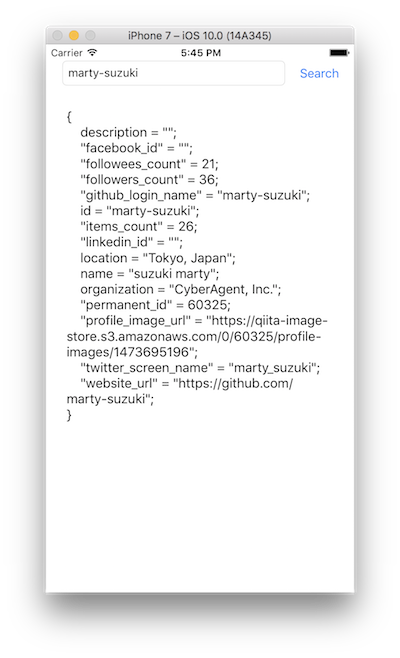

> 参考 [mixi-inc/iOSTraining 6.1 HTTPリクエストの基礎](https://github.com/mixi-inc/iOSTraining/wiki/6.1-HTTP%E3%83%AA%E3%82%AF%E3%82%A8%E3%82%B9%E3%83%88%E3%81%AE%E5%9F%BA%E7%A4%8E)

この章では、iOSにおけるHTTPリクエストの投げ方について説明します。

Appleの公式ドキュメントはこちらを参照ください

[https://developer.apple.com/library/content/documentation/Cocoa/Conceptual/URLLoadingSystem/URLLoadingSystem.html](https://developer.apple.com/library/content/documentation/Cocoa/Conceptual/URLLoadingSystem/URLLoadingSystem.html)

# HTTPリクエスト概要

FoundationフレームワークにおけるURLアクセスに関するクラスは以下のものがあります。

>
>
>[URL Loading System Programming Guide](http://developer.apple.com/library/mac/#documentation/Cocoa/Conceptual/URLLoadingSystem/URLLoadingSystem.html) より引用


プロトコルとしては、http, https, ftp, fileのプロトコルをサポートし、認証やキャッシュ、クッキーの処理などを行うクラスもあります。
HTTPリクエストを投げて、処理をするだけの場合を想定した時に用いるクラスは

- URLRequest (URLリクエストのラッパー、HTTPheaderやbodyの追加などを行う)
- URLResponse (URLレスポンスのラッパー)
- URLSession (リクエストを受けて通信を行い、結果を返すなど実際の通信を行うクラス)

となります。また、URLをラップしたクラスであるURLも用いられます。これらのクラスを用いてHTTP通信を行う時の処理のフローは以下のようになります。

1. URL, URLRequestを用いてHTTPリクエストを生成
2. URLSessionに1.で生成したリクエストを渡して通信スタート
3. 通信の結果を受け取り、処理を行う。

この章では、このフローに沿ってHTTP通信の解説を行います。

また、iOS9以降では`App Transport Security`があるため、https以外のリクエストはエラーになるようになってしまいました。  
この章ではhttpsで通信をするので問題ありませんが、httpを使いたい場合は各々で調べておいてください。

### 始める前に

HTTP通信を行う際に何かしらサーバーが必要かと思います。リクエストの詳細を表示したりレスポンスを制御するサーバーがあれば今回は事足りるのですが、QiitaのPublic APIをご利用ください。

[http://qiita.com/api/v2/docs](http://qiita.com/api/v2/docs)

## HTTPリクエストの生成

HTTPリクエスト生成のフローは

1. URLオブジェクトの生成
2. URLRequestオブジェクトの生成
3. 必要なパラメータの付与

という形になります。

#### URLオブジェクトの生成

```swift
let url = URL(string: "https://7gogo.jp/")
```

とすることで、URLオブジェクトを作ることができます。

|メソッド名| 説明 |
|------|----|
| init?(string: String) | URLの文字列からURLオブジェクトを作る |

またURLオブジェクトはURLの一部にアクセスすることも可能です。

```swift
let url = URL(string: "https://7gogo.jp:9000/hoge/fuga/piyo?id=fugafuga&key=value")!
print(url) // https://7gogo.jp:9000/hoge/fuga/piyo?id=fugafuga&key=value
print(url.pathComponents) // ["/", hoge, fuga, piyo]
print(url.baseURL) // nil
print(url.host) // Optional("7gogo.jp")
print(url.port) // Optional(9000)
print(url.query) // Optional("id=fugafuga&key=value")
```

その他のオプションについてはこちらをご覧ください。

[https://developer.apple.com/reference/foundation/nsurl](https://developer.apple.com/reference/foundation/nsurl)


#### URLRequestの生成

URLからURLRequestを作るには、以下のようにします

```swift
let request1 = URLRequest(url: url) //シンプルな方法
let request2 = URLRequest(url: url, cachePolicy: .reloadIgnoringLocalCacheData, timeoutInterval: 30) // キャッシュの方法やタイムアウトの時間を指定する方法
```

URLRequestオブジェクトはstructなので、`let`でイミュータブルです。パラメータの付与を行う際には`var`でミュータブルなURLRequestオブジェクトを用います。

```swift
var request = URLRequest(url: url) //シンプルな方法
```

#### パラメータの付与

HTTPヘッダやBodyを付与する場合は以下のようにします。

**HTTPヘッダを付与する場合**

```swift
request.setValue("plain/text", forHTTPHeaderField: "Content-Type")
```

|メソッド名| 説明 |
|------|----|
|`func setValue(_ value: String?, forHTTPHeaderField field: String)` | リクエストにHTTPヘッダを追加する。第一引数にはヘッダの値を、第二引数にはヘッダのフィールド名を渡す|

**Bodyを付与する場合**

```swift
let data = string.data(using: .utf8)
request.httpBody = data
```

|メソッド名| 説明 |
|------|----|
|`func data(using encoding: String.Encoding, allowLossyConversion: Bool = default) -> Data? ` | リクエストにBodyを追加する。引数はData型となるため、文字列を渡したい場合は`data(using:_)`を用いて一度変換する必要がある|


ここまでで、以下のようなリクエストを作ることができました。

```swift
let url = URL(string: "https://example.co.jp:9000")!
var request = URLRequest(url: url)
let data = "hoge fuga piyo".data(using: .utf8)!
request.httpMethod = "POST"
request.setValue("x-www-form-urlencoded", forHTTPHeaderField: "Content-Type")
request.setValue("\(data.count)", forHTTPHeaderField: "Content-Length") // PostでContent-Lengthを設定する
request.httpBody = data
```

## URLSessionを用いた通信

ここまでで生成したリクエストを実際に投げて、そのレスポンスを取得します。

サーバーとの通信はURLSessionクラスが行います。通信は非同期で行われ、ロード完了後の処理としてdelegateメソッドを呼ぶパターンとclosureを実行するパターンの二つがあります。
ここでは、closureパターンを紹介します。

### 非同期通信を行う

非同期で通信を行うためににはクラスメソッドである`dataTask(with:completionHandler:)`を用います。  
URLSessionを初期化する際に様々な設定をするのですが、ここでは特に設定の必要のないURLSessionのシングルトンインスタンスの`shared`を使いします。

```swift
let url = URL(string: "https://qiita.com/api/v2/items?query=swift")!
let request = URLRequest(url: url)
let task = URLSession.shared.dataTask(with: request) { (data, response, error) in
    guard let data = data else { return }
    do {
        let object = try JSONSerialization.jsonObject(with: data, options: [])
        print(object)
    } catch let e {
        print(e)
    }
}
task.resume()
```

|メソッド名| 説明 |
|------|----|
| `dataTask(with:completionHandler:)` | 渡したリクエストを非同期で実行する。読み込みが完了するとcompletionHandlerが実行されます |

実行後blockに渡ってくるData, response, errorは同期実行したときのものと同様です。

## 通信結果の処理

URLSessionを用いて通信を行った後は、そのデータを処理しましょう。[JSONのシリアライズとデシリアライズ](./4-1_JSON.md)の説明をもとに、dataをオブジェクトに変換します。

```swift
do {
    let object = try JSONSerialization.jsonObject(with: data, options: [])
    print(object)
} catch let e {
    print(e)
}
```
optionsはそれぞれ適切ものを入れてください。

#### URLResponseとError

通信を行ったとき、通信結果のデータと共にURLResponseとErrorが渡されます。

URLResponseはリクエストに対するレスポンスのラッパーで、レスポンスのMIMEタイプなどを知ることができます。URLSessionで渡したリクエストのプロトコルがhttp, httpsの場合このレスポンスの実態はURLHTTPResponseとなり、HTTPレスポンスヘッダなどが含まれるようになります。

Errorは汎用的なエラー型です。エラードメインやエラーコード、エラーの理由に関する記述などが含まれます。エラーがない時はnilとなるので、エラーのとき、エラーでないときで処理を分ける場合は以下のようにすることが一般的です。

```swift
let task = URLSession.shared.dataTask(with: request) { (data, response, error) in
    if let error = error {
        // エラー処理
        return
    }
    // 通常処理
}
```

ErrorにはHTTPのエラーコードなどは含まれないので注意してください。

# 演習

ここまでで、基本的なHTTPリクエストについて抑えることができたので、その内容を用いた演習です。

**概要**

QiitaのAPIサーバーに対してリクエストを投げ、レスポンス結果をUITextViewに表示するアプリを作ってください。

User取得API [https://qiita.com/api/v2/users/:user_name](https://qiita.com/api/v2/users/marty-suzuki)  
[User Object](http://qiita.com/api/v2/docs#%E3%83%A6%E3%83%BC%E3%82%B6)



- ユーザー名を入れたらUserのレスポンスが返ってくるリクエストを実行してください
- 完成したら、エラーが返却された時の処理を追加してください
  - 赤文字でエラーの理由などを記述してください
- 余裕があればUser Objectを作成し、パースしてください。


#### 注意点

非同期通信を行った時、完了ブロック(completionHandler)はメインスレッドでないスレッドで実行されます。  
iOSのUIなどの描画を行う際には、メインスレッド上で行わないといけないため、完了ブロックの中でUI更新処理を行うと更新されません。  
そこで、再描画をメインスレッドで実行します。以下のようにすることで、メインスレッドで処理を行うことができます。

```swift
DispatchQueue.main.async {
    // ここにUIの処理を記述
}
```
