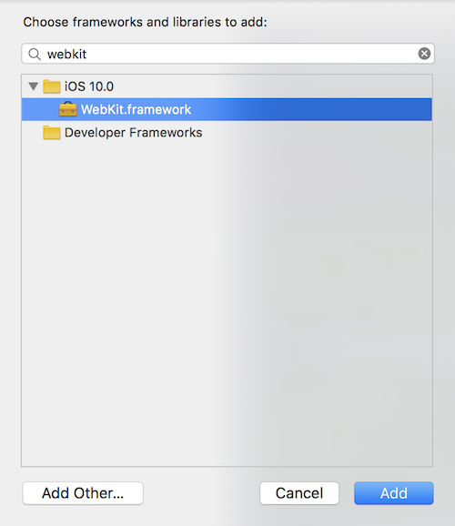
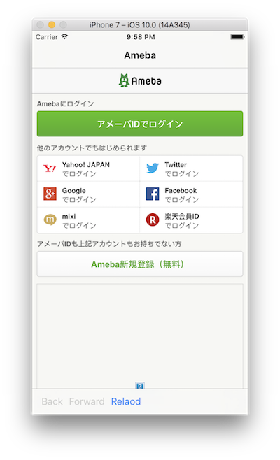
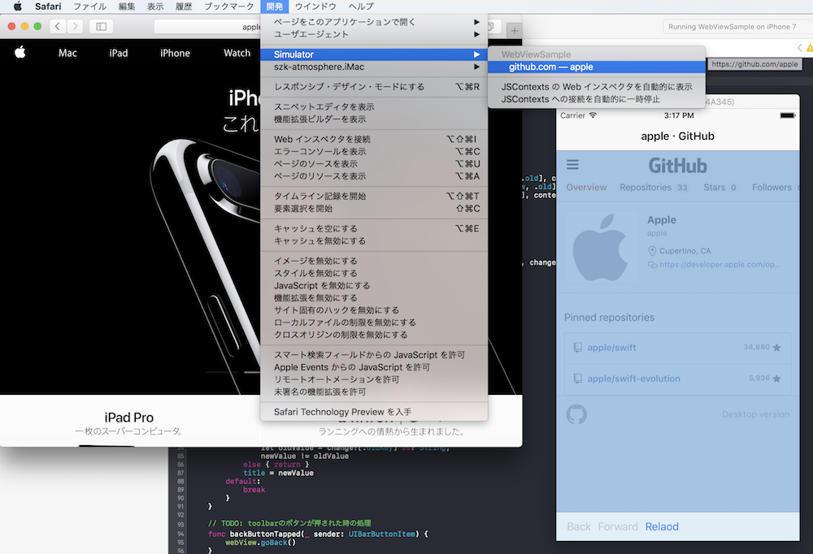
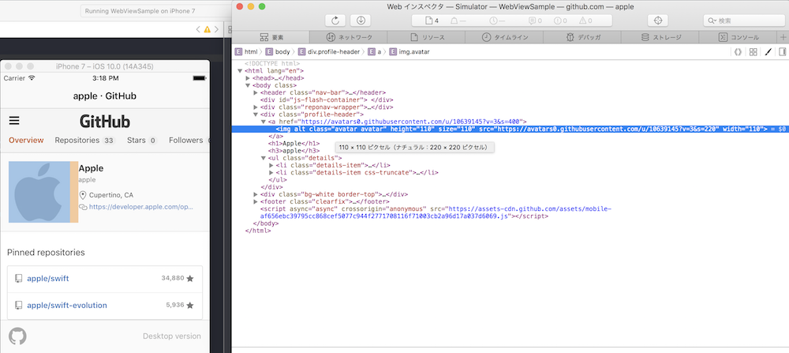
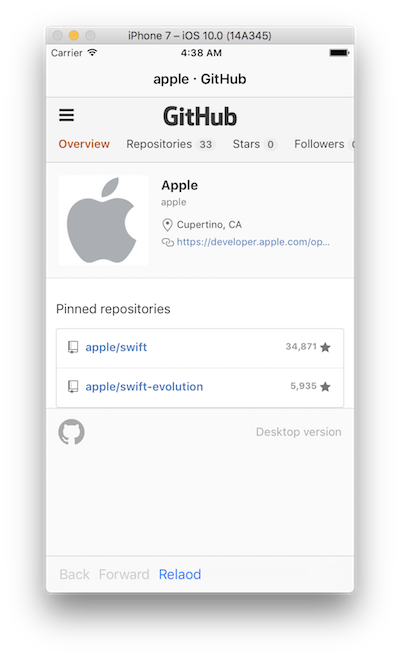

> 参考 [mixi-inc/iOSTraining 6.3 UIWebView](https://github.com/mixi-inc/iOSTraining/wiki/6.3-UIWebView)

iOSアプリを作っていて、リンクなどを毎回Safariで開くのではなくアプリの中で開きたいということがあると思います。そのような時に使えるコンポーネントとしてWKWebViewがあります。
この章ではそのWKWebViewの使い方と、WKWebViewを使った演習を行います。

# WKWebViewの基本的な使い方

WKWebViewはUIViewのサブクラスで、単体でほぼ一つのブラウザとしての働きをすることができます。
何かのviewとしてWKWebViewのインスタンスを生成し、URLRequestのインスタンスと共にloadRequestメソッドを実行することで読み込みを開始します。

ユーザーがリンクをタップした時の遷移や、Cookieに関する処理も自動的に行います。戻る、進む、リロードなどの処理もそれぞれ `goBack()`, `goForward()`, `reload()`などのメソッドを呼ぶことで実現することが出来ます。

### WKWebViewのサンプル

1.　Xcodeから新しいプロジェクトを作り、Single View Applicationをテンプレートとして開いてください。そしてWKWebViewを使うためには、WebKit Frameworkを追加する必要があります。`project -> Build Phases -> Link Binary With Libraries`からWebKitを追加してください。



2.　Interface BuilderではWKWebViewを追加することができないので、コード上から追加します。

```swift
//WKWebViewを初期化
let webView = WKWebView(frame: .zero, configuration: WKWebViewConfiguration())

override func viewDidLoad() {
    super.viewDidLoad()
    // Do any additional setup after loading the view, typically from a nib.
    //ViewControllerのviewにaddSubview
    view.addSubview(webView)
    webView.translatesAutoresizingMaskIntoConstraints = false
    view.addConstraints([
        NSLayoutConstraint(item: webView, attribute: .top, relatedBy: .equal, toItem: view, attribute: .top, multiplier: 1, constant: 0),
        NSLayoutConstraint(item: webView, attribute: .right, relatedBy: .equal, toItem: view, attribute: .right, multiplier: 1, constant: 0),
        NSLayoutConstraint(item: webView, attribute: .left, relatedBy: .equal, toItem: view, attribute: .left, multiplier: 1, constant: 0),
        NSLayoutConstraint(item: webView, attribute: .bottom, relatedBy: .equal, toItem: view, attribute: .bottom, multiplier: 1, constant: 0)
    ])
}
```

3.　リクエストを読み込みます

```swift
let url = URL(string: "https://s.amebame.com/#home")!
let request = URLRequest(url: url)
webView.load(request)
```

すると、次のようなログイン画面が出てくると思います。



ログインする、遷移するなどすこしいじってみてください。
ログインや遷移なども全て自動で行ってくれることがお分かりかと思います。

# WebViewへのフック

フックとしてdelegateが用意されており、delegateをセットすることでwebviewの状態が変化した時に情報を取得することが出来ます。
プロトコルには以下のようなものがあります

| メソッド名 | 説明 |
|-----|----|
| `webView(_:didStartProvisionalNavigation:)` | WebViewが新しい画面のロードを開始した時に呼ばれます |
| `webView(_:didFinish:)` | WebViewのロードが完了した時に呼ばれます |
| `webView(_:didFail:withError:)` | WebViewが読み込みに失敗した時に呼ばれます。失敗の内容についてはerrorに含まれます |
| `webView(_:decidePolicyFor:decisionHandler:)` | webViewが読み込みを行うかどうかを判断し、closureにenumを渡します。一部のURLをフックするどの用途として使います |

詳細な説明はこちらをご覧ください  
[WKNavigationDelegate](https://developer.apple.com/reference/webkit/wknavigationdelegate)  
[WKUIDelegate](https://developer.apple.com/reference/webkit/wkuidelegate)

先ほどのサンプルに追加を行いこのデリゲートメソッドを実際に実装してみます。
- プロトコルへの準拠を宣言し、viewDidLoadで`webView.navigationDelegate = self`とします。
- リクエスト開始前へのフックとして`webView(_:decidePolicyFor:decisionHandler:)`を追加します。今回はリクエストをコンソールに表示します。

```swift
func webView(_ webView: WKWebView, decidePolicyFor navigationAction: WKNavigationAction, decisionHandler: @escaping (WKNavigationActionPolicy) -> Void) {
    print(navigationAction.request.url)
    decisionHandler(.allow) // decisionHandlerに.allowを返さないとそこからの処理が進みません
}
```

出力結果は以下のようになりました。

```
Optional(https://s.amebame.com/#home)
Optional(https://s.amebame.com/oauth/ameba?state=home)
Optional(https://dauth.user.ameba.jp/authorize?state=home&scope=profile%2Capplication%2Cconnection%2Cphoto%2Ccoin&response_type=code&client_id=db98bf8b687fc3334c4b8cde9116687fd75eb285ed5a2373df8010ae070f5338)
Optional(https://dauth.user.ameba.jp/authenticate?client_id=db98bf8b687fc3334c4b8cde9116687fd75eb285ed5a2373df8010ae070f5338&redirect_uri=https%3A%2F%2Fdauth.user.ameba.jp%2Fauthorize%3Fstate%3Dhome%26scope%3Dprofile%252Capplication%252Cconnection%252Cphoto%252Ccoin%26response_type%3Dcode%26client_id%3Ddb98bf8b687fc3334c4b8cde9116687fd75eb285ed5a2373df8010ae070f5338)
```

Cookieを持っていない状態だったので一度login画面にリダイレクトされているのが分かります。

# `evaluateJavaScript(_:completionHandler:)`

WKWebViewにはアプリからWebViewへJavaScriptを実行できるメソッド、`evaluateJavaScript(_:completionHandler:)`があります。
このメソッドを使うことでWebとネイティブをハイブリッドさせたアプリを作ることもできます。

このメソッドで直接DOMを直接取得することはできません。しかしDOMの操作や単一の値として取得できるもの(高さなど)は取得することができます。例えば[https://github.com/apple](https://github.com/apple)の画面に表示されている一つ目のリポジトリのURLを以下のように取得できます。

```swift
webView.evaluateJavaScript("document.getElementsByClassName(\"list-item repo-list-item\")[0].href;") { result, error in
    print(result)
}
```

console

```

Optional(https://github.com/apple/swift)
```

実行のタイミングは、webViewのロード完了時などです。


# WebViewのデバッグ

Mac版Safariを用いることでiOSのSafariのインスペクタを表示することができます。
また、このインスペクタをSafari以外のアプリのWebViewでも利用することができます。

アプリのWebViewが表示されている状況で、Mac Safariのメニューバー→開発→iPhone Simulatorと辿ることで現在実行中のアプリのweb インスペクタを利用することができます。






細かい利用法などはこちらをご覧ください

[About Safari Web Inspector](https://developer.apple.com/library/content/documentation/AppleApplications/Conceptual/Safari_Developer_Guide/Introduction/Introduction.html)

# 演習 ブラウザコンポーネントの作成

WKWebViewを使った演習としてブラウザコンポーネントを作ります。

仕様は以下の通りになります。

- ナビゲーションバーとツールバーが表示されている
  - ナビゲーションバーのタイトルには各ページのタイトルが表示されている。遷移するごとに切り替わる
  - ツールバーには戻るボタンと進むボタン、リロードがついている
    - 戻るがないとき、進むがないときはボタンがdisableになっている
- 最初のリクエストは https://github.com/apple からとする

以下に完成図を示します。


