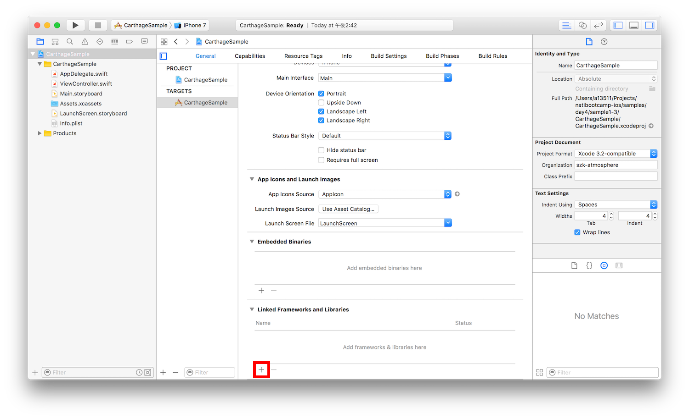
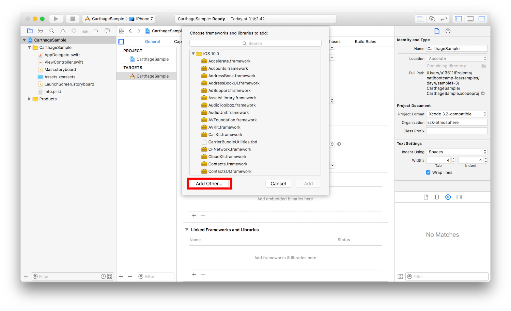
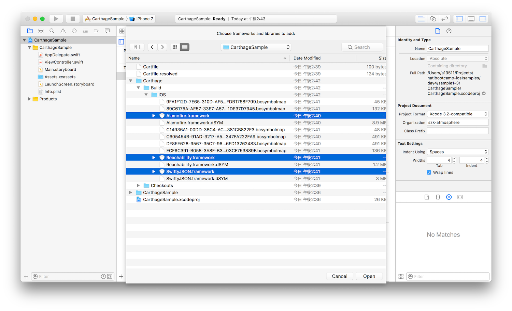
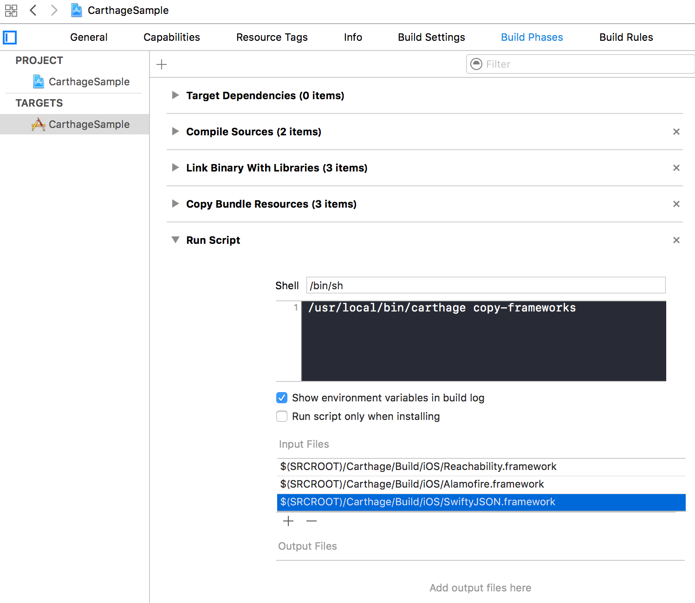

このページでは、Carthageを用いたライブラリ管理の方法を紹介します。

Carthageのリポジトリは下記になります。詳細はこちらをご覧ください。

[https://github.com/Carthage/Carthage](https://github.com/Carthage/Carthage)


# Carthageの導入と利用

#### インストール

- Homebrewを用いてインストールします。
  - 参考 [【El Capitan】Mac OSX 10.11にHomebrewインストール](http://qiita.com/aoioooii/items/c14922eede6a83a750da)

コマンドラインツールで以下を実行します

```
[sudo] brew install carthage
```

しばらく時間がかかると思います。

#### Cartfileの記述

利用するライブラリやそのバージョンの指定、ターゲットごとのライブラリの振り分けなどはCartfileというファイルに記述します。

```
# Cartfile

# Elegant HTTP Networking in Swift
github "Alamofire/Alamofire"
```

- 利用するライブラリを指定するには

```
github 'ユーザー名/リポジトリ名' バージョンを指定
```

と書きます。

任意のバージョン以降を指定したい場合は

```
# 3.3.0以降
github “Alamofire/Alamofire” >= 3.3.0
```

任意のバージョン以降かつメジャーバージョンが同じものを指定したい場合は

```
# 3.x
github “Alamofire/Alamofire” ~> 3.0 # (3.0以降、3.0未満)
```

任意の固定でバージョンを指定したい場合は

```
# 4.0.0
github “Alamofire/Alamofire” == 4.0.0
```

ブランチを指定したい場合は

```
# ブランチを指定
github “Alamofire/Alamofire” “branch”
```

URLでリポジトリを指定したい場合は

```
github “https://github.com/Alamofire/Alamofire”
```

ローカルプロジェクトを使用したい場合は

```
# ローカルプロジェクトを使用
git “file:///directory/to/project” “branch”
```

と書くことが出来ます。

#### インストール

ライブラリのインストールには

```
carthage update
```

プラットフォームを指定した場合は

```
carthage update --platform iOS
```

とします。プロジェクト配下にCarthage/Buildというディレクトリができて、その中にbuildされたframeworkが置いてあります。

そして、そのframeworkをプロジェクトファイルのGeneralタブの「Linked Frameworks and Library」から追加します。



「Add Other」から該当のframeworkを探します。



プロジェクトのディレクトリ内から、Carthage/Build/iOSと移動し、ライブラリの.frameworkファイルを選択します。



frameworkが追加できたら、Build Phasesタブに移動し、「New Run Script Phase」を選択します。


すると「Run Script」が現れるので、「Shell」の下にある黒い部分に以下のコマンドを記述します。

```
/usr/local/bin/carthage copy-frameworks
```

そして次に「input Files」、以下のようにframeworkの情報を記述します。

```
$(SRCROOT)/Carthage/Build/iOS/xxxxxxxxx.framework
```




あとはソースコード内で

```
import Alamofire
```

とすれば利用できるようになります。

#### その他

CocoaPodsとの違いは、`carthage update`時にxcodebuildを使ってframeworkがbuildされています。
それによって、projectのビルドにライブラリのビルドが含まれないので、ビルドが速くなります。

不便な点としては、CocoaPodsのSpecsのように登録されているライブラリが中央集中型で管理されていますが、Carthageにはそういったものがないので自分でライブラリを探す必要があります。

このサンプルは[samples/day4/sample1-3](../../samples/day4/sample1-3)にあります。
