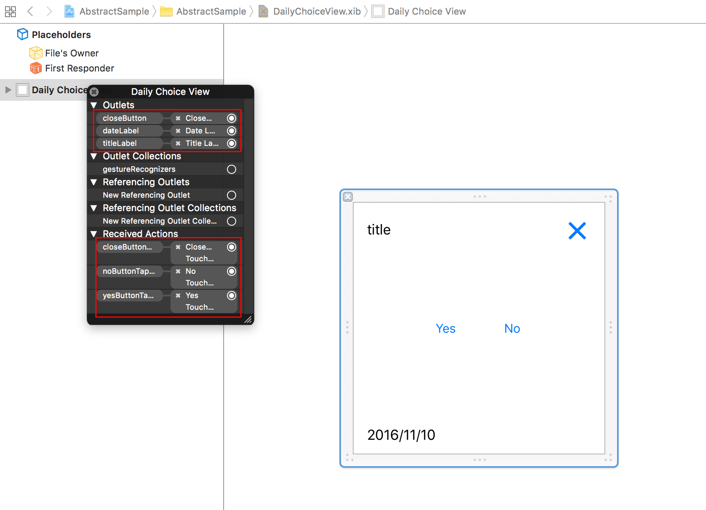
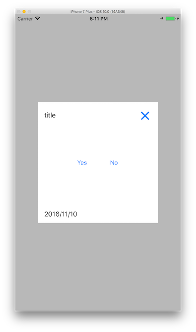
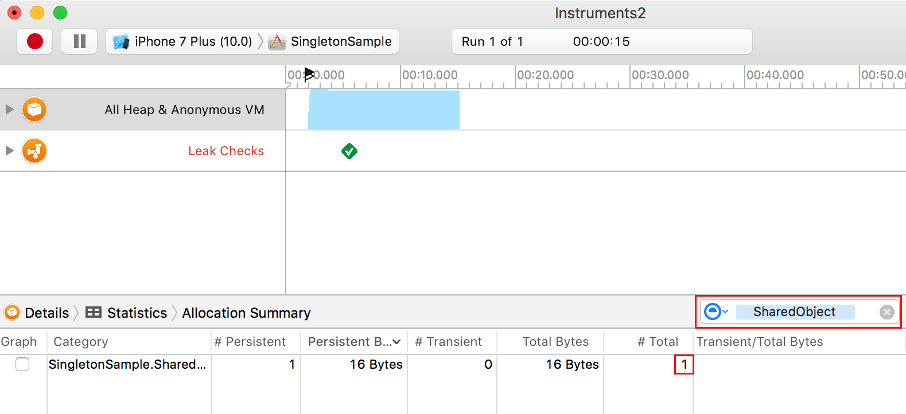

> 参考 [mixi-inc/iOSTraining 9.2 クラス設計 2](https://github.com/mixi-inc/iOSTraining/wiki/9.2-%E3%82%AF%E3%83%A9%E3%82%B9%E8%A8%AD%E8%A8%88-2)

引き続きクラス設計について説明します。

## iOS開発におけるViewまわりでの抽象クラス

day4 2.1 で例として挙げた仕様がありました。

> - ファーストビューので、曜日ごとに違う画像を表示したい
> - その画像をタップした際の画面遷移やアクションが画像によってことなる

この仕様が画像では無く、様々な種類のビューをオーバーレイし、×ボタンを押すと閉じることが出来るように変更したいとします。


この場合は、一つのカスタムビュークラスでテキストビューやイメージビューなどのサブビューを条件分岐で表示非表示にしがちです。しかし、そうしてしまうとコードにレイアウトのコードが増えたり、ビューの種類が増えてきた場合に条件分岐がさらに多くなり対応が難しくなります。

こういったケースでは抽象クラスを使うと上記の問題は解決できます。

**ポイント**
Swift では Protocol というものが存在しますが、厳密に抽象クラスを作成する言語的機能（Java の abstract 修飾子など）は存在しません。よって、抽象クラスとして作成したクラスのインスタンスも生成可能です。NSObject クラスのインスタンスが生成可能なように、Swift では抽象クラスの扱いに関しては開発者側で行う必要があります。

上記の例では抽象クラスを作成し、そのサブクラスで適宜必要なコンポーネントとレイアウトの実装を行うと良いでしょう。


では実際に実装していきましょう。ここでは YES/NO のボタンを設置するカスタムビュー DailyChoiceView を作成していきます。

抽象クラス DailyView では xib ファイルは作成せず、.swift ファイルだけ作成します。

delegate method を含めた delegate protocol を宣言しておきます。

DailyView.swift

```swift
protocol DailyViewDelegate: class {
    func dailyView(view: DailyView, didTapClose button: UIButton)
}

class DailyView: UIView {

    @IBOutlet weak var titleLabel: UILabel!
    @IBOutlet weak var closeButton: UIButton!
    @IBOutlet weak var dateLabel: UILabel!

    weak var delegate: DailyViewDelegate?

    @IBAction func closeButtonTapped(_ sender: UIButton) {
        delegate?.dailyView(view: self, didTapClose: sender)
    }
}
```

実装クラスである DailyChoiceView では .swift に加えて .xib まで作成して実装します。
DailyViewDelegateを継承したDailyChoiceViewDelegateを作成し、必要なものを宣言します。

DailyChoiceView.swift

```swift
protocol DailyChoiceViewDelegate: DailyViewDelegate {
    func dailyView(view: DailyView, didTapYes button: UIButton)
    func dailyView(view: DailyView, didTapNo button: UIButton)
}

class DailyChoiceView: DailyView {

    class func view() -> DailyChoiceView {
        return Bundle.main.loadNibNamed("DailyChoiceView", owner: nil, options: nil)?.last as! DailyChoiceView
    }

    @IBAction func yesButtonTapped(_ sender: UIButton) {
        (delegate as? DailyChoiceViewDelegate)?.dailyView(view: self, didTapYes: sender)
    }

    @IBAction func noButtonTapped(_ sender: UIButton) {
        (delegate as? DailyChoiceViewDelegate)?.dailyView(view: self, didTapNo: sender)
    }
}

```

DailyChoiceView.xib



インスタンスを生成して表示させてみましょう。

ViewController.swift

```swift
class ViewController: UIViewController {

    var dailyView: DailyView?

    override func viewDidLoad() {
        super.viewDidLoad()
        // Do any additional setup after loading the view, typically from a nib.

        let dailyChoiceView = DailyChoiceView.view()
        dailyChoiceView.delegate = self
        dailyChoiceView.translatesAutoresizingMaskIntoConstraints = false
        view.addSubview(dailyChoiceView)
        view.addConstraints([
            NSLayoutConstraint(item: dailyChoiceView, attribute: .centerX, relatedBy: .equal, toItem: view, attribute: .centerX, multiplier: 1, constant: 0),
            NSLayoutConstraint(item: dailyChoiceView, attribute: .centerY, relatedBy: .equal, toItem: view, attribute: .centerY, multiplier: 1, constant: 0),
            NSLayoutConstraint(item: dailyChoiceView, attribute: .height, relatedBy: .equal, toItem: nil, attribute: .notAnAttribute, multiplier: 1, constant: dailyChoiceView.bounds.size.height),
            NSLayoutConstraint(item: dailyChoiceView, attribute: .width, relatedBy: .equal, toItem: nil, attribute: .notAnAttribute, multiplier: 1, constant: dailyChoiceView.bounds.size.width)
        ])
        dailyView = dailyChoiceView
    }
}

extension ViewController: DailyViewDelegate {
    func dailyView(view: DailyView, didTapClose button: UIButton) {
        dailyView?.removeFromSuperview()
    }
}

extension ViewController: DailyChoiceViewDelegate {
    func dailyView(view: DailyView, didTapNo button: UIButton) {
        print("no tapped")
    }

    func dailyView(view: DailyView, didTapYes button: UIButton) {
        print("yes tapped")
    }
}

```



## Singleton インスタンス
アプリケーション内で一つだけインスタンスを存在させたい場合、Singleton パターンを使って実装します。Cocoa API では `UserDefaults.standard` `NotificationCenter.default` などで実現されています。その実装方法は以下のようになります。

SharedObject.swift

```swift
class SharedObject {

    static let shared = SharedObject()

    private init() {}

    func doSomething() {
        //doSomething
    }
}
```

この実装により、どこからインスタンス生成を行ってもアプリケーション上では一つのインスタンスしか存在しないようになります。
試しにインスタンス生成を複数回行ったとします。

```swift
let array = (0..<10).map { _ in
    SharedObject.shared
}
```

instruments で allocation を見るてもインスタンスが一つだけ存在していることが分かります。(instruments に関しては day4 1-1で解説しています)



このサンプルは[samples/day4/sample2-2](../../samples/day4/sample2-2)に置いてあります。
