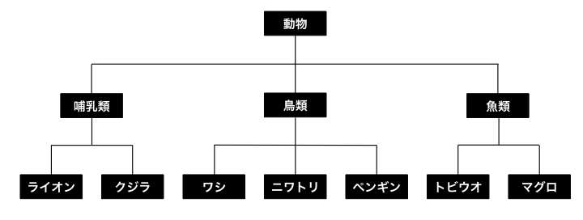
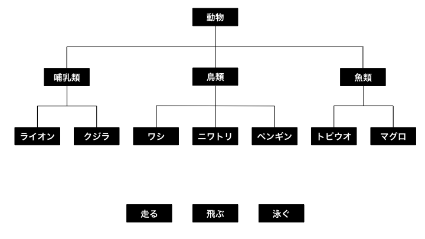
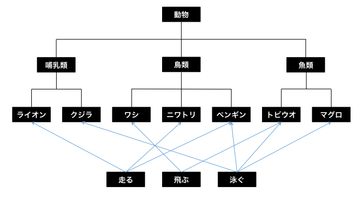

引き続きクラス設計について説明します。

## Swiftにおけるプロトコル指向プログラミング

プロトコル指向プログラミングはオブジェクト指向プログラミングのパラダイムの一つです。
従来のオブジェクト指向プログラミングでクラスを実装するにあたって、下記のことが起こりえます。

> __・暗黙の共有__。たとえば、2つのオブジェクトが第3のオブジェクトを参照している場合、2つのオブジェクトは互いにそのことを知らずに、第3のオブジェクトを変更できてしまう。共有を回避するため、参照するオブジェクトを複製すると、今度は効率がわるくなる。ロックを使って競合を避けるという方法もある。だが、これはさらに効率をわるくし、デッドロックにつながるおそれもある。コードはさらに複雑になる。これはバグがさらに増えることを意味する。

> __・継承問題__。多くのオブジェクト指向言語では、スーパークラスを一つしか持つことができず、初期の段階で選ばなくてはならない。スーパークラスをあとから変更するのは、極めて困難だ。またスーパークラスは派生クラスにストアドプロパティを強制する。これは初期化の処理と、スーパークラスが求める普遍性を壊さないようにするのを複雑にする。さらに通常は、オーバーライドできるもの、そのやり方、いつすべきでないかに制約がある。こうした制約は通常、ドキュメントに残される。

> __・型関係の喪失__。これはインターフェイスと実装の合体によるものだ。通常、実装できないベースクラスのメソッドに現れ、派生クラスのメソッド実装において、派生クラスにダウンキャストする必要がある。

> [Swiftにおけるプロトコル指向プログラミング](https://www.infoq.com/jp/news/2015/06/protocol-oriented-swift)

WWDC2105の[Protocol-Oriented Programming in Swift](https://developer.apple.com/videos/play/wwdc2015/408/)からSwiftにおけるプロトコル指向プログラミングの詳細が説明されています。

例として、下図のような関係性で動物を構成しているとします。



それぞれの動物は、`走る`・`飛ぶ`・`泳ぐ`をいう特性を持っているとします。



その特性をそれぞれの動物の割り当てた場合、このようになります。



この中のライオンとペンギンを従来のオブジェクト指向で実装します。

### オブジェクト指向での実装

```swift
//動物のクラス
class Animal {
    var runnningSpeed: Int?
    var swimmingSpeed: Int?
    var flyingSpeed: Int?

    func run() {
        guard let runnningSpeed = runnningSpeed else { return }
        print("\(String(describing: self)) runnning speed: \(runnningSpeed)km/h")
    }

    func swim() {
        guard let swimmingSpeed = swimmingSpeed else { return }
        print("\(String(describing: self)) swimming speed: \(swimmingSpeed)km/h")
    }

    func fly() {
        guard let flyingSpeed = flyingSpeed else { return }
        print("\(String(describing: self)) flying speed: \(flyingSpeed)km/h")
    }
}

//哺乳類のクラス
class Mammalian: Animal {

}

class Lion: Mammalian {
    override init() {
        super.init()
        self.runnningSpeed = 58
    }
}

//鳥類のクラス
class Birds: Animal {

}

class Penguin: Birds {
    override init() {
        super.init()
        self.runnningSpeed = 9
        self.swimmingSpeed = 36
    }
}
```

それぞれの動物は、`走る`・`飛ぶ`・`泳ぐ`をいう特性を持ちうるので、それらをまとめてAnimalクラスで持つ必要があります。
Lionクラス・Penguinクラスでは、それらのクラスの中でどのpropertyに初期化が必要なのかを考慮して実装する必要があります。


```swift
let lion = Lion()
lion.run() //Lion runnning speed: 58km/h
lion.swim() //何も出力されない

let penguin = Penguin()
penguin.run() //Penguin runnning speed: 9km/h
penguin.fly() //何も出力されない
```

実際のそれぞれの動物のクラスをインスタンス化をしメソッドを呼び出すと、本来は呼べる必要のないメソッドも呼べてしまいます。

### プロトコル指向での実装

```swift
//プロトコル
protocol Runnable {
    var runnningSpeed: Int { get set }
    func run()
}

extension Runnable {
    func run() {
        print("\(String(describing: self)) runnning speed: \(runnningSpeed)km/h")
    }
}

protocol Swimmable {
    var swimmingSpeed: Int { get set }
    func swim()
}

extension Swimmable {
    func swim() {
        print("\(String(describing: self)) swimming speed: \(swimmingSpeed)km/h")
    }
}

//動物のクラス
class Animal {

}

//哺乳類のクラス
class Mammalian: Animal {

}

class Lion: Mammalian, Runnable {
    var runnningSpeed: Int = 58
}

//鳥類のクラス
class Birds: Animal {

}

class Penguin: Birds, Runnable, Swimmable {
    var runnningSpeed: Int = 9
    var swimmingSpeed: Int = 36
}
```

protocolの定義時に必要なpropertyやメソッドの宣言を行います。
共通化できる部分は、extensionを使用してデフォルト実装していきます。
クラスの実装時にprotocolを採用すると実装が強制されるようになるので、どのpropertyに初期化が必要なのかを考慮せずに済みます。

```swift
let lion = Lion()
lion.run() //Lion runnning speed: 58km/h
lion.swim() //メソッドが存在しないので、エラー

let penguin = Penguin()
penguin.run() //Penguin runnning speed: 9km/h
penguin.fly() //メソッドが存在しないので、エラー
```

protocolによって必要なメソッドが宣言されているので、存在しないものが呼び出されることはなくなります。

### 応用

```swift
//動物のprotocol
protocol Animal {

}

//哺乳類のprotocol
protocol Mammalian: Animal {

}

struct Lion: Mammalian, Runnable {
    var runnningSpeed: Int = 58
}

//鳥類のprotocol
protocol Birds: Animal {

}

struct Penguin: Birds, Runnable, Swimmable {
    var runnningSpeed: Int = 9
    var swimmingSpeed: Int = 36
}
```

structは継承を行うことはできませんが、protocolの採用をすることはできます。
そのため、実際にインスタンス化するオブジェクトをstructとし、それ以外の部分をprotocolとして定義する方法もあります。

### 実用例

キーボード周りのNotificationをprotocolを使って実装します。

```swift
protocol KeyboardObservable: class {
    var keyboardObservers: [Any] { get set }
    func keyboardWillShow(_ notification: Notification)
    func keyboardDidShow(_ notification: Notification)
    func keyboardWillHide(_ notification: Notification)
    func keyboardDidHide(_ notification: Notification)
    func addKeyboardObservers()
    func removeKeyboardObservers()
}

extension KeyboardObservable {
    func addKeyboardObservers() {
        keyboardObservers = [
            (.UIKeyboardWillShow, keyboardWillShow(_:)),
            (.UIKeyboardDidShow, keyboardDidShow(_:)),
            (.UIKeyboardWillHide, keyboardWillHide(_:)),
            (.UIKeyboardDidHide, keyboardDidHide(_:))
        ].map { NotificationCenter.default.addObserver(forName: $0, object: nil, queue: .main, using: $1) }
    }

    func removeKeyboardObservers() {
        keyboardObservers.forEach { NotificationCenter.default.removeObserver($0) }
        keyboardObservers.removeAll()
    }
}
```

必要なViewControllerにのみprotocolを採用することで、メソッドの呼び出しできるようになり必要な実装が強制されます。

```Swift
class ViewController: UIViewController, KeyboardObservable {

    var keyboardObservers: [Any] = []

    override func viewDidAppear(_ animated: Bool) {
        super.viewDidAppear(animated)
        addKeyboardObservers()
    }

    override func viewDidDisappear(_ animated: Bool) {
        super.viewDidDisappear(animated)
        removeKeyboardObservers()
    }

    func keyboardWillShow(_ notification: Notification) {
        //キーボードが表示される前の処理
    }

    func keyboardDidShow(_ notification: Notification) {
        //キーボードが表示された後の処理
    }

    func keyboardWillHide(_ notification: Notification) {
        //キーボードが非表示にされる前の処理
    }

    func keyboardDidHide(_ notification: Notification) {
        //キーボードが非表示にされた後の処理
    }
}
```

このサンプルは[samples/day4/sample2-3](../../samples/day4/sample2-3)に置いてあります。
